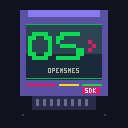

<div align="center">



# OpenSNES

**Modern, open-source SDK for Super Nintendo development**

*Write SNES games in C. Build on Linux, macOS, and Windows.*

[](https://opensource.org/license/mit/)
[](https://github.com/k0b3n4irb/opensnes/actions)
[]()
[]()
[]()

**[Documentation](https://k0b3n4irb.github.io/opensnes/)** · **[Getting Started](https://k0b3n4irb.github.io/opensnes/getting_started.html)** · **[Contributing](https://k0b3n4irb.github.io/opensnes/contributing.html)**

</div>

---

## Introduction

OpenSNES lets you write Super Nintendo games in **standard C11** — no proprietary toolchain, no assembly required to get started. One `make` command builds the compiler, tools, library, and all 55 example ROMs.

This project builds on **[PVSnesLib](https://github.com/alekmaul/pvsneslib)** by [Alekmaul](https://github.com/alekmaul) and its community. OpenSNES is a fork focused on a modern C11 compiler, comprehensive testing, and developer experience.

## A Fair Warning

SNES development is hard. Not "takes a weekend to figure out" hard — fundamentally, structurally hard.

The SNES was designed in 1989 by hardware engineers, for assembly programmers, with no concessions to convenience. There is no operating system. There is no standard library. There is no debugger that pauses the world while you inspect variables. The CPU runs at 3.58 MHz, has 128 KB of RAM, and doesn't know what a float is.

You will need to understand how a PPU renders tiles scanline by scanline. You will need to know why writing to VRAM outside of VBlank silently fails. You will need to care about individual clock cycles, because on this hardware, every single one matters.

OpenSNES lets you write game logic in C. That's a real advantage — you get if/else, functions, structs, and all the abstraction C provides. The SDK handles initialization, DMA transfers, joypad reading, sprite management, and audio playback through a clean API. For many things, you'll never touch a register directly.

But C alone won't get you to a finished game.

The PPU has quirks that no C abstraction can fully hide. Performance-critical inner loops, custom HDMA effects, and advanced hardware tricks eventually require reading — and writing — 65816 assembly. The SDK handles audio through SNESMOD (music and sound effects from C, no assembly needed), and it handles sprites, backgrounds, and DMA through its library. But the moment you push past what the library provides, you're on the hardware's terms.

This is not a flaw in the SDK. It's the nature of the machine. OpenSNES will keep improving — better optimizations, more library functions, smoother workflows — but the gap between "my sprites move" and "my game ships" will always require understanding what happens beneath the C.

If that sounds exciting rather than terrifying, you're in the right place.

## Who is OpenSNES for?

OpenSNES is built for developers who already know the SNES — or who are willing
to invest the time to learn it. Concretely, you'll be productive here if:

- You're comfortable reading and writing **65816 assembly** when needed (most
  game code is C, but you will hit assembly: HDMA tables, the NMI handler,
  perf-critical inner loops).
- You understand the **NMI / VBlank model** — when you can write to VRAM, why
  DMA outside of VBlank silently fails, what a 4 KB VBlank budget means.
- You can read a hex address. OAM, CGRAM, VRAM, BG tilemap addresses, palette
  base offsets — these are part of the daily vocabulary.
- You're porting from PVSnesLib, or coming from another SNES SDK, or you've
  already shipped something for a comparable retro target.

It is **not** the right SDK if any of these apply:

- You're new to SNES development and just want to "make a game in C". The
  language is the easy part; the hardware is the hard part. Start with a
  beginner-friendly engine (Godot, GameMaker, etc.), then come back when the
  retro itch is specific.
- You want a fully managed runtime that hides the hardware. There isn't one
  to hide it behind — the silent-failure list is real and inherited from the
  machine.
- You need a stable production toolchain for a deadline-driven project. The
  SDK is **late beta** — the test suite is green and CI is enforced, but
  several optimisations and chip APIs are still planned (see the
  [roadmap](ROADMAP.md)).

**Read [`KNOWN_LIMITATIONS.md`](KNOWN_LIMITATIONS.md) before you start.** It
catalogs every silent failure we know about, with severity tags and
mitigations. Skim it once; refer back when something mysterious happens.
For ASM-writing contributors, [`compiler/ABI.md`](compiler/ABI.md) documents
the calling convention with worked examples (push order, frame layout, return
values) — required reading before porting any function from PVSnesLib.

### Enhancement-chip maturity

| Mode / Chip | Status | Notes |
|-------------|:------:|-------|
| **LoROM** | Stable | Default. Production-ready. |
| **HiROM** | Stable | Set `USE_HIROM := 1` in your Makefile. |
| **FastROM** | Stable | Set `USE_FASTROM := 1`. Adds ~33 % CPU bandwidth. |
| **SA-1** | Experimental | C wrapper is minimal; coprocessor code lives in a per-example `sa1_boot.asm`. SIWP register init is an assumption, not a published spec. |
| **SuperFX** | Experimental | GSU is assembly-only (no C compiler exists for the RISC ISA). **Validate with Mesen2** — most accurate GSU emulator we have currently. **snes9x does not detect the GSU chip** in our ROM headers, so the snes9x-based CI test suite cannot validate SuperFX execution end-to-end (P3.4 tracks adding a Mesen2-headless CI path). |

---

## What OpenSNES Gives You

| | |
|---|---|
| **C11 compiler for the 65816** | cproc + QBE with a custom backend ([benchmark](docs/BENCHMARK.md)) |
| **30 hardware modules** | PPU, sprites, backgrounds, DMA, HDMA, input, audio, Mode 7, collision, SRAM... |
| **Asset pipeline** | PNG to tiles, fonts, Impulse Tracker to SPC700 |
| **55 examples** | From "Hello World" to Tetris with music — each with README and screenshot |
| **Framework opt-ins** | Game loop, scene stack, asset bundles — drop them in if they fit, ignore them otherwise |
| **Debug emulator** | snes9x WASM with ~390 automated checks (compiler tests + visual regression + lag detection + runtime + input sequences) |
| **Cross-platform** | Linux, macOS, Windows — CI-enforced on all three |

## Design Philosophy

OpenSNES is a **2D game engine** for SNES, not a thin C-over-asm wrapper.
Five principles guide every design decision:

1. **Sane defaults, escape hatches** — the 90% case is a one-liner; the
   10% case stays possible.
2. **Hide quirks, document the escape** — hardware traps don't reach
   the user, but the explanation is one click away.
3. **Modules are opt-in, never all-or-nothing** — `LIB_MODULES` selects
   what links into your ROM.
4. **Type-safe at the boundary** — structs and enums beat positional
   `u16` arguments.
5. **Predictable performance** — no hidden allocations, no lazy
   patterns, every frame-time cost is documented.

See **[PHILOSOPHY.md](PHILOSOPHY.md)** for the full statement and the
explicit positioning vs. PVSnesLib (the two projects sit at different
altitudes of the same stack and are complementary).

## Quick Start

```bash
git clone --recursive https://github.com/k0b3n4irb/opensnes.git
cd opensnes
make
```

Open `examples/text/hello_world/hello_world.sfc` in [Mesen2](https://www.mesen.ca/) and you're running on a Super Nintendo.

For prerequisites and platform-specific setup, see the **[Getting Started guide](https://k0b3n4irb.github.io/opensnes/getting_started.html)**.

## Examples

55 examples organized as a progressive learning path — backgrounds, sprites, scrolling, HDMA effects, audio, input, save games, and complete games.

**[Browse all examples](examples/README.md)** · **[Learning path](https://k0b3n4irb.github.io/opensnes/learning_path.html)**

### Supported Platforms

| Platform | Architecture | Status |
|----------|-------------|--------|
| **Linux** | x86_64, arm64 | [](https://github.com/k0b3n4irb/opensnes/actions) |
| **macOS** | arm64 (Apple Silicon), x86_64 | [](https://github.com/k0b3n4irb/opensnes/actions) |
| **Windows** | x86_64 (MSYS2) | [](https://github.com/k0b3n4irb/opensnes/actions) |

---

## Acknowledgements

We stand on the shoulders of:

- **[PVSnesLib](https://github.com/alekmaul/pvsneslib)** by Alekmaul — the foundation
- **[QBE](https://c9x.me/compile/)** by Quentin Carbonneaux — compiler backend
- **[cproc](https://sr.ht/~mcf/cproc/)** by Michael Forney — C frontend
- **[WLA-DX](https://github.com/vhelin/wla-dx)** by Ville Helin — assembler
- **[SNESMOD](https://github.com/mukunda-/snesmod)** by Mukunda Johnson — audio driver

See [ATTRIBUTION.md](ATTRIBUTION.md) for the full list of dependencies, licenses, and contributors.

## Contributing

Contributions welcome! See the **[Contributing Guide](https://k0b3n4irb.github.io/opensnes/contributing.html)**.

- [Documentation](https://k0b3n4irb.github.io/opensnes/)
- [Open issues](https://github.com/k0b3n4irb/opensnes/issues)
- [Roadmap](ROADMAP.md)
- [Changelog](CHANGELOG.md)
- [Known limitations](KNOWN_LIMITATIONS.md) — silent failures and trade-offs to read before starting

## License

MIT License — See [LICENSE](LICENSE)
