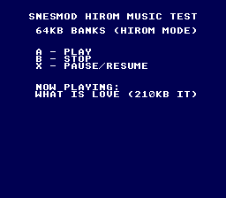

# SNESMOD HiROM Music

> HiROM music playback via SNESMOD



## Build & Run

```bash
cd $OPENSNES_HOME
make -C examples/audio/snesmod_music_hirom
```

Then open `music_hirom.sfc` in your emulator (Mesen2 recommended).

## What You'll Learn

- HiROM mode: 64KB banks instead of LoROM's 32KB
- Playing large IT modules (210KB) with SNESMOD
- smconv `-i` flag for HiROM-compatible address mapping
- SNESMOD bank crossing handled transparently by `incptr`

## Controls

| Button | Action |
|--------|--------|
| A | Play music |
| B | Stop music |
| X | Pause / Resume |

## Modules Used

| Module | Purpose |
|--------|---------|
| console | System initialization |
| sprite | OAM management |
| dma | DMA transfers |
| input | Joypad reading |
| background | BG configuration |
| text | On-screen text display |
