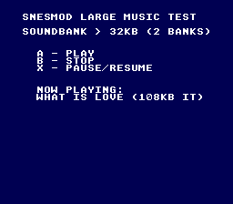

# SNESMOD Large Soundbank Music

> Large soundbank music playback (>32KB, multi-bank LoROM)



## Build & Run

```bash
cd $OPENSNES_HOME
make -C examples/audio/snesmod_music_large
```

Then open `music_large.sfc` in your emulator (Mesen2 recommended).

## What You'll Learn

- Soundbanks larger than 32KB are automatically split across ROM banks by smconv
- SNESMOD `incptr` macro handles bank boundary crossing during playback
- Single `snesmodSetSoundbank()` call works regardless of bank count

## Controls

| Button | Action |
|--------|--------|
| A | Play music |
| B | Stop music |
| X | Pause / Resume |

## Modules Used

| Module | Purpose |
|--------|---------|
| console | System initialization |
| sprite | OAM management |
| dma | DMA transfers |
| input | Joypad reading |
| background | BG configuration |
| text | On-screen text display |
