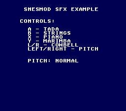

# SNESMOD Sound Effects

> Sound effect playback with pitch control. Five instrument samples on the buttons,
> three pitch settings on the D-pad. No background music -- effects only.



## Build & Run

```bash
cd $OPENSNES_HOME
make -C examples/audio/snesmod_sfx
```

Then open `sfx.sfc` in your emulator (Mesen2 recommended).

## Controls

| Button | Action |
|--------|--------|
| A | Play "Tada" |
| B | Play "Hall Strings" |
| X | Play "Honky Tonk Piano" |
| Y | Play "Marimba" |
| L / R | Play "Cowbell" |
| D-Pad Left / Right | Cycle pitch (Low / Normal / High) |

## What You'll Learn

- How to initialize SNESMOD for effects-only playback (no music)
- Loading individual sound effects from a soundbank with `snesmodLoadEffect()`
- Playing effects with volume, pan, and pitch via `snesmodPlayEffect()`
- Using three built-in pitch constants: `SNESMOD_PITCH_LOW`, `SNESMOD_PITCH_NORMAL`, `SNESMOD_PITCH_HIGH`
- Why `snesmodProcess()` must be called every frame, even without music

---

## SNES Concepts

### SNESMOD Initialization

SNESMOD is initialized in two steps: `snesmodInit()` sets up the SPC700 driver, then
`snesmodSetSoundbank()` tells it which ROM bank contains the soundbank data:

```c
snesmodInit();
snesmodSetSoundbank(SOUNDBANK_BANK);
```

`SOUNDBANK_BANK` is a constant generated by the build system from the soundbank source
files listed in the Makefile's `SOUNDBANK_SRC` variable.

### Loading and Playing Effects

Each effect must be loaded before it can be played. This transfers the BRR sample data
to the SPC700's 64KB audio RAM:

```c
for (i = 0; i < NUM_EFFECTS; i++) {
    snesmodLoadEffect(i);
}
```

To play an effect, call `snesmodPlayEffect()` with four parameters -- the effect ID,
volume (0-127), pan (0=left, 128=center, 255=right), and pitch:

```c
snesmodPlayEffect(SFX_TADA, 127, 128, pitch);
```

### The Soundbank

The soundbank is built from an Impulse Tracker `.it` file (`sfx/effectssfx.it`) that
contains five instrument samples. The `smconv` tool converts it into a binary soundbank
at build time. The `.it` file holds the raw instrument definitions but no music patterns --
this is an effects-only soundbank.

| Index | Effect | Constant |
|-------|--------|----------|
| 0 | Tada | `SFX_TADA` |
| 1 | Hall Strings | `SFX_HALL_STRINGS` |
| 2 | Honky Tonk Piano | `SFX_HONKY_TONK_PIANO` |
| 3 | Marimba | `SFX_MARIMBA_1` |
| 4 | Cowbell | `SFX_COWBELL` |

### Text Display

The on-screen HUD uses the `text` library module (`textInit`, `textLoadFont`,
`textPrintAt`, `textFlush`) for rendering control labels and the current pitch setting.
`textFlush()` is called after updating the pitch display to transfer the text buffer
to VRAM.

---

## Files

| File | Purpose |
|------|---------|
| `main.c` | SFX triggering, pitch control, text display |
| `sfx/effectssfx.it` | Impulse Tracker file with 5 instrument samples |
| `soundbank.h` | Generated header with effect constants and bank info |
| `Makefile` | Build configuration (`USE_SNESMOD := 1`, `SOUNDBANK_SRC`) |

## What's Next?

**SNESMOD Music:** [SNESMOD Music](../snesmod_music/) - Tracker music playback

**Graphics:** [Simple Sprite](../../graphics/sprites/simple_sprite/) - Display a sprite on screen
