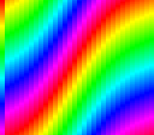

# mode4 — a 256-colour layer with offset-per-tile

**Family 2 (Backgrounds) · the offset-per-tile modes (2/4/6), after
[`mode2`](../mode2/README.md).**



Mode 4 gives you an 8bpp (256-colour) BG1, a 2bpp BG2, and — like Mode 2 —
BG3 as an offset table that lets every 8-pixel column scroll on its own. The
difference is the table: Mode 4 reads **one row** of it, so each column gets
one word, either a vertical offset or a horizontal one.

BG1 here is a diagonal 256-colour gradient. A sine wave is written into the
offset row every frame as vertical words, and the columns ripple; press
**A** and the same wave goes in as horizontal words, and the columns slide
sideways in 8-pixel steps.

## Build & Run

```bash
cd $OPENSNES_HOME
make -C examples/backgrounds/mode4
```

Open `mode4.sfc` in luna (or any SNES emulator) and press A.

## SNES Concepts

- **Mode 4**: `setMode(BG_MODE4, 0)` — BG1 8bpp, BG2 2bpp, BG3 the offset
  table (not drawn)
- **The Mode 4 offset word**: bit 15 = 1 vertical, 0 horizontal; bit 13 =
  apply to BG1 (bit 14 = BG2); the value in bits 0-9, of which a
  horizontal offset ignores the low 3 (snesdev-wiki, *Offset-per-tile*)
- **One row**: BG3 row 0 holds the 32 words; word 0 applies to the second
  visible column — the leftmost column is never offset
- **BG3VOFS picks the row**: `bgSetScroll(2, 0, 0)` reads row 0. The lib
  writes BG3's VOFS raw in Modes 2/4/6 (for a displayed layer it writes
  `y - 1`; see KNOWN_LIMITATIONS, "Vertical scroll is off by one")
- **8bpp tiles at run time**: 32 tiles from pixels with `tileEncode8bpp()`,
  a 256-entry palette computed at boot
- **Upload timing**: the row is built during the picture and DMA'd at the
  start of VBlank, as in `mode2`

## What You'll See

- Diagonal rainbow bands whose columns ripple up and down as a travelling
  wave; the leftmost column stays put.
- **A**: the columns move sideways instead, 8 pixels at a time. **A**
  again: back to vertical.

## Testing

`tools/luna-test/manifests/backgrounds_mode4.toml` checks the mode and
BG3VOFS, the vertical words at frame 100 and the horizontal words after A
(`$2008`, `$2010`… in VRAM), and that the row is uploaded in blank.

## Modules Used

| Module | Purpose |
|--------|---------|
| `console` | System initialization, `setMode`, `WaitForVBlank` |
| `dma` | Palette, tiles, map and the offset row |
| `background` | BG1 and BG3 bases, BG3 scroll |
| `input` | The A button |
| `math` | `fixSin` for the wave |
| `tile` | The 8bpp tiles, built from pixels |
