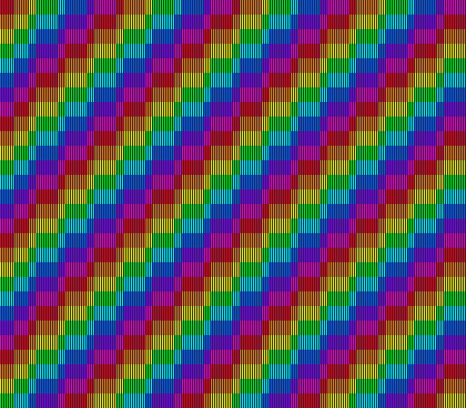

# mode6 — one hi-res layer with offset-per-tile

**Family 2 (Backgrounds) · the offset-per-tile modes (2/4/6), after
[`mode2`](../mode2/README.md) and [`mode4`](../mode4/README.md).**


*The screenshot is luna's native 512×448 output: the stripes are one
half-pixel wide.*

Mode 6 is the hi-res member of the offset-per-tile family. It gives you one
4bpp (16-colour) BG1 drawn 512 half-pixels wide, like Mode 5, and BG3 as the
offset table, read like Mode 2's: one row of horizontal offset words, one row
of vertical ones. Its tiles are always 16 half-pixels wide, and so are the
table's columns, so 32 words still cover the screen.

BG1 here is diagonal colour bands drawn in one-half-pixel stripes, which no
256-pixel mode can show. A sine wave written into the vertical row makes the
columns ripple; press **A** and the wave moves to the horizontal row, and the
columns slide sideways. **B** shows a still test card for a question the
references leave open (below).

## Build & Run

```bash
cd $OPENSNES_HOME
make -C examples/backgrounds/mode6
```

Open `mode6.sfc` in luna (or any SNES emulator) and press A, then B.

## SNES Concepts

- **Mode 6**: `setMode(BG_MODE6, 0)` — BG1 4bpp in hi-res, BG3 the offset
  table (not drawn), no BG2
- **Hi-res needs both screens**: the sub screen draws the even half-pixel
  columns and the main screen the odd ones, so BG1 goes on both
  (`setMainScreen(LAYER_BG1)` and `setSubScreen(LAYER_BG1)`), as in Mode 5
- **16-half-pixel tiles**: a map entry for character N draws N on the left
  and N + 1 on the right; this applies to BG3 too, so each offset word moves
  a 16-half-pixel column (anomie-regs, *Backgrounds / Mode 6*)
- **The table, as in Mode 2**: BG3 row 0 = horizontal words, row 1 =
  vertical words; bit 13 = apply to BG1; value in bits 0-9; column 0 is
  never offset
- **BG3VOFS picks the rows**: `bgSetScroll(2, 0, 0)`; the lib writes BG3's
  VOFS raw in Modes 2/4/6
- **4bpp tiles at run time**: 16 characters from pixels with
  `tileEncode4bpp()`, no asset
- **Upload timing**: the row is built during the picture and DMA'd at the
  start of VBlank, as in `mode2`

## What You'll See

- Diagonal rainbow bands with fine vertical stripes, whose columns ripple up
  and down as a travelling wave; the leftmost column stays put.
- **A**: the columns slide sideways instead. **A** again: back to vertical.
- **B**: the wave stops and the test card appears. **B** again: back.

## The test card: bit 3 of a hi-res offset



*luna's native capture after B: every odd column is shifted half a tile.*

In a 256-pixel mode the low 3 bits of a horizontal offset are not applied
(fullsnes `e7b0c5d598767874`: "Lower 3bit of HORIZONTAL offsets are
ignored"; snesdev-wiki `d594aeedde1b87c2`: "the fine scroll of 0-7 pixels
is retained"), so offsets move whole 8-pixel tiles. In Mode 6 the scroll counts half-pixels and a tile is 16 of them, so
bit 3 — the value 8 — falls *inside* a tile, and no reference says whether
it is applied. The card writes 8 into every odd column and 0 into the even
ones, nothing else, so the answer is in the picture:

- **luna and ares** apply it (and bsnes, by luna's team's reading of its
  code): odd columns move by half a tile, and the steps of the diagonal
  bands are cut into half steps (the image above). ares:
  `sfc/ppu/background.cpp`, `hoffset = hpixel + (hlookup & ~7) + …`
  (corpus chunk `a81897dc4e20fe4b`).
- **Mesen2** drops it: it puts the offset into a doubled scroll and halves
  the result (`Core/SNES/SnesPpu.cpp`, corpus chunk `008321f6eaec1f44`),
  so the card looks like the plain bands. luna's team measured the two disagreeing exactly on the
  columns whose offset has bit 3 set.
- **A console**: not measured yet. It is row 23 of the hardware protocol
  (`docs/HARDWARE_VERIFICATION.md`). ares and bsnes share an author, so
  their agreement is one implementation, not two witnesses.

For a game: horizontal offsets that are multiples of 16 look the same
everywhere. If you check this example in Mesen2, its wave columns differ
from luna's wherever an offset has bit 3 set; neither the example nor the
lib is at fault. The corpus note is `cartouche-fiches` chunk
`61be8d9e9e954b38`.

## Testing

`tools/luna-test/manifests/backgrounds_mode6.toml` checks the mode, both
screens and BG3VOFS, the wave in the vertical row at frame 100, then in the
horizontal row after A with the vertical row back to zero (VRAM `$6000` and
`$6040`), and that every upload lands in blank. Without the A press it
fails. `backgrounds_mode6_card.toml` checks the card: B at frame 110,
then at 140 the wave is frozen and row 0 holds `$2000`/`$2008` alternately
with row 1 zero. It pins what the ROM writes, not what the PPU draws.

## Modules Used

| Module | Purpose |
|--------|---------|
| `console` | System initialization, `setMode`, `WaitForVBlank` |
| `dma` | Palette, tiles, map and the offset rows |
| `background` | BG1 and BG3 bases, BG3 scroll |
| `input` | The A button |
| `math` | `fixSin` for the wave |
| `tile` | The 4bpp characters, built from pixels |
