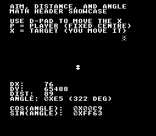

# aim_target



Live demonstration of the four math primitives a 2D action game leans on
the most: **`sqrt16`** (pixel distance), **`atan2_8`** (8-bit angle to a
target), and the **`fixCos` / `fixSin` LUTs** (project a velocity vector
along that angle). Everything updates live as the user moves the target
with the D-pad — the numbers on screen are real arithmetic, not pre-baked.

The player diamond stays anchored at the screen centre; the X follows
the D-pad. Each frame the example recomputes `dx`/`dy` from the two
positions, calls `sqrt16(dx² + dy²)` for the pixel distance, calls
`atan2_8(dy, dx)` for the 8-bit angle, then calls `fixCos` and `fixSin`
on that angle to read back the unit direction vector.

## SNES Concepts

- `<snes/math.h>` square-root and atan2 (chantier B6, 2026-05-09):
    - `sqrt16(n)` → integer floor of √n, range 0–255
    - `atan2_8(dy, dx)` → 8-bit angle in the same convention as the
      `fixSin` / `fixCos` LUTs (0 = +X, 64 = +Y, 128 = −X, 192 = −Y)
- LUT chaining — feed the `atan2_8` output back into the trig LUT to
  recover a unit direction vector that points from player to target.
  This is the canonical pattern for projectile aiming, pursuit AI,
  and any "rotate sprite to face X" code.
- Mode 0 + sprite overlay — BG1 hosts the text via the `text` module;
  the player and target are 8×8 OBJ sprites on the OBJ layer so they
  don't disturb the text display. Sprite tiles are placed at VRAM
  $4000 to keep $0000 free for the text font.

## What to Observe

The live readout panel updates every frame:

- `DX` / `DY` — signed distances from player to target
- `DIST` — `sqrt16(dx² + dy²)` in pixels (0–255)
- `ANGLE` — 8-bit angle from the player to the target (hex), with the
  equivalent in degrees in parentheses (≈ angle × 360 / 256)
- `COS` / `SIN` — 8.8 fixed-point components of the unit direction
  vector. Their values match the angle: at `ANGLE = 0x40` (90°,
  target straight south on a SNES screen) you see `COS = 0x0000`
  and `SIN = 0x0100`.

Move the X around with the D-pad and watch the entire panel react in
real time.

## How to Build

```sh
make -C examples/basics/aim_target
```

The ROM lands at `examples/basics/aim_target/aim_target.sfc`.

## Modules Used

`console`, `sprite`, `dma`, `background`, `text`, `input`, `gameloop`,
`math`.

## See also

- [`docs/tutorials/math.md`](../../../docs/tutorials/math.md) — the
  full fixed-point math tutorial, including the section on
  `sqrt16`/`atan2_8` added with chantier B6.
- [`lib/include/snes/math.h`](../../../lib/include/snes/math.h) —
  Doxygen reference for the math API.
