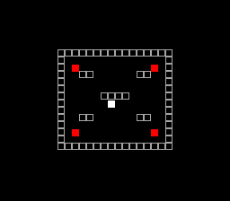

# Collision Detection Demo

> AABB sprite-vs-sprite and tile-based wall collision in a walled arena.
> Move the white square with the D-pad. Overlapping a red enemy turns both green.



## Build & Run

```bash
cd $OPENSNES_HOME
make -C examples/basics/collision_demo
```

Then open `collision_demo.sfc` in your emulator (Mesen2 recommended).

## Controls

| Button | Action |
|--------|--------|
| D-Pad | Move player sprite (2 pixels/frame) |

## What You'll Learn

- AABB collision via `collideRect()` with `Rect` struct pointers
- Tile-based wall collision via `collideTile()` with a collision map array
- Per-axis rejection for sliding along walls instead of stopping dead
- Direct `oamMemory[]` buffer writes (avoiding `oamSet()`'s 158-byte stack overhead)
- OAM high table management for X high bit and sprite size
- Palette bank swapping for visual collision feedback

---

## SNES Concepts

### AABB Collision with Rect Pointers

`collideRect()` takes two `Rect*` pointers and returns non-zero if the rectangles
overlap. The `Rect` struct holds `x`, `y`, `width`, and `height` fields:

```c
player_box.x = player_x;
player_box.y = player_y;
player_box.width = PLAYER_SIZE;
player_box.height = PLAYER_SIZE;

if (collideRect(&player_box, &enemy_box[i])) {
    collision_flags |= (1 << i);
}
```

The example checks the player against four static enemy sprites each frame, storing
results in a bitmask (`collision_flags`). Bit N set means enemy N is overlapping.

### Tile-Based Wall Collision

`collideTile()` takes four parameters: a pixel X coordinate, a pixel Y coordinate,
a pointer to the collision map array, and the map width in tiles:

```c
collideTile(map_x, map_y, collision_map, MAP_WIDTH)
```

It converts the pixel position to a tile index (dividing by 8) and returns the tile
value -- 1 for solid, 0 for passable. The example checks all four corners of the
player's 8x8 bounding box to detect wall overlap.

### Per-Axis Sliding

When a diagonal movement would collide, each axis is tested independently. If only
the X component collides, the Y movement still applies (and vice versa). This lets
the player slide along walls:

```c
if (!check_wall_collision(new_x, new_y)) {
    player_x = new_x;
    player_y = new_y;
} else {
    if (!check_wall_collision(new_x, player_y)) player_x = new_x;
    if (!check_wall_collision(player_x, new_y)) player_y = new_y;
}
```

### Direct oamMemory[] Writes

Instead of calling `oamSet()` (which has a 158-byte stack frame per call), the example
writes sprite data directly into the OAM buffer. Each sprite is 4 bytes: X low, Y,
tile number, and attribute byte (priority + palette bank):

```c
oamMemory[0] = (u8)player_x;
oamMemory[1] = (u8)player_y;
oamMemory[2] = 0;                                  /* tile 0 */
oamMemory[3] = (u8)((3 << 4) | (palette << 1));    /* priority 3, palette bank */

oam_update_flag = 1;  /* NMI handler DMAs the buffer */
```

When a collision is active, the palette bank switches from 0 (normal colors: white
player, red enemies) to 1 (green highlight for both), providing instant visual feedback.

### Collision Map Layout

The arena is a 16x14 tile grid (128x112 pixels) centered on the 256x224 screen. Walls
form the border with symmetric internal platforms:

```
1,1,1,1,1,1,1,1,1,1,1,1,1,1,1,1   (top wall)
1,0,0,0,0,0,0,0,0,0,0,0,0,0,0,1
...
1,0,0,1,1,0,0,0,0,0,0,1,1,0,0,1   (platforms)
...
1,0,0,0,0,0,1,1,1,1,0,0,0,0,0,1   (center platform)
...
1,1,1,1,1,1,1,1,1,1,1,1,1,1,1,1   (bottom wall)
```

The same data drives both the visual BG tilemap (drawn once at init) and the runtime
collision checks (read every frame).

---

## Files

| File | Purpose |
|------|---------|
| `main.c` | Collision logic, sprite management, game loop |
| `Makefile` | Build config (`LIB_MODULES := console input sprite dma collision background`) |

## What's Next?

**Game:** [Breakout](../../games/breakout/) - Complete game with collision, sprites, and levels
