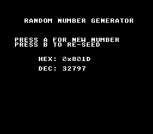

# Random Numbers

Generates and displays random 16-bit numbers on button press. Every game needs randomness — enemy spawns, item drops, damage variance, shuffle order. The SNES has no hardware RNG, so we use a software pseudo-random number generator (LFSR) seeded from the frame counter.



## What You'll Learn

- How to generate random numbers with `rand()` (returns 0-65535)
- How to seed the PRNG with `srand()` for unpredictable sequences
- Why seeding from `getFrameCount()` at a player-triggered moment gives good randomness
- How to display numbers in both hex and decimal with the text module

## Controls

| Button | Action |
|--------|--------|
| A | Generate a new random number |
| B | Re-seed the PRNG from the frame counter |

## SNES Concepts

### Why Seed Matters

`rand()` produces a deterministic sequence — the same seed always gives the same numbers. For a game, you want unpredictability. The trick: call `srand(getFrameCount())` when the player presses START on the title screen. Since the player presses at an unpredictable frame, the seed varies each playthrough.

### Using rand() in Games

```c
u16 enemy_x = rand() % 256;        // Random X position (0-255)
u16 damage = 10 + (rand() % 6);    // Damage 10-15
u8 drop = (rand() % 100) < 20;     // 20% chance of item drop
```

## Modules Used

| Module | Why it's here |
|--------|--------------|
| `console` | `consoleInit()`, `WaitForVBlank()`, NMI handler setup |
| `sprite` | OAM buffer (required by NMI handler) |
| `dma` | DMA transfers used internally by console init |
| `background` | BG layer configuration |
| `text` | `textInit()`, `textPrintAt()`, `textFlush()` for number display |
| `input` | `padPressed()` for single-press button detection |

## Build & Run

```bash
cd $OPENSNES_HOME
make -C examples/basics/random
```

Open `random.sfc` in Mesen2. Press A repeatedly, then press B and press A again — the sequence changes.
