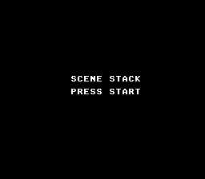

# Scene Stack

Demonstrates the opt-in `scene` framework: title → counter → pause overlay, three Scene structs swapping via `scenePush` / `scenePop` instead of a hand-rolled state machine.



## What You'll Learn

- How to split a game into `Scene` callbacks (`init` + `update`)
- How `scenePush` suspends the current scene and runs the new one's `init` once
- How `scenePop` resumes a suspended scene **without** re-running its `init`
- How `sceneRun` replaces the standard `while (1) { WaitForVBlank(); update(); }` loop

## Controls

| Where | Button | Action |
|---|---|---|
| Title | Start | Push counter scene (counter resets to 0) |
| Counter | Select | Push pause overlay (counter freezes) |
| Counter | Start | Pop back to title (counter discarded) |
| Pause | Select | Pop back to counter (counter resumes from where it was) |

## SNES Concepts

### The Scene struct

```c
typedef struct {
    void (*init)(void);    // optional, NULL skip; runs once on first push
    void (*update)(void);  // required; runs every VBlank while on top
} Scene;
```

Three callbacks live in this example: `title_init/update`, `counter_init/update`, `pause_init/update`. Each is a small function (8-15 lines) that does one thing.

### Push/pop semantics

- **Push** suspends the currently-executing scene's `update` finishes its frame, then the next VBlank dispatches to the new top scene. `init` runs exactly once on push.
- **Pop** removes the top scene; the resumed scene's `update` runs on the next VBlank — no `init` re-run, so its state survives. The counter's `counter_value` global persists across pause/resume because of this.
- The bottom of the stack is immortal. `scenePop` on a stack of size 1 is a silent no-op (the title screen can't accidentally exit).

### Why a framework instead of a switch

The hand-rolled equivalent is a `enum State current; switch (current) { ... }` plus an array for the suspend stack. ~15 lines of state-machine boilerplate per game. The framework brings it to 5: declare the Scene structs, call `sceneRun`. The runtime cost is one indirect call per frame (~20 cycles on top of `WaitForVBlank`'s overhead) — negligible against a 357K-cycle frame budget.

## How to Build

```bash
make
```

Then load `scene_stack.sfc` in your favourite SNES emulator.

## Modules Used

`console`, `sprite`, `dma`, `background`, `text`, `input`, `scene`
