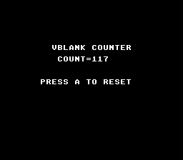

# VBlank Timer

Displays a live frame counter that increments every VBlank (60 fps NTSC, 50 fps PAL). The simplest possible real-time display on the SNES: read a hardware counter, render it as text, repeat.



## What You'll Learn

- How the NMI handler increments `frame_count` every VBlank — the heartbeat of every SNES game
- How to use the text module for real-time number display
- How `WaitForVBlank()` synchronizes the main loop to exactly 60/50 fps
- How to read input with `padPressed()` for single-press detection

## Controls

| Button | Action |
|--------|--------|
| A | Reset counter to 0 |

## SNES Concepts

### VBlank and frame_count

The SNES PPU triggers an NMI interrupt at the end of every visible frame (scanline 225). The NMI handler in `crt0.asm` increments `frame_count` — a 16-bit counter that wraps at 65535 (~18 minutes at 60 fps). This counter is the basis for all game timing: animation delays, physics steps, input polling, and audio updates all synchronize to it.

### WaitForVBlank

`WaitForVBlank()` blocks the main loop until the next NMI fires. This guarantees the game runs at a fixed frame rate. Without it, the main loop would spin freely and produce inconsistent timing.

## Modules Used

| Module | Why it's here |
|--------|--------------|
| `console` | `consoleInit()`, `WaitForVBlank()`, NMI handler with `frame_count` |
| `sprite` | OAM buffer (required by NMI handler) |
| `dma` | DMA transfers used internally by console init |
| `background` | BG layer configuration |
| `text` | `textInit()`, `textPrintAt()`, `textFlush()` for counter display |
| `input` | `padPressed()` for single-press reset button |

## Build & Run

```bash
cd $OPENSNES_HOME
make -C examples/basics/timer
```

Open `timer.sfc` in Mesen2 and watch the counter increment.
