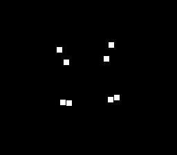

# DSP-1 Cube



A wireframe cube's 8 corners tumbling in 3D — with every rotation AND the
perspective projection computed by the **DSP-1 coprocessor** (NEC µPD77C25),
not the 65816. Each frame the CPU hands the DSP-1 a rotation matrix and 8
model-space points; the DSP-1 rotates them (`dsp1Objective`), projects them
to the screen with a true perspective divide (`dsp1Project`, configured once
by `dsp1Parameter`), and the CPU just places 8 sprites at the returned H/V.

This is the SDK's first DSP-1 example, and the third leg of the
enhancement-chip family alongside SA-1 and Super FX.

## SNES Concepts

- **DSP-1 command interface** — the CPU drives the coprocessor over two
  registers (data + status) with an RQM handshake; see `snes/dsp1.h`
- **Offloaded 3D math** — `dsp1Attitude()` builds a rotation matrix on the DSP,
  `dsp1Objective()` transforms each vertex through it, per frame
- **Hardware perspective** — `dsp1Parameter()` defines the projection plane
  (with `azs = 0x4000` the camera looks along +Y — X across, Z up), then
  `dsp1Project()` returns screen H/V and a depth scale M per point; corners
  swinging toward the camera visibly spread apart. The DSP-1 does no
  rasterisation, so the CPU just places the 8 corner sprites
- **`dsp1Present()`** — known-answer probe (Multiply 0.5×0.5 == 0.25) before
  relying on the chip; keeps the ROM well-behaved on firmware-less emulators
- **`dsp1Init()`** — issues the `$80` resync handshake so the chip starts in a
  known command-wait state

## Firmware requirement

The DSP-1 runs Sony's mask-ROM firmware. Emulators that low-level-emulate the
chip (including **luna**) need that firmware supplied — it is copyrighted and
**not shipped with the SDK**:

```bash
# put your own dump here, then it persists
cp dsp1b.rom ~/.config/luna/firmware/dsp1b.rom
# or let luna install it once (persists for future runs):
#   luna state --dsp1-rom /path/to/dsp1b.rom dsp1_cube.sfc
```

Without it, the ROM still boots but the coprocessor stays inert (the cube won't
move). High-level-emulation emulators (snes9x) run it firmware-free.

## How to Build

```bash
cd examples/chips/dsp1_cube
make
```

Run `dsp1_cube.sfc` in an emulator with the DSP-1 firmware available.

## Modules Used

`console`, `dma`, `sprite`, `dsp1`
