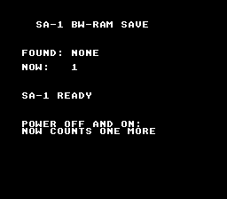

# SA-1 Save

> A boot counter kept in the SA-1's battery-backed BW-RAM: switch the
> console off and on, the number is one more.



On an SA-1 cartridge the save memory is not LoROM SRAM at `$70:0000` but the
coprocessor's BW-RAM, seen by the SNES CPU at `$40:0000` and writable only
once SBWE (`$2226`) is set — crt0 does that on an SA-1 build, and the `sram`
module addresses it. The program reads a block at boot (a magic word tells a
saved block from power-on garbage), adds one to the counter it finds, saves,
and prints both values. No input.

This is the console row for the SA-1 save path (`docs/HARDWARE_VERIFICATION.md`,
row 25); on luna the power-cycle chain `h_sa1_save_boot1.toml` →
`i_sa1_save_boot2.toml` asserts 1 then 2 across a battery file.

## SNES Concepts

- SA-1 BW-RAM as the save memory (`$40:0000` for the SNES CPU, SBWE first)
- A magic word marks a written block; a fresh chip holds garbage, not zeros
- The same `sramSaveOffset` / `sramLoadOffset` calls as `memory/save_game`

## Build & Run

```bash
make -C examples/chips/sa1_save
testing/bin/luna run examples/chips/sa1_save/sa1_save.sfc --until-frame 120 --screenshot out.png
```

## Modules

`console`, `dma`, `background`, `text`, `sa1`, `sram` (`LIB_MODULES`), with
`USE_SA1 := 1` and `USE_SRAM := 1` (header `$35`: SA-1 + battery).
