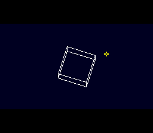

# Super FX Game Skeleton

> The shape of a Super FX game: the game runs every frame, the GSU renders
> on its own clock, the NMI puts finished frames on screen.



A crosshair follows the D-pad at 60 frames per second, and SNESMOD music
plays, while the GSU draws `superfx_3d`'s rotating cube at 30. Neither waits for the other: the
renderer runs from the GSU's code cache, so the CPU keeps the ROM and its
game loop; `gsuPresent()` double-buffers the frames, and the NMI moves each
one to VRAM a piece per VBlank, showing it only once all of it has landed.

## Build & Run

```bash
cd $OPENSNES_HOME
make -C examples/chips/superfx_game_skeleton
```

Then open `superfx_game_skeleton.sfc` in luna (or bsnes). Hold the D-pad.

## What You'll Learn

- **A job that leaves the ROM to the CPU**: `gsuCacheLoad()` +
  `gsuStartCached()`, with a renderer that has no `CACHE`, no `LJMP` and no
  ROM read (`gsu_cube.sfx`, `superfx_3d`'s renderer minus two `CACHE`)
- **Double-buffered presentation**: two framebuffers in Game Pak RAM
  (`$70:0000`, `$70:4000`), two char blocks in VRAM (`$0000`, `$2000`
  words), BG1's char base swapped only after a whole frame
- **Game Pak RAM time-sharing**: the NMI takes the RAM from the GSU for each
  transfer (SCMR `RAN = 0`) and gives it back; the GSU waits meanwhile
- **The blank window**: a 40 + 40 line letterbox (`gsuSetupHdmaBlanking`)
  lets the NMI move about 11 KB per VBlank, so a 16 KB frame lands in two
- **The game loop stays at 60 fps**: it only starts a job when the last
  one is done and the previous frame is on screen (`gsuBusy()`,
  `gsuPresentBusy()`), and never waits on either

## Architecture

```
every frame (CPU)                   when the GSU is done (CPU)
─────────────────                   ──────────────────────────
pad → crosshair → OAM               gsuWait()      RAM back to the CPU
snesmodProcess()
WaitForVBlank()                     gsuPresent()   queue it, flip gsu_scbr
                                    rotate, edges → $70:8000
NMI (every VBlank)                  gsuCacheLoad() + gsuStartCached()
──────────────────
OAM, then gsu_present_step:         GSU (from its cache)
  RAN = 0, DMA $70 → VRAM,          ───────────────────
  RAN back; whole frame landed →    clear the buffer at R8, draw 12 edges,
  BG12NBA to the new block          STOP
```

## Per-Example Files

| File | Purpose |
|------|---------|
| `main.c` | Game loop, crosshair, rotation and projection, job pacing |
| `gsu_cube.sfx` | Bresenham + PLOT renderer that runs from the code cache |
| `gsu_loader.asm` | `.incbin` of the renderer, edge upload to Game Pak RAM |

## Testing

`tools/luna-test/manifests/superfx_game_skeleton.toml` holds RIGHT for 60
frames and checks the crosshair moved 60 pixels (the game never skipped a
frame), about 30 presented frames per second and no bus violation.
`tools/luna-test/vram_dma_blank.py` checks every framebuffer byte lands in
blank, as whole frames into alternating blocks, with every swap after a
whole frame.

## Modules Used

| Module | Purpose |
|--------|---------|
| `console` | System initialization, `WaitForVBlank` |
| `sprite` | The crosshair (OAM) |
| `dma` | Palettes and the crosshair tile |
| `background` | BG1 mode, map, scroll, char base |
| `input` | The D-pad |
| `superfx` | Cache jobs, presentation, letterbox, bitmap tilemap (added by `USE_SUPERFX`) |
| `snesmod` | The music (`audio/snesmod_music`'s module; added by `USE_SNESMOD`) |
