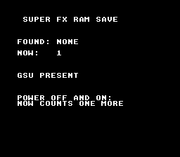

# Super FX Save

> A boot counter kept in the GSU's battery-backed Game Pak RAM: switch the
> console off and on, the number is one more.



A Super FX cartridge has one RAM, the GSU's Game Pak RAM at `$70:0000`; with a
battery it is also the save memory (header `$15`, size at `$FFBD`). The `sram`
module addresses it like any other save memory. The block lives at `$E000`,
above the two 16 KB framebuffers a game that presents frames would use
(`chips/superfx_game_skeleton`). The GSU is never started: its program here
is a single `STOP`, linked because a Super FX build carries exactly one.

This is the console row for the Super FX save path (`docs/HARDWARE_VERIFICATION.md`,
row 26); on luna the chain `j_gsu_save_boot1.toml` → `k_gsu_save_boot2.toml`
asserts 1 then 2 across a battery file.

## SNES Concepts

- Game Pak RAM: the GSU's work RAM and the battery-backed save memory
- Keep the save block out of the framebuffers the GSU draws into
- A magic word marks a written block; a fresh RAM holds garbage, not zeros

## Build & Run

```bash
make -C examples/chips/superfx_save
testing/bin/luna run examples/chips/superfx_save/superfx_save.sfc --until-frame 120 --screenshot out.png
```

## Modules

`console`, `dma`, `background`, `text`, `sram` (`LIB_MODULES`), plus `superfx`
added by `USE_SUPERFX := 1`; `USE_SRAM := 1` (header `$15`: GSU + battery).
