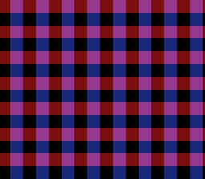

# Pseudo-Hires Blend

> A 50 % blend of two layers without colour math: SETINI bit 3 interleaves
> the sub screen and the main screen column by column.



BG1 (red horizontal bars) is on the main screen, BG2 (blue vertical bars,
scrolling) on the sub screen, and colour math is off: without pseudo-hires
the sub screen never reaches the output. With it, the PPU outputs 512
pixels per line, the sub screen on the even columns and the main screen on
the odd ones; a CRT on composite blends each pair, and so does an
emulator's 256-pixel view — purple where the bars cross. Press **A** to
toggle it.

## Build & Run

```bash
cd $OPENSNES_HOME
make -C examples/color/pseudo_hires
```

Open `pseudo_hires.sfc` in luna (or any SNES emulator) and press A.

## SNES Concepts

- **SETINI ($2133) bit 3**, pseudo-hires, through `videoSetPseudoHires()`:
  the lib keeps a shadow of the write-only register
- **Main and sub screen designation** (`setMainScreen`, `setSubScreen`)
  without colour math: the sub screen is seen only through pseudo-hires
- **The interleave**: sub screen on the even columns, main screen on the
  odd ones (snesdev-wiki, *PPU registers* and *Uncommon graphics mode
  games*; anomie's register doc; the wiki's *Backgrounds* page has the
  inverse, a known error)
- **Why use it**: a transparency effect that leaves colour math free for
  something else; the price is horizontal detail, and on a sharp RGB
  display the columns show as stripes rather than a blend
- **Tiles built at run time** with `tileEncode4bpp()` — no asset file

## What You'll See

- Purple squares where red and blue cross, half-bright red and blue
  elsewhere, black in between.
- **A**: pseudo-hires off — only the red bars remain. **A** again: back on.
- In luna's native 512-pixel output (`--native-res`), the even columns
  carry BG2's blue and the odd ones BG1's red, one by one.

## Testing

`testing/manifests/color_pseudo_hires.toml` presses A twice and
checks SETINI ($08, $00, $08), the screen designations and that BG2 keeps
scrolling.

## Modules Used

| Module | Purpose |
|--------|---------|
| `console` | System initialization, `videoSetPseudoHires()` |
| `dma` | Palettes, tiles and maps to CGRAM / VRAM |
| `background` | BG1 / BG2 char and map bases, BG2 scroll |
| `input` | The A button |
| `tile` | The two tiles, built from pixels |
