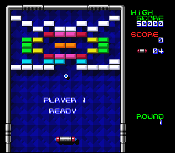

# Breakout

> A fully playable Breakout clone — ball, paddle, bricks, levels, score, and shadows.
> This is the "put it all together" example. If you can follow this one, you can make a game.



## Controls

| Button | Action |
|--------|--------|
| D-Pad Left/Right | Move paddle |
| A (hold) | Move faster |
| Start | Pause |

## Build & Run

```bash
make -C examples/games/breakout
# Open breakout.sfc in Mesen2
```

## What You'll Learn

- How to pack tilemaps in VRAM when space is tight (yes, they can overlap on purpose)
- The "RAM buffer" pattern: copy ROM to RAM so you can modify tilemaps at runtime
- Why bricks should be background tiles, not sprites (and how to destroy them live)
- The drop shadow trick that makes your sprites look 10x better with zero effort
- Atomic DMA: what happens when you *don't* update overlapping regions together (spoiler: pink flash)
- Grid-based collision without testing 100 bricks individually

---

## Walkthrough

### 1. Lights Off, Load Everything

The very first thing the game does is kill the display:

```c
REG_INIDISP = 0x80;  // Force blank — screen goes black, VRAM is ours

dmaCopyVram(tiles1, 0x1000, 0x0F00);  // 3840 bytes of BG tiles
dmaCopyVram(tiles2, 0x2000, 0x0250);  // 592 bytes of sprite tiles
```

> **Why force blank?** Outside of VBlank, the PPU owns the VRAM bus for rendering.
> Writes during active display are silently *ignored* — not queued, not buffered, just gone.
> Setting bit 7 of INIDISP shuts off the renderer entirely. Now you can DMA as much
> as you want without racing the clock.

### 2. The VRAM Map — A Deliberate Overlap

Here's where it gets interesting. This game's VRAM layout has an intentional overlap:

```
$0000─$07FF  BG1 tilemap (playfield, HUD, bricks)
$0400─$0BFF  BG3 tilemap (background pattern)   ← overlaps BG1!
$1000─$1EFF  BG tiles (borders, bricks, font)
$2000─$224F  Sprite tiles (ball, paddle)
```

BG1's tilemap is 32x32 entries but the game only uses the top 16 rows. Rows 16-31
(addresses `$0400`-`$07FF`) sit there unused — so we slide BG3's tilemap right into
that gap. Free 1 KB of VRAM, no catch.

Well... one catch:

> **The pink flash incident.** During the port, level transitions showed a single frame
> of garbled colors. The culprit? BG1 and BG3 tilemaps were uploaded in *separate* VBlanks.
> The frame between them had BG3 half-overwritten by BG1. Fix: both transfers in the
> same VBlank, always.

```c
WaitForVBlank();
dmaCopyVram((u8 *)blockmap, 0x0000, 0x800);  // BG1: 2 KB
dmaCopyVram((u8 *)backmap,  0x0400, 0x800);  // BG3: 2 KB
```

That's ~4 KB in one VBlank. Tight, but PVSnesLib routinely does 4.5 KB+. It works.

### 3. ROM is Read-Only (The RAM Buffer Pattern)

Bricks get destroyed. Score changes. Colors cycle each level. You can't modify ROM,
so you copy everything to RAM and work on the copies:

```c
extern u16 blockmap[];  // Writable copy of BG1 tilemap  — 2 KB at $0800
extern u16 backmap[];   // Writable copy of BG3 tilemap  — 2 KB at $1000
extern u16 pal[];       // Writable copy of the palette   — 512 bytes at $1800

mycopy((u8 *)blockmap, bg1map, 0x800);
mycopy((u8 *)backmap,  bg2map, 0x800);
mycopy((u8 *)pal,      palette, 0x200);
```

> **Why are these in `data.asm` instead of C?** They're big — 2 KB each. If you declared
> them as C static arrays, the compiler would place them around `$00A0`, which crashes into
> the OAM buffer at `$0300`-`$051F`. In assembly, we pin them to `$0800` with
> `.RAMSECTION ... ORGA $0800 FORCE`. Problem solved.

### 4. Bricks Are Not Sprites

The SNES gives you 128 sprites. A full brick wall has 100 bricks. You *could* use sprites,
but you'd blow most of your budget on rectangles that don't even move.

The much better approach: bricks are **background tiles**. Each brick is 2 tiles wide
(16 pixels), and the palette number encodes its color:

```c
// Tilemap entry: bits 0-9 = tile number, bits 10-12 = palette
blockmap[offset]     = 13 + (color << 10);  // Left half
blockmap[offset + 1] = 14 + (color << 10);  // Right half
```

Destroying a brick? Write zeroes (transparent tile), DMA the tilemap, done:

```c
blockmap[0x42 + idx] = 0;
blockmap[0x43 + idx] = 0;
```

One frame later the brick is gone. No sprite management, no flicker, no limits.

### 5. Grid Collision (Don't Loop Over 100 Bricks)

Instead of checking every brick against the ball, convert the ball's pixel position
to grid coordinates and look up the single cell it's in:

```c
bx = (pos_x - 14) >> 4;  // ÷16 (brick width)
by = (pos_y - 14) >> 3;  // ÷8  (brick height)

b = bx + (by << 3) + (by << 1) - 10;  // index in 10×10 array
```

> **65816 trick:** `by * 10` is written as `(by << 3) + (by << 1)` — that's `by*8 + by*2`.
> A shift is 2 cycles. A software multiply is ~50. On this CPU, you learn to love
> bit shifts real fast.

If `blocks[b] != 8`, there's a brick there. One array lookup instead of 100 comparisons.

### 6. Paddle Bounce Physics

Where the ball hits the paddle determines the bounce angle. Four zones, 7 pixels each:

```c
k = (pos_x - px) / 7;
switch (k) {
    case 0: vel_x = -2; vel_y = -1; break;  // Left edge  — sharp angle
    case 1: vel_x = -1; vel_y = -2; break;  // Left-center — shallow
    case 2: vel_x =  1; vel_y = -2; break;  // Right-center — shallow
    default: vel_x =  2; vel_y = -1; break;  // Right edge — sharp angle
}
```

This is what makes Breakout feel like Breakout. Without it, the ball just bounces
at the same angle every time and the game plays itself.

### 7. Drop Shadows (Free Depth)

Every visible sprite has a shadow twin: same shape, darker palette, offset a few pixels
down-right, drawn at a lower priority:

```c
// Ball — priority 3 (front)
oamSet(1, pos_x, pos_y, 20 | 256, 0, 3, 0);

// Ball shadow — priority 1 (behind), offset +3/+3
oamSet(6, pos_x + 3, pos_y + 3, 21 | 256, 0, 1, 0);
```

It costs 5 extra sprites (one per visible piece), but the result looks surprisingly polished
for something so simple.

> **What's `tile | 256`?** Sprite tiles live at VRAM `$2000` (the secondary name table,
> selected by `REG_OBJSEL = 0x00`). Bit 8 of the tile number picks this table.
> Without it, the PPU looks for tiles at `$0000` — which is your tilemap. You'll get
> garbage sprites and spend an hour debugging before you remember this bit.

### 8. Color Cycling Between Levels

Each new level swaps CGRAM colors 8-15 with one of 7 pre-made color sets:

```c
if (color < 6) color++;
else color = 0;

mycopy((u8 *)pal + 16, backpal + color * 16, 0x10);

WaitForVBlank();
dmaCopyCGram((u8 *)pal, 0, 256 * 2);
```

Same tiles, same tilemap, completely different look. This is why the SNES palette
system is so powerful — recoloring is essentially free.

### 9. The Game Loop

One iteration per frame, clean and predictable:

```c
static void run_frame(void) {
    pad0 = pad_keys[0];    // Read joypad (filled by NMI handler every frame)
    handle_pause();
    move_paddle();
    move_ball();

    if (pos_y > 195)
        check_paddle();     // Bottom zone — paddle collision
    else
        check_bricks();     // Upper zone — brick collision

    draw_screen();          // Update sprite positions
    WaitForVBlank();
    oamUpdate();            // Push OAM buffer to hardware
}
```

> Note that we read `pad_keys[0]` directly — not through `padPressed()`. This is the
> raw buffer that the NMI handler fills every frame. Sometimes the simple way is
> the right way.

---

## Tips & Tricks

- **Getting a pink flash on level change?** Your overlapping tilemap DMAs are split
  across two VBlanks. Put them both after the same `WaitForVBlank()` call.

- **Sprite 0 looks glitched?** Known issue related to WRAM/OAM mirroring.
  Just start at index 1 and hide sprite 0 with `oamHide(0)`. Not glamorous, but it works.

- **Why `mycopy()` instead of `memcpy()`?** Standard memcpy can have issues with
  cross-bank addressing on the 65816. The three-line `while(len--)` version is dumb
  but reliable for bank 0 addresses.

- **Why are loop variables global?** `static u8 i, j, k;` at file scope reduces stack
  pressure. On the 65816, stack-relative addressing is slower than direct/zero-page access.
  In a game loop running 60 times per second, this matters.

---

## Go Further

- **Add power-ups:** When a brick breaks, spawn a falling sprite. Test collision with
  the paddle to activate bonuses (wide paddle, slow ball, multiball).

- **Add sound:** Play a BRR sample on each bounce. Check out
  [sfx_demo](../../audio/sfx_demo/) for the SPC700 pattern.

- **Design your own levels:** Edit `brick_map` in `data.asm`. Values 0-7 are colors,
  8 is empty. The grid is 10 columns x 10 rows — go wild.

- **Next example:** [LikeMario](../likemario/) — scrolling camera, platformer physics,
  and tile streaming.

---

## Under the Hood: The Build

### The Makefile

```makefile
TARGET      := breakout.sfc
CSRC        := main.c
ASMSRC      := data.asm
USE_LIB     := 1
LIB_MODULES := console sprite dma background input
```

### Why `ASMSRC` for a Game?

`data.asm` serves two purposes in Breakout:

**1. ROM asset storage** — tile data, tilemaps, and palettes are pre-converted binary
files included via `.INCBIN`:

```asm
.SECTION ".bg1tiles" SUPERFREE
tiles1: .INCBIN "res/tiles1.dat"    ; 3840 bytes of BG tiles
.ENDS
```

`SUPERFREE` lets the linker place each section in any ROM bank with space. A typical
game has 10-30 KB of tile data — far too much for a single bank.

**2. Pinned RAM buffers** — the writable tilemap copies need specific addresses:

```asm
.RAMSECTION ".blockmap" BANK $7E SLOT 2 ORGA $0800 FORCE
blockmap: DSB 2048    ; BG1 tilemap copy — $0800-$0FFF
.ENDS
```

`ORGA $0800 FORCE` pins the buffer at exactly address `$0800` in bank $7E WRAM.
This is necessary because the game modifies tilemaps at runtime (destroying bricks,
cycling colors), and C arrays can't be reliably placed at specific addresses.

> **Why not just use C arrays?** Two problems. First, the compiler places C arrays
> in low WRAM ($0000-$01FF range), which collides with the OAM buffer at $0300.
> Second, for overlapping VRAM regions (BG1 and BG3 share $0400-$07FF), you need
> precise control over DMA source addresses — assembly gives you that control.

### Pre-Converted Assets

The `res/` folder contains `.dat` files — raw binary data ready for DMA to VRAM.
These were originally converted from PVSnesLib's asset pipeline. No `gfx4snes` step
in the Makefile because the conversion was done once, offline, and the results checked
into the repository.

For a new game, you'd typically add a gfx4snes rule:

```makefile
GFXSRC := res/tiles.png res/sprites.png
```

This tells `make/common.mk` to run `gfx4snes` on each PNG, producing `.pic` (tiles),
`.pal` (palette), and `.map` (tilemap) files.

### Why These Modules?

| Module | Why it's here |
|--------|--------------|
| `console` | PPU init, NMI handler, `WaitForVBlank()` |
| `sprite` | OAM buffer for ball, paddle, and drop shadows (10 sprites total) |
| `dma` | `dmaCopyVram()` for tilemap uploads, `dmaCopyCGram()` for palette, OAM DMA |
| `background` | `bgSetMapPtr()` for configuring BG1/BG3 tilemap addresses |
| `input` | Joypad buffers — though Breakout reads `pad_keys[0]` directly |

---

## Technical Reference

| Register | Address | Role in this example |
|----------|---------|---------------------|
| INIDISP  | $2100   | Force blank during initial load |
| BGMODE   | $2105   | Mode 1 (BG1 4bpp, BG3 2bpp) |
| BG1SC    | $2107   | BG1 tilemap at $0000 |
| BG3SC    | $2109   | BG3 tilemap at $0400 |
| BG12NBA  | $210B   | BG1 tile data at $1000 |
| BG34NBA  | $210C   | BG3 tile data at $2000 |
| TM       | $212C   | Enable OBJ + BG3 + BG1 (`0x15`) |
| OBJSEL   | $2101   | 8x8 sprites, secondary name table at $2000 |

## Files

| File | What's in it |
|------|-------------|
| `main.c` | All game logic (~770 lines) |
| `data.asm` | RAM buffers at `$0800`, string constants, asset includes |
| `res/tiles1.dat` | BG tiles: borders, bricks, font |
| `res/tiles2.dat` | Sprite tiles: ball, paddle, shadows |
| `res/bg1map.dat` | Playfield tilemap |
| `res/bg2map.dat` | 4 background patterns (one per level, 2 KB each) |
| `res/palette.dat` | Full 256-color palette |
| `res/backpal.dat` | 7 color sets for level cycling |
| `Makefile` | `LIB_MODULES := console sprite dma background input` |

## Credits

- Original game: Ulrich Hecht (SNES SDK)
- PVSnesLib port: alekmaul
- OpenSNES port: OpenSNES team
