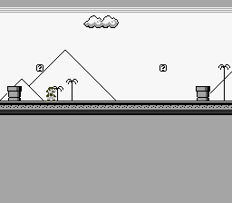

# LikeMario

> A side-scrolling platformer with gravity, tile collision, and a camera that follows
> the player across a world bigger than the screen. This is the real deal.



## Controls

| Button | Action |
|--------|--------|
| D-Pad Left/Right | Walk |
| A | Jump (hold Up + A for higher jump) |

## Build & Run

```bash
make -C examples/games/likemario
# Open likemario.sfc in Mesen2
```

## What You'll Learn

- How tile streaming works — loading new map columns into VRAM as the camera scrolls
- Fixed-point physics: gravity, acceleration, and sub-pixel movement on a CPU with no multiply
- Tile-based collision detection with O(1) lookups (no sprite-to-sprite checks)
- The double-buffer pattern: stage data in RAM during active display, flush to VRAM during VBlank
- Why the camera position and the scroll register are two different things

---

## Walkthrough

### 1. The World Is Bigger Than the Screen

The SNES screen is 256 pixels wide — 32 tiles. But the LikeMario map is hundreds of
tiles wide. The PPU's tilemap is only 32x32 entries, so you can't load the entire world
at once. Instead, the game streams new tile columns into VRAM as the camera scrolls.

Think of the tilemap as a circular buffer. As the camera moves right, the leftmost
column scrolls off-screen. That column's VRAM slot gets overwritten with the next
column from the map. The player never sees the swap because it happens off-screen.

### 2. The VRAM Layout

```c
#define VRAM_SPR_LARGE  0x0000   // Sprite graphics
#define VRAM_SPR_SMALL  0x1000   // Sprite graphics (small)
#define VRAM_BG_TILES   0x2000   // Background tileset
#define VRAM_BG_MAP     0x6800   // Background tilemap (32x32)
```

The tileset (the pixel art for every unique tile) lives at `$2000`. The tilemap
(which tile goes where) lives at `$6800`. Sprites get `$0000`-`$1FFF`. This layout
avoids overlaps and leaves room for the 32x32 tilemap to wrap around.

### 3. Streaming: The Column Pipeline

Streaming happens in three stages, split across the frame:

**During active display** (CPU is free, PPU is drawing):
```c
static void map_prepare_column(u16 map_col, u16 vram_col) {
    /* Fill col_buffer[32] from map data — RAM only, no VRAM access */
    for (row = 0; row < map_height; row++) {
        col_buffer[row] = map_row_ptrs[row][map_col];
    }
    col_pending = 1;  /* Flag: "I have data ready" */
}
```

**During VBlank** (PPU is idle, VRAM is writable):
```c
static void map_flush_column(void) {
    if (!col_pending) return;
    REG_VMAIN = 0x81;  /* Auto-increment vertically (down the column) */
    /* Write col_buffer to VRAM */
    col_pending = 0;
}
```

**The decision logic** (every frame):
```c
static void map_update(void) {
    tile_x = camera_x >> 3;
    if (tile_x != last_tile_x) {
        /* Camera moved — stream the column 32 tiles ahead */
        new_col = tile_x + 32;
        map_prepare_column(new_col, new_col & 31);
        last_tile_x = tile_x;
    }
}
```

> **Why +32, not +31?** The screen shows tiles 0-31, but tile 32 is partially visible
> at the right edge (the camera rarely sits on an exact tile boundary). Without that
> extra column, you'd see a blank strip flickering at the right side during scrolling.
> This was a bug in the original port that took a while to track down.

### 4. Fixed-Point Physics

The 65816 has no multiply instruction and runs at 3.58 MHz. You can't afford
floating-point anything. Instead, positions and velocities use **8-bit fixed-point**:
the high byte is the pixel position, the low byte is the fractional part (1/256th
of a pixel).

```c
static s16 mario_xvel;     /* Velocity: units of 1/256 pixel per frame */
static u8  mario_xfrac;    /* Fractional pixel accumulator */

/* Apply velocity */
new_frac = (s16)mario_xfrac + mario_xvel;
mario_x += asr8(new_frac);     /* Integer part → pixel position */
mario_xfrac = new_frac & 0xFF; /* Fractional part → carry forward */
```

At 60fps, a velocity of `0x0140` (= 1.25 pixels/frame) moves Mario at 75 pixels per
second. The fractional accumulator means Mario can move at speeds finer than 1 pixel
per frame — essential for smooth deceleration.

> **What's `asr8()`?** Arithmetic shift right by 8 — effectively dividing by 256 while
> preserving the sign. The compiler's `>>` operator uses logical shift (LSR), which
> fills the top bit with 0 instead of the sign bit. For negative velocities (moving left),
> this gives the wrong answer. `asr8()` is a workaround that inverts, shifts, and inverts
> back.

### 5. Gravity in Two Lines

```c
mario_yvel += GRAVITY;                /* Accelerate downward every frame */
if (mario_yvel > 0x0400) mario_yvel = 0x0400;  /* Terminal velocity */
```

`GRAVITY = 48` (in 1/256 pixel/frame units). That's roughly 0.19 pixels/frame of
acceleration — feels like a Mario game because these constants were tuned by PVSnesLib
to match the original's feel.

Jumping sets a negative Y velocity:
```c
if (padPressed(0) & KEY_A) {
    if (padHeld(0) & KEY_UP)
        mario_yvel = -MARIO_HIJUMPING;  /* -0x0594: high jump */
    else
        mario_yvel = -MARIO_JUMPING;    /* -0x0394: normal jump */
}
```

### 6. Tile-Based Collision

No bounding boxes, no sprite lists. The world is made of tiles, and collision is a
lookup:

```c
static u8 map_get_tile_prop(s16 px, s16 py) {
    tx = px >> 3;
    ty = py >> 3;
    if (tx < 0 || ty < 0 || tx >= map_width || ty >= map_height)
        return T_SOLID;  /* Out of bounds = wall */
    tile_id = map_row_ptrs[ty][tx] & 0x03FF;  /* Mask off flip/palette bits */
    return tile_props[tile_id];
}
```

`map_row_ptrs[]` is precomputed at load time — one pointer per row, so looking up a
tile is just an array index. No multiplication, no searching. O(1).

To check if Mario is standing on ground, test two points at his feet:

```c
left  = map_get_tile_prop(mario_x + 2,  mario_y + 16);
right = map_get_tile_prop(mario_x + 13, mario_y + 16);
if (left == T_SOLID || right == T_SOLID) {
    mario_y = ((mario_y + 16) & 0xFFF8) - 16;  /* Snap to tile grid */
    mario_yvel = 0;
    mario_action = ACT_STAND;
}
```

Two points, not one, because Mario is 16 pixels wide. Testing only the center would
let him hang off ledges with half his body in mid-air.

### 7. The Main Loop

One frame, one iteration. Game logic runs during active display, VRAM writes during VBlank:

```c
while (1) {
    /* Active display — game logic (no VRAM access) */
    mario_handle_input();
    mario_apply_physics();
    mario_collide_vertical();
    mario_collide_horizontal();
    mario_clamp_and_transition();
    mario_animate();
    mario_update_camera();
    map_update();                        /* Stage column in RAM */

    oamInitDynamicSpriteEndFrame();

    /* VBlank — hardware updates */
    WaitForVBlank();
    map_flush_column();                  /* Write staged column to VRAM */
    bgSetScroll(0, camera_x, 0);        /* Update scroll register */
    oamVramQueueUpdate();               /* Upload sprite tiles */
}
```

The split is strict: everything above `WaitForVBlank()` touches only RAM.
Everything below it writes to hardware. Break this rule and you get visual corruption.

---

## Tips & Tricks

- **Mario falls through the floor?** Check your collision points. If `mario_y + 16`
  overshoots by even one pixel, the tile lookup returns the row below the floor — empty
  space — and Mario keeps falling.

- **Tiles missing at the right edge?** Your streaming offset is wrong. It must be
  `tile_x + 32`, not `tile_x + 31`. The 33rd tile is partially visible.

- **Mario slides after stopping?** That's intentional — deceleration. The velocity
  decreases by a fixed amount each frame until it reaches zero. Remove the deceleration
  code and Mario stops instantly (feels stiff).

- **Scrolling tears or flickers?** `bgSetScroll()` must happen during VBlank. If it's
  called during active display, the top and bottom halves of the screen scroll by
  different amounts for one frame.

---

## Go Further

- **Add enemies:** Use a second sprite with its own collision box. Check overlap with
  Mario each frame. Start simple — a Goomba that walks left until it hits a wall.

- **Add coins:** Mark certain tiles as collectible in `tile_props[]`. When Mario touches
  one, replace the tilemap entry with an empty tile and increment a counter.

- **Add sound:** The assets include `mariojump.brr` (a jump sound effect) and
  `overworld.it` (music). Wire them up with SNESMOD — see
  [SNESMOD Music](../../audio/snesmod_music/) for the pattern.

- **Study the physics:** Change `GRAVITY`, `MARIO_ACCEL`, and `MARIO_JUMPING`. Small
  tweaks completely change how the game feels. This is how real platformers are tuned.

---

## Under the Hood: The Build

### The Makefile

```makefile
TARGET      := likemario.sfc
CSRC        := main.c
ASMSRC      := data.asm
USE_LIB     := 1
LIB_MODULES := console sprite sprite_dynamic sprite_lut dma input background
```

### Asset Conversion with gfx4snes

The Makefile includes custom rules for two different asset types:

```makefile
# Background tiles: 8x8, 4bpp, 16 colors
tiles.pic tiles.pal: tiles.png
	$(GFX4SNES) -s 8 -o 16 -u 16 -p -m -i $<

# Mario sprites: 16x16, 4bpp, 16 colors
mario_sprite.pic mario_sprite.pal: mario_sprite.bmp
	$(GFX4SNES) -s 16 -o 16 -u 16 -p -t bmp -i $<
```

| Flag | Meaning |
|------|---------|
| `-s 8` / `-s 16` | Tile size (8x8 for backgrounds, 16x16 for sprites) |
| `-o 16` | Palette offset: start at color 16 in CGRAM |
| `-u 16` | Use up to 16 unique colors |
| `-p` | Generate palette file (`.pal`) |
| `-m` | Generate tilemap file (`.map`) — only for backgrounds |
| `-t bmp` | Input format is BMP (default is PNG) |
| `-i` | Input file |

### Why So Many Modules?

| Module | Why it's here |
|--------|--------------|
| `console` | PPU init, NMI handler, `WaitForVBlank()` |
| `sprite` | OAM buffer for Mario |
| `sprite_dynamic` | VRAM queue for animated sprite frames |
| `sprite_lut` | Tile offset calculations for the dynamic engine |
| `dma` | Bulk transfers: tile data, palettes, OAM buffer |
| `input` | `padHeld()`, `padPressed()` — NMI handler fills the buffers |
| `background` | `bgSetScroll()`, `bgSetGfxPtr()`, `bgInitTileSet()` |

### Data Placement

`data.asm` uses two different section types for a reason:

```asm
; Graphics — accessed only via DMA, can be in any ROM bank
.SECTION ".rodata1" SUPERFREE
tiles_til:        .INCBIN "tiles.pic"
mario_sprite_til: .INCBIN "mario_sprite.pic"
.ENDS

; Map data — accessed directly by C code, must be in bank $00
.SECTION ".rodata2" SEMIFREE BANK 0
mapmario:    .INCBIN "BG1.m16"       ; Tilemap (u16 per tile)
tilesetatt:  .INCBIN "map_1_1.b16"   ; Collision properties
.ENDS
```

The map data is in `SEMIFREE BANK 0` because the compiler generates `lda.l $0000,x`
for array accesses — which always reads from bank $00. If the map were in bank $01,
every tile lookup would return garbage.

---

## Technical Reference

| Register | Address | Role in this example |
|----------|---------|---------------------|
| BGMODE   | $2105   | Mode 1 (BG1 4bpp for the world) |
| BG1SC    | $2107   | BG1 tilemap at $6800 |
| BG12NBA  | $210B   | BG1 tiles at $2000 |
| BG1HOFS  | $210D   | Horizontal scroll (= camera_x) |
| VMAIN    | $2115   | VRAM increment mode ($81 = vertical for column writes) |
| TM       | $212C   | Enable OBJ + BG1 |
| INIDISP  | $2100   | Force blank during init |

## Files

| File | What's in it |
|------|-------------|
| `main.c` | All game logic: physics, collision, streaming, camera (~493 lines) |
| `data.asm` | ROM assets: tiles, sprites, palettes, map data, collision table |
| `tiles.png` | Background tileset source (8x8 tiles) |
| `mario_sprite.bmp` | Sprite sheet source (16x16 frames) |
| `BG1.m16` | World tilemap (tile indices + flip/palette bits) |
| `map_1_1.b16` | Per-tile collision properties (solid/empty) |
| `overworld.it` | Music file (Impulse Tracker, not yet wired up) |
| `mariojump.brr` | Jump sound effect (BRR, not yet wired up) |
| `Makefile` | `LIB_MODULES := console sprite sprite_dynamic sprite_lut dma input background` |

## Credits

- Original: alekmaul (PVSnesLib example)
- Tileset and sprites: community assets
