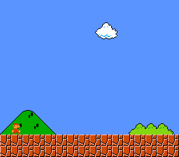

# Map and Objects

A scrolling platformer that combines the **map engine** (tile-based world scrolling)
with the **object engine** (entity management with physics and collision). A player
character (Mario) walks and jumps through a side-scrolling level populated with
enemies (Goombas and Koopa Troopas) that patrol back and forth. This example
demonstrates how real SNES games organize their world and entity logic.



## What You'll Learn

- How to use the map engine for tile-based level scrolling with collision data
- How to use the object engine to manage multiple entities with init/update callbacks
- How to implement enemy AI with patrol boundaries and animation
- How to build a multi-file C project on the SNES (separate .c files per entity)
- How the dynamic sprite engine streams sprite tiles into VRAM on demand

## SNES Concepts

### Map Engine and Tile Collision

The SNES PPU renders backgrounds from tilemaps in VRAM, but it has no built-in
concept of "solid ground." The map engine bridges this gap by maintaining a
collision attribute table (`tilesetatt` / `.b16` file) that marks each tile as
solid, passable, or hazardous. When `objCollidMap()` is called, it checks the
object's position against this table and adjusts velocity accordingly -- stopping
downward movement when standing on a solid tile, for example. The tilemap sits at
VRAM $6800 in a 64x32 layout (`SC_64x32`), giving a world 512 pixels wide --
wider than the 256-pixel screen, which is what enables scrolling.

### Object Engine

The object engine manages a pool of game entities. Each object type registers two
callbacks: an **init** function and an **update** function. These callbacks are
registered in assembly (`data.asm`) because the 65816 requires 24-bit addresses
(16-bit pointer + 8-bit bank byte) and the C compiler only emits 16-bit pointers.
Each frame, `objUpdateAll()` iterates over all active objects, loads their state
into `objWorkspace`, and calls their update function.

### Dynamic Sprites

Unlike static sprite allocation where tiles live at fixed VRAM addresses, the
dynamic sprite engine (`oamInitDynamicSprite`, `oamDynamic16Draw`) uploads only the
tiles that are visible each frame. This is essential when you have multiple animated
characters, since SNES OBJ VRAM is limited to 32 KB. Sprite graphics are stored in
ROM and streamed to VRAM as needed during VBlank via `oamVramQueueUpdate()`.

## Controls

| Button | Action |
|--------|--------|
| D-Pad Left/Right | Walk |
| A | Jump (short hop) |
| Up + A | High jump |

## How It Works

### 1. Initialize the Map and Sprite System

The tileset is loaded to VRAM $2000, and the tilemap pointer is set to $6800
with a 64x32 tile layout. The dynamic sprite engine is initialized with large
sprites at VRAM $0000 and small sprites at $1000.

```c
bgInitTileSet(0, &tileset, &tilesetpal, 0,
              (&tilesetend - &tileset), 16 * 2, BG_16COLORS, 0x2000);
bgSetMapPtr(0, 0x6800, SC_64x32);
oamInitDynamicSprite(0x0000, 0x1000, 0, 0, OBJ_SIZE8_L16);
```

### 2. Register Object Types in Assembly

Each object type (Mario=0, Goomba=1, Koopa Troopa=2) has its init and update
function pointers stored with correct bank bytes. This must be done in assembly
because C cannot express 24-bit far pointers:

```c
extern void objRegisterTypes(void);
objRegisterTypes();
```

### 3. Load Objects from Map Data

Objects are defined in the level editor and stored in a `.o16` file. The object
engine parses this data, calling each type's init function to spawn entities at
their map positions:

```c
objLoadObjects((u8 *)&objmario);
mapLoad((u8 *)&mapmario, (u8 *)&tilesetdef, (u8 *)&tilesetatt);
```

### 4. Main Loop: Update, Draw, Sync

Every frame: update the map scroll state, update all objects (physics + AI),
finalize sprite allocation, wait for VBlank, then flush tilemap and sprite
changes to VRAM:

```c
while (1) {
    mapUpdate();
    objUpdateAll();
    oamInitDynamicSpriteEndFrame();
    WaitForVBlank();
    mapVblank();
    oamVramQueueUpdate();
}
```

### 5. Enemy AI (Goomba Example)

Each Goomba patrols between `xmin` and `xmax` boundaries. A frame counter
triggers animation and direction changes every 10 ticks. Screen position is
computed by subtracting the camera scroll (`x_pos`, `y_pos`):

```c
goombax = goombax - x_pos;
oambuffer[goombanum].oamx = goombax;
oamDynamic16Draw(goombanum);
```

## Project Structure

```
mapandobjects/
├── main.c             — Initialization, main loop, map/object engine setup
├── mario.c / .h       — Player: input, physics, walk/jump/fall animation
├── goomba.c / .h      — Goomba enemy: patrol AI, 2-frame animation
├── koopatroopa.c / .h — Koopa Troopa: 2-sprite composite, flip on turn
├── data.asm           — ROM data + object type registration (ASM)
├── Makefile           — Build config (4 C files, 8 library modules)
└── res/               — Tileset, sprite sheets, level data (.m16/.o16/.t16/.b16)
```

## Build & Run

```bash
cd $OPENSNES_HOME
make -C examples/games/mapandobjects
```

Then open `mapandobjects.sfc` in your emulator (Mesen2 recommended).
