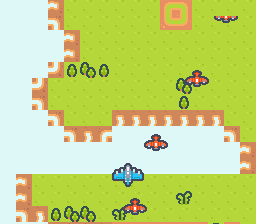

# shmup_1942

Vertical "1942-style" shoot 'em up built iteratively on Kenney's CC0
*Pixel Shmup* pack. Lands in stages so each commit is a working ROM.



## Roadmap status

| Stage | What it added |
|-------|---------------|
| S1 | gfx4snes pipeline + procedural land-with-water-channels |
| S2 | 256×512 scene + SC_32x64 + vertical auto-scroll |
| S3 | Player ship (sprite) + D-pad movement |
| S4 | Enemy spawn pool (≤8 simultaneous) |
| S5 | Bullets + AABB collision |
| S5.2 *(this stage)* | Bullet despawn fix — clears top of screen properly |
| **S6** *(open chantier)* | HUD on BG3 (deferred — see below) |

## Bullet despawn fix (S5.2)

Earlier the bullet's `despawn` test was `y < -BULLET_SPRITE` (= `-32`).
That left the bullet "alive" all the way down to the moment its
sprite-anchor `y` reached `-32`, but the actual visible ball pixels
(canvas y=4..11 of the 32×32 sprite) had already cleared the top of
the screen at `y ≈ -12`. Between those two thresholds, the SNES
8-bit OAM `y` byte wrapped (`(u8)(-33) = 223`) and the bullet
flashed at the *bottom* of the screen for one frame before despawning.

Symptom from the user POV: "bullets stop before reaching the top of
the screen". Fix in code: despawn at `y < -12`, just after the
visible ball exits the top of the playfield.

## Open chantier — S6 HUD on BG3

I attempted a BG3 + `text` module HUD (score / lives) and it produced
two symptoms I couldn't resolve in one session:

1. **Bank $00 ROM is razor-tight.** The `text` module + a couple of
   string-literal labels (`"S"` / `"L"`) bring bank-0 down to 12 bytes
   free, below the 16-byte fail threshold. Even tiny strings spill to
   bank 1 = garbage when read. Workaround: use `textPutChar('S')`
   with char literals (no string in ROM).
2. **BG3 enable hides BG1.** As soon as `setMainScreen` includes
   `TM_BG3`, the procedural terrain disappears and the screen turns
   solid backdrop colour, regardless of:
   - BG3 priority bit (`BG3_MODE1_PRIORITY_HIGH` on/off)
   - BG3 tile priority in tilemap entries (`text_config.priority = 0` or `1`)
   - Whether `textInit` / `textLoadFont` are called at all
   - VRAM address alignment for BG3 tiles + tilemap (verified at
     word-vs-byte level against `mode1_bg3_priority` and `text_test`)
   Other layers (BG1, sprites) keep working; the HUD text itself
   renders correctly on BG3. There's just a mystery interaction
   between enabling BG3 and BG1's visibility that the surrounding
   examples in the repo don't trigger and that I couldn't find in
   the SDK docs.

The S6 work was reverted to keep the ROM in a known-good state. A
future chantier can pick up the investigation — likely candidates:
the BG3 tile priority bit semantics, REG_BG3SC quirks at non-default
word boundaries, or a CGRAM colour-math interaction with the HUD
palette slot.

## Architecture (current)

```
VRAM (BYTE / WORD addresses)
  $0000 / $0000  BG1 tilemap          (SC_32x64, 4 KB)
  $4000 / $2000  BG1 tiles            (49 unique 8×8)
  $C000 / $6000  Sprite tiles         (player + enemy + bullet)

CGRAM
   0-15  BG1 palette 0 (terrain)
 128-143 sprite palette 0 (player)
 144-159 sprite palette 1 (enemy)
 160-175 sprite palette 2 (bullet)

OAM
   0       player
   1..8    enemy pool
   9..16   bullet pool

setMode(BG_MODE1, 0);
setMainScreen(TM_BG1 | TM_OBJ);
```

## Build

```bash
cd examples/games/shmup_1942 && make
```

Produces `shmup_1942.sfc` (LoROM, 256 KB).

## Re-generating assets

```bash
python3 res/extract_sprites.py   # re-extract player + enemy + draw bullet
python3 res/compose_scene.py     # redraw the terrain (bump SEED)
make
```

## Modules Used

`console`, `dma`, `background`, `asset`, `sprite`, `input`.

## Licence

Source artwork: CC0 from [Kenney](https://kenney.nl/assets/pixel-shmup).
See [ATTRIBUTION.md](../../../ATTRIBUTION.md).
