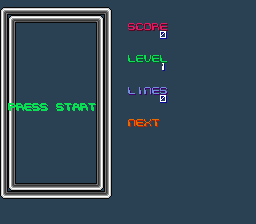

# Tetris

Classic Tetris game with Korobeiniki music.

## Features

- 7 standard Tetris pieces (I, O, T, S, Z, J, L)
- DAS (Delayed Auto Shift) for smooth horizontal movement
- Line clear animation with screen shake
- Multi-line clear (single, double, triple, Tetris)
- NES-style gravity speed table (30 levels)
- Score, level, and lines counter
- Next piece preview
- HDMA gradient background
- Korobeiniki music via SNESMOD
- Random piece order (seeded from frame count)

## Controls

| Button | Action |
|--------|--------|
| LEFT/RIGHT | Move piece |
| DOWN | Soft drop |
| A/X | Rotate clockwise |
| B | Rotate counter-clockwise |
| START | Start game / Pause |

## Architecture

- **BG1** (4bpp): Playfield — border + locked blocks + falling piece
- **BG2** (4bpp): HUD — score, level, lines, next piece preview
- **BG3** (2bpp): Message overlay (PRESS START, PAUSED, GAME OVER)
- **HDMA**: Background color gradient
- **SNESMOD**: Korobeiniki theme music

## Modules

`console sprite dma background input snesmod`
