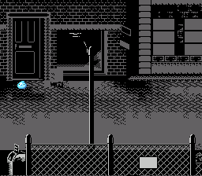

# Continuous Scroll

> Two-layer parallax scrolling with a player sprite that triggers camera movement.
> Move with the D-pad. Walk past the threshold and the world scrolls to follow.



## Controls

| Button | Action |
|--------|--------|
| D-Pad | Move the character |

## Build & Run

```bash
make -C examples/graphics/backgrounds/continuous_scroll
# Open continuous_scroll.sfc in Mesen2
```

## What You'll Learn

- How SNES background scrolling actually works (it's not moving tiles — it's moving the camera)
- The threshold pattern: only scroll when the player reaches the screen edge
- Parallax scrolling: moving two layers at different speeds to create depth
- Why scroll register updates must happen during VBlank (and how to guarantee it)

---

## Walkthrough

### 1. Two Layers, Two Speeds

This example uses Mode 1 with two background layers: BG1 is the main scene,
BG2 is a distant backdrop. When the camera scrolls, BG1 moves at full speed
while BG2 moves slower, creating the illusion of depth. Think of the background
layers in Streets of Rage 2 — that's exactly this technique.

```c
setMode(BG_MODE1, 0);
REG_TM = 0x13;  /* Enable OBJ + BG2 + BG1 */
```

Both layers get their own tile data and tilemaps, loaded to different VRAM regions
to avoid overlap:

```c
bgSetMapPtr(0, 0x0000, SC_32x32);   /* BG1 tilemap at $0000 */
bgSetMapPtr(1, 0x0800, SC_32x32);   /* BG2 tilemap at $0800 */

bgInitTileSet(0, bg1_tiles, bg1_pal, 2,   /* BG1 tiles at $2000 */
              ..., BG_16COLORS, 0x2000);
bgInitTileSet(1, bg2_tiles, bg2_pal, 4,   /* BG2 tiles at $4000 */
              ..., BG_16COLORS, 0x4000);
```

> **Why palette slot 2 and 4?** Each BG palette slot holds 16 colors. Slot 0 starts
> at CGRAM address 0, slot 2 at address 32, slot 4 at address 64. Using different
> slots means BG1 and BG2 get independent color palettes.

### 2. The Threshold Scroll Pattern

The player moves freely on screen. But when they reach a threshold (column 140 going right,
column 80 going left), the background starts scrolling and the player gets pushed back:

```c
#define SCROLL_THRESHOLD_RIGHT 140
#define SCROLL_THRESHOLD_LEFT  80

if (game.player_x > SCROLL_THRESHOLD_RIGHT && game.bg1_scroll_x < MAX_SCROLL_X) {
    game.bg1_scroll_x += 1;
    game.bg2_scroll_x += 1;
    game.player_x -= 1;   /* Push player back to keep them visually centered */
}
```

The player walks right → reaches column 140 → the world scrolls right while the player
stays at column 140. It looks like the camera is following the character, but it's actually
the background moving in the opposite direction.

> **Why push the player back?** Without `player_x -= 1`, the player would walk past
> the threshold and keep going off-screen. The push-back keeps them locked to the
> threshold while the world scrolls beneath them. This is the same pattern used in
> Super Mario World's camera system.

### 3. The VBlank Callback

Scroll registers are write-only and take effect immediately. If you write them during
active display (while the PPU is drawing), you'll get a visible tear — the top half of
the screen shows the old scroll position, the bottom half shows the new one.

The fix: update scroll registers during VBlank, when the PPU isn't drawing. This example
uses a VBlank callback:

```c
void myVBlankHandler(void) {
    if (game.need_scroll_update) {
        bgSetScroll(0, game.bg1_scroll_x, game.bg1_scroll_y);
        bgSetScroll(1, game.bg2_scroll_x, game.bg2_scroll_y);
        game.need_scroll_update = 0;
    }
}

/* Register it during init */
nmiSetBank(myVBlankHandler, 1);
```

The main loop sets `game.need_scroll_update = 1` after changing scroll values.
The NMI handler calls `myVBlankHandler` at the start of every VBlank, which
applies the new values and clears the flag. Clean, glitch-free scrolling.

> **What's the `1` in `nmiSetBank`?** It's the ROM bank number. In LoROM, your code
> lives in bank 1 ($8000-$FFFF of the second 32KB). The NMI handler needs the bank
> number to do a long call to your function.

### 4. The Game State Struct

All game variables live in one struct:

```c
typedef struct {
    s16 player_x;
    s16 player_y;
    s16 bg1_scroll_x;
    s16 bg1_scroll_y;
    s16 bg2_scroll_x;
    s16 bg2_scroll_y;
    u8 need_scroll_update;
} GameState;

GameState game = {20, 100, 0, 32, 0, 32, 1};
```

> **Why a struct instead of separate variables?** The OpenSNES compiler has a known
> quirk: separate `static u16` variables can generate broken code for some access
> patterns, while struct members work correctly. Using a struct also keeps related
> state together, which makes the code easier to follow.

### 5. The Main Loop

One frame, one iteration. Read input, move player, check thresholds, update sprite:

```c
while (1) {
    WaitForVBlank();
    while (REG_HVBJOY & 0x01) { }  /* Wait for joypad auto-read */
    pad = REG_JOY1L | (REG_JOY1H << 8);

    if (pad & KEY_RIGHT) {
        if (game.player_x < 230) game.player_x += 2;
    }
    /* ... other directions ... */

    /* Threshold scroll */
    if (game.player_x > SCROLL_THRESHOLD_RIGHT && game.bg1_scroll_x < MAX_SCROLL_X) {
        game.bg1_scroll_x += 1;
        game.bg2_scroll_x += 1;
        game.player_x -= 1;
    }

    oamSet(0, game.player_x, game.player_y, 0, 0, 2, 0);
    game.need_scroll_update = 1;
}
```

The sprite position updates via `oamSet()`, and the NMI handler automatically DMAs
the OAM buffer to hardware — no manual `oamUpdate()` needed inside the loop.

---

## Tips & Tricks

- **Scrolling tears or flickers?** Your scroll registers are being written during active
  display. Make sure all `bgSetScroll()` calls happen in the VBlank callback, not in the
  main loop.

- **Player gets stuck at the edge?** Check your threshold values. If
  `SCROLL_THRESHOLD_RIGHT` is too high (close to 256), the player can walk off-screen
  before scrolling kicks in.

- **Want true parallax?** Change BG2's scroll increment to be slower than BG1's.
  `bg2_scroll_x += 1` every other frame while `bg1_scroll_x += 1` every frame.
  The speed difference creates the depth illusion.

- **Sprite disappears at the left edge?** The SNES uses 9-bit X coordinates for sprites.
  Values below 0 wrap to 256+, which is off-screen. Clamp `player_x` to a minimum of 0.

---

## Go Further

- **Add tile streaming:** Right now the tilemap is static. For larger worlds, you'd
  upload new tile columns as the camera scrolls. See [LikeMario](../../games/likemario/)
  for a working implementation.

- **Add vertical scrolling:** Same pattern, but with Y thresholds and `bg_scroll_y`.
  Vertical scrolling is slightly trickier because the SNES tilemap wraps every 32 rows.

- **Add animation:** Use different sprite tiles based on direction. Tile 0 for right,
  tile 1 for left, advance every few frames for a walk cycle.

- **Next example:** [LikeMario](../../games/likemario/) — full platformer with gravity,
  collision, and tile streaming.

---

## Under the Hood: The Build

### The Makefile

```makefile
TARGET      := continuous_scroll.sfc
USE_LIB     := 1
LIB_MODULES := console sprite input background dma
CSRC        := main.c
ASMSRC      := data.asm
```

### Why `ASMSRC` for Background Data?

`data.asm` is the asset container. It includes pre-converted tile data, tilemaps,
palettes, and the player sprite — all as binary blobs via `.INCBIN`:

```asm
.SECTION ".bg1_tiles" SUPERFREE
bg1_tiles: .INCBIN "res/bg1.pic"
.ENDS

.SECTION ".bg1_map" SUPERFREE
bg1_map: .INCBIN "res/bg1.map"
.ENDS
```

The `SUPERFREE` directive tells the linker "put this in any ROM bank with space."
Background tile sets can be 4-8 KB each — far too large for bank $00 WRAM. In ROM,
they cost nothing at runtime and get DMA'd to VRAM during initialization.

### Why These Modules?

| Module | Why it's here |
|--------|--------------|
| `console` | PPU setup, NMI handler, `WaitForVBlank()` |
| `sprite` | OAM buffer for the player character sprite |
| `input` | Joypad buffers. This example also reads `REG_JOY1L/H` directly, but the NMI handler needs the input module's buffer symbols. |
| `background` | `bgSetMapPtr()`, `bgSetScroll()`, `bgInitTileSet()` — the high-level API for configuring background layers and updating scroll registers |
| `dma` | `dmaCopyVram()`, `dmaCopyCGram()` for bulk asset transfers, plus OAM DMA in NMI |

> **Why `background` here but not in Hello World?** Hello World writes scroll and tilemap
> registers directly. This example uses `bgSetScroll()` in a VBlank callback — the
> background module provides that function and manages the double-write protocol that
> 16-bit scroll registers require (write low byte, then high byte, to the same address).

### The gfx4snes Tool

The background art in `res/` was converted from PNG source images:

```bash
gfx4snes -s 8 -p -i bg1.png    # 8x8 tiles, generate palette
gfx4snes -s 8 -p -i bg2.png    # Same for the parallax layer
```

`gfx4snes` does three things:
1. Splits the PNG into 8x8 (or 16x16) tiles
2. Encodes each tile in SNES bitplane format (4bpp for Mode 1)
3. Generates a tilemap (`.map`) that records which tile goes where

The output files (`.pic` for tiles, `.pal` for palette, `.map` for tilemap) are raw
binary — exactly the format the PPU expects. DMA them to VRAM and they just work.

---

## Technical Reference

| Register | Address | Role in this example |
|----------|---------|---------------------|
| BGMODE   | $2105   | Mode 1 (two 4bpp layers + one 2bpp) |
| BG1SC    | $2107   | BG1 tilemap at $0000 |
| BG2SC    | $2108   | BG2 tilemap at $0800 |
| BG1HOFS  | $210D   | BG1 horizontal scroll (via bgSetScroll) |
| BG2HOFS  | $210F   | BG2 horizontal scroll |
| TM       | $212C   | Enable OBJ + BG2 + BG1 |
| INIDISP  | $2100   | Force blank / brightness control |

## Files

| File | What's in it |
|------|-------------|
| `main.c` | Game loop, scrolling logic, VBlank callback (~255 lines) |
| `data.asm` | BG1/BG2 tiles, palettes, tilemaps, character sprite |
| `Makefile` | `LIB_MODULES := console sprite input background dma` |

## Credits

- Original: odelot (PVSnesLib example)
- Sprite: Calciumtrice (CC-BY 3.0)
- Backgrounds inspired by Streets of Rage 2
