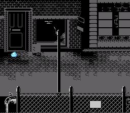

# Continuous Scroll

> Two-layer parallax scrolling with a player sprite that triggers camera movement.
> Move with the D-pad. Walk past the threshold and the world scrolls to follow.



## Controls

| Button | Action |
|--------|--------|
| D-Pad | Move the character |

## Build & Run

```bash
cd $OPENSNES_HOME
make -C examples/graphics/backgrounds/continuous_scroll
```

Then open `continuous_scroll.sfc` in your emulator (Mesen2 recommended).

## What You'll Learn

- How SNES background scrolling actually works (it's not moving tiles -- it's moving the camera)
- The threshold pattern: only scroll when the player reaches the screen edge
- Parallax scrolling: two layers with independent scroll offsets
- Why scroll register updates must happen during VBlank (and how bgSetScroll's dirty-flag mechanism guarantees it)

---

## Walkthrough

### 1. Two Layers, Two Speeds

This example uses Mode 1 with two background layers: BG1 is the main scene,
BG2 is a distant backdrop. When the camera scrolls, both layers move together
(though parallax could use different speeds for a depth illusion). A character
sprite overlays the scrolling backgrounds.

```c
setMode(BG_MODE1, 0);
REG_TM = 0x13;  /* Enable OBJ + BG2 + BG1 */
```

Both layers get their own tile data and tilemaps, loaded to different VRAM regions
to avoid overlap:

```c
bgSetMapPtr(0, 0x0000, SC_32x32);   /* BG1 tilemap at $0000 */
bgSetMapPtr(1, 0x0800, SC_32x32);   /* BG2 tilemap at $0800 */

bgInitTileSet(0, bg1_tiles, bg1_pal, 2,   /* BG1 tiles at $2000 */
              ..., BG_16COLORS, 0x2000);
bgInitTileSet(1, bg2_tiles, bg2_pal, 4,   /* BG2 tiles at $4000 */
              ..., BG_16COLORS, 0x4000);
```

> **Why palette slot 2 and 4?** Each BG palette slot holds 16 colors. Slot 0 starts
> at CGRAM address 0, slot 2 at address 32, slot 4 at address 64. Using different
> slots means BG1 and BG2 get independent color palettes.

### 2. The Threshold Scroll Pattern

The player moves freely on screen. But when they reach a threshold (column 140 going right,
column 80 going left), the background starts scrolling and the player gets pushed back:

```c
#define SCROLL_THRESHOLD_RIGHT 140
#define SCROLL_THRESHOLD_LEFT  80

if (game.player_x > SCROLL_THRESHOLD_RIGHT && game.bg1_scroll_x < MAX_SCROLL_X) {
    game.bg1_scroll_x += 1;
    game.bg2_scroll_x += 1;
    game.player_x -= 1;   /* Push player back to keep them visually centered */
}
```

The player walks right, reaches column 140, the world scrolls right while the player
stays at column 140. It looks like the camera is following the character, but it's actually
the background moving in the opposite direction.

> **Why push the player back?** Without `player_x -= 1`, the player would walk past
> the threshold and keep going off-screen. The push-back keeps them locked to the
> threshold while the world scrolls beneath them. This is the same pattern used in
> Super Mario World's camera system.

### 3. Scroll Updates via bgSetScroll Dirty Flags

Scroll registers are write-only and take effect immediately. If you write them during
active display (while the PPU is drawing), you'll get a visible tear -- the top half of
the screen shows the old scroll position, the bottom half shows the new one.

This example calls `bgSetScroll()` from the main loop, which does NOT write to the PPU
directly. Instead, it stores the new scroll values and sets a dirty flag. The NMI handler
(triggered at VBlank) checks the dirty flags and writes the actual scroll registers at
a safe time:

```c
/* In the main loop -- sets dirty flags, does NOT touch PPU registers */
bgSetScroll(0, game.bg1_scroll_x, game.bg1_scroll_y);
bgSetScroll(1, game.bg2_scroll_x, game.bg2_scroll_y);
```

This deferred-write mechanism ensures glitch-free scrolling without needing a custom
VBlank callback. The initial scroll values are also set before `setScreenOn()` so the
first visible frame shows the correct position.

### 4. Input Reading

The example reads the joypad directly from hardware registers after waiting for the
auto-joypad read to complete:

```c
WaitForVBlank();
while (REG_HVBJOY & 0x01) { }  /* Wait for auto-joypad */
pad = REG_JOY1L | (REG_JOY1H << 8);
```

### 5. The Game State Struct

All game variables live in one struct:

```c
typedef struct {
    s16 player_x;
    s16 player_y;
    s16 bg1_scroll_x;
    s16 bg1_scroll_y;
    s16 bg2_scroll_x;
    s16 bg2_scroll_y;
} GameState;

GameState game = {20, 100, 0, 32, 0, 32};
```

> **Why a struct instead of separate variables?** The OpenSNES compiler has a known
> quirk: separate `static u16` variables can generate broken code for some access
> patterns, while struct members work correctly. Using a struct also keeps related
> state together, which makes the code easier to follow.

---

## Tips & Tricks

- **Player gets stuck at the edge?** Check your threshold values. If
  `SCROLL_THRESHOLD_RIGHT` is too high (close to 256), the player can walk off-screen
  before scrolling kicks in.

- **Want true parallax?** Change BG2's scroll increment to be slower than BG1's.
  `bg2_scroll_x += 1` every other frame while `bg1_scroll_x += 1` every frame.
  The speed difference creates the depth illusion.

- **Sprite disappears at the left edge?** The SNES uses 9-bit X coordinates for sprites.
  Values below 0 wrap to 256+, which is off-screen. Clamp `player_x` to a minimum of 0.

---

## Go Further

- **Add tile streaming:** Right now the tilemap is static. For larger worlds, you'd
  upload new tile columns as the camera scrolls. See [LikeMario](../../../games/likemario/)
  for a working implementation.

- **Add vertical scrolling:** Same pattern, but with Y thresholds and `bg_scroll_y`.
  Vertical scrolling is slightly trickier because the SNES tilemap wraps every 32 rows.

- **Add animation:** Use different sprite tiles based on direction. Tile 0 for right,
  tile 1 for left, advance every few frames for a walk cycle.

- **Next example:** [LikeMario](../../../games/likemario/) -- full platformer with gravity,
  collision, and tile streaming.

---

## Under the Hood: The Build

### The Makefile

```makefile
TARGET      := continuous_scroll.sfc
USE_LIB     := 1
LIB_MODULES := console sprite input background dma
CSRC        := main.c
ASMSRC      := data.asm
```

### Why These Modules?

| Module | Why it's here |
|--------|--------------|
| `console` | PPU setup, NMI handler, `WaitForVBlank()` |
| `sprite` | OAM buffer for the player character sprite |
| `input` | Joypad buffer symbols needed by NMI handler |
| `background` | `bgSetMapPtr()`, `bgSetScroll()`, `bgInitTileSet()` with dirty-flag deferred writes |
| `dma` | `dmaCopyVram()`, `dmaCopyCGram()` for bulk asset transfers, plus OAM DMA in NMI |

---

## Technical Reference

| Register | Address | Role in this example |
|----------|---------|---------------------|
| BGMODE   | $2105   | Mode 1 (two 4bpp layers + one 2bpp) |
| BG1SC    | $2107   | BG1 tilemap at $0000 |
| BG2SC    | $2108   | BG2 tilemap at $0800 |
| BG1HOFS  | $210D   | BG1 horizontal scroll (via bgSetScroll) |
| BG2HOFS  | $210F   | BG2 horizontal scroll |
| TM       | $212C   | Enable OBJ + BG2 + BG1 |
| INIDISP  | $2100   | Force blank / brightness control |

## Files

| File | What's in it |
|------|-------------|
| `main.c` | Game loop, scrolling logic, input handling (~265 lines) |
| `data.asm` | BG1/BG2 tiles, palettes, tilemaps, character sprite |
| `Makefile` | `LIB_MODULES := console sprite input background dma` |

## Credits

- Original: odelot (PVSnesLib example)
- Sprite: Calciumtrice (CC-BY 3.0)
- Backgrounds inspired by Streets of Rage 2
