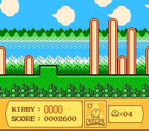

# Mode 0 — 4-Layer 2bpp Background

Demonstrates BG Mode 0 with four independent background layers, each using a 4-color (2bpp) palette.

## Description

Mode 0 provides four background layers, each with its own 4-color palette bank. This example shows a Kirby-style parallax scene with all four layers scrolling at different speeds.

## Architecture

- **Mode 0**: Four BGs, each 2bpp (4 colors per tile)
- **BG0**: Foreground terrain (static)
- **BG1**: Mid-ground elements (scroll speed ×3)
- **BG2**: Far buildings (scroll speed ×2)
- **BG3**: HUD bar (scroll speed ×1)
- Each BG uses a separate palette bank (0-3)

## Ported from

PVSnesLib "Mode0" example.

## Modules

`console dma background`
