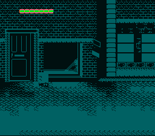

# Mode 1 BG3 High Priority -- HUD Layer Over Backgrounds



## What This Example Shows

How to use **BG3 as a high-priority HUD overlay** in Mode 1. Normally BG3 is the
lowest-priority background layer, but the `BG3_MODE1_PRIORITY_HIGH` flag promotes
it to the highest priority -- rendering on top of BG1 and BG2.

This is the standard SNES technique for status bars, health displays, and score
overlays in Mode 1 games (Zelda ALttP, Streets of Rage, Final Fantasy, etc.).

## Controls

No interactive controls. The display is static.

## Build & Run

```bash
cd $OPENSNES_HOME
make -C examples/graphics/backgrounds/mode1_bg3_priority
```

Then open `mode1_bg3_priority.sfc` in your emulator (Mesen2 recommended).

## How It Works

### 1. Set up three background layers

```c
bgSetMapPtr(0, 0x0000, SC_32x32);  /* BG1 tilemap */
bgSetMapPtr(1, 0x0400, SC_32x32);  /* BG2 tilemap */
bgSetMapPtr(2, 0x0800, SC_32x32);  /* BG3 tilemap */
```

Each BG gets its own tilemap region in VRAM. BG1 and BG2 are 4bpp (16 colors),
BG3 is 2bpp (4 colors) -- that is how Mode 1 works on the SNES.

### 2. Load tiles and palettes

```c
bgInitTileSet(0, &bg1_tiles, &bg1_pal, 2, ..., BG_16COLORS, 0x2000);
bgInitTileSet(1, &bg2_tiles, &bg2_pal, 4, ..., BG_16COLORS, 0x3000);
bgInitTileSet(2, &bg3_tiles, &bg3_pal, 0, ..., BG_16COLORS, 0x4000);
```

Each BG has its own palette slot (2, 4, 0). The palette slot is encoded in
the tilemap entries, so tiles reference the correct colors automatically.

### 3. Enable BG3 high priority

```c
setMode(BG_MODE1, BG3_MODE1_PRIORITY_HIGH);
REG_TM = TM_BG1 | TM_BG2 | TM_BG3;
```

The `BG3_MODE1_PRIORITY_HIGH` flag (bit 3 of the BGMODE register at $2105) changes
BG3's rendering order from lowest to highest. Without this flag, the HUD
would be hidden behind the other two layers.

## SNES Concepts

### Mode 1 Priority System

In Mode 1, the default layer priority (back to front) is: BG3, BG2, BG1, then
sprites interleaved by their priority bits. Setting `BG3_MODE1_PRIORITY_HIGH`
changes this so that BG3 tiles with their per-tile priority bit set render above
everything else -- even above BG1 and sprites.

This is why BG3 is the standard HUD layer: it can sit on top of the entire scene
without interfering with BG1/BG2 content.

### BG3 is 2bpp in Mode 1

Mode 1 allocates 4 bits per pixel to BG1 and BG2 (16 colors each), but only 2 bits
per pixel to BG3 (4 colors). This is enough for simple HUD elements -- text, health
bars, icons -- but not for detailed artwork. Each 8x8 BG3 tile occupies 16 bytes
in VRAM, compared to 32 bytes for a 4bpp tile.

### Tilemap Palette Bits

Each tilemap entry (2 bytes) encodes a palette number in bits 12-10. The `gfx4snes`
converter bakes this in automatically, so the palette slot passed to `bgInitTileSet()`
must match what the map data expects. A mismatch means tiles display with the wrong
colors.

## VRAM Layout

| Address | Content | Size |
|---------|---------|------|
| `$0000` | BG1 tilemap | 2048 bytes |
| `$0400` | BG2 tilemap | 2048 bytes |
| `$0800` | BG3 tilemap | 2048 bytes |
| `$2000` | BG1 tiles (4bpp) | ~2.5 KB |
| `$3000` | BG2 tiles (4bpp) | ~1 KB |
| `$4000` | BG3 tiles (2bpp) | 128 bytes |

## Project Structure

| File | Purpose |
|------|---------|
| `main.c` | BG setup, Mode 1 + BG3 priority configuration |
| `data.asm` | Three sets of tile/palette/tilemap data via `.INCBIN` |
| `res/` | Source PNGs for BG1, BG2, BG3 |
| `Makefile` | `LIB_MODULES := console sprite dma background` |

## Going Further

- **Add scrolling**: Call `bgSetScroll()` in the main loop to scroll BG1 and BG2
  independently while keeping BG3 (the HUD) stationary. This is how Zelda ALttP
  keeps the item bar fixed while the world scrolls.

- **Dynamic HUD text**: Use the text system (`textPrintAt()`) to render score or
  health values to BG3's tilemap each frame.

- **Explore related examples**:
  - `backgrounds/continuous_scroll` -- Parallax scrolling with multiple BG layers
  - `effects/hdma_wave` -- Per-scanline effects on backgrounds
