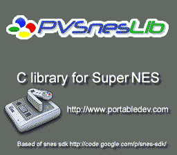

# Mode 1 LZ77

Demonstrates loading **LZ77-compressed tile data** directly into VRAM using the
`LzssDecodeVram()` function. The compressed tile file is 8.5 KB in ROM but
decompresses to 12.5 KB of 4bpp tile data -- a 31% size reduction. On a real
cartridge with limited ROM space, compression like this is essential for fitting
large tilesets, and the SNES hardware can decompress data fast enough to load
during force blank.



## What You'll Learn

- How to use LZ77 (LZSS) compression to reduce ROM usage for tile data
- How to decompress tiles directly to VRAM with `LzssDecodeVram()`
- The difference between compressed tiles and uncompressed tilemaps/palettes
- How to set up a static Mode 1 background from ROM data

## SNES Concepts

### LZ77 / LZSS Compression

LZ77 is a dictionary-based compression algorithm that replaces repeated byte
sequences with back-references (offset + length pairs). The LZSS variant used
here stores a header with the uncompressed size, followed by flag bytes that
indicate whether the next chunk is a literal byte or a back-reference. The
`gfx4snes` tool generates LZ77-compressed tile data when invoked with the `-z`
flag. The OpenSNES library provides `LzssDecodeVram()` which decompresses
directly into VRAM via the PPU data port ($2118/$2119), avoiding the need for a
large RAM buffer.

### Why Compress Tiles but Not Tilemaps?

Tile graphics (character data) are the largest asset in most SNES games -- a
single 4bpp 8x8 tile is 32 bytes, and a full tileset can easily reach 16-32 KB.
Tilemaps are smaller (2 bytes per tile entry, typically 2 KB for a 32x32 screen)
and palette data is tiny (32 bytes for 16 colors). Compressing the large tile
data gives the best ROM savings with minimal added complexity. In this example,
only the `.pic` file is compressed; the `.map` and `.pal` files are stored raw.

### Force Blank for VRAM Access

The SNES PPU ignores writes to VRAM during active display (scanlines 0-224).
Decompression takes longer than one VBlank period, so the screen must be kept
in **force blank** (`REG_INIDISP = $80`, which sets bit 7 of register $2100)
during the entire decompression. The `consoleInit()` function leaves the screen
in force blank by default, so the decompression can proceed immediately.

## Controls

This example has no interactive controls. It displays a static image.

## How It Works

### 1. Initialize and Stay in Force Blank

`consoleInit()` initializes the NMI handler and leaves the display disabled.
Force blank is explicitly set to ensure VRAM writes succeed during decompression:

```c
consoleInit();
REG_INIDISP = 0x80;    /* Force blank: PPU off, VRAM writable */
```

### 2. Decompress Tiles to VRAM

`LzssDecodeVram()` reads the compressed data from ROM and writes the
decompressed 4bpp tile data directly to VRAM at word address $4000. No
intermediate RAM buffer is needed:

```c
LzssDecodeVram(patterns, 0x4000);
```

### 3. Load Palette and Tilemap (Uncompressed)

The 16-color palette is DMA'd to CGRAM starting at color 0. The tilemap is
DMA'd to VRAM at $0000:

```c
dmaCopyCGram(palette, 0, (u16)(palette_end - palette));
dmaCopyVram(map, 0x0000, (u16)(map_end - map));
```

### 4. Configure BG1 and Enable Display

BG1 is configured with its tilemap at VRAM $0000 and tile data at $4000, then
Mode 1 is activated with only BG1 enabled:

```c
bgSetMapPtr(0, 0x0000, SC_32x32);
bgSetGfxPtr(0, 0x4000);
setMode(BG_MODE1, 0);
setScreenOn();
```

### 5. Idle Loop

The program enters an infinite `WaitForVBlank()` loop. The image is static --
no scrolling, no animation:

```c
while (1) {
    WaitForVBlank();
}
```

## Project Structure

```
mode1_lz77/
├── main.c        — Decompression, VRAM setup, display
├── data.asm      — ROM data: compressed tiles (.pic), tilemap (.map), palette (.pal)
├── Makefile      — Build configuration (gfx4snes with -z flag for LZ77)
└── res/
    └── pvsneslib.png — Source image (converted to LZ77-compressed 4bpp tiles)
```

## Build & Run

```bash
cd $OPENSNES_HOME
make -C examples/graphics/backgrounds/mode1_lz77
```

Then open `mode1_lz77.sfc` in your emulator (Mesen2 recommended). You should
see a static full-screen image. The key takeaway is not what is displayed, but
that the tile data was loaded from a compressed source, saving approximately
4 KB of ROM space.
