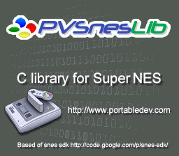

# Mode 3 — 256-Color Background

Demonstrates BG Mode 3 with a single 256-color (8bpp) background layer.

## Description

Mode 3 provides one 256-color background, allowing photographic-quality images on the SNES. The tileset exceeds 32KB, requiring split DMA loading with explicit bank bytes via an assembly loader.

## Architecture

- **Mode 3**: One BG, 8bpp (256 colors)
- **BG1**: Full 256-color image
- Tileset split: first 32KB + remaining ~7KB in separate DMA transfers
- Assembly DMA loader handles bank byte for SUPERFREE sections in bank $01+

## Ported from

PVSnesLib "Mode3" example.

## Modules

`console dma background`
