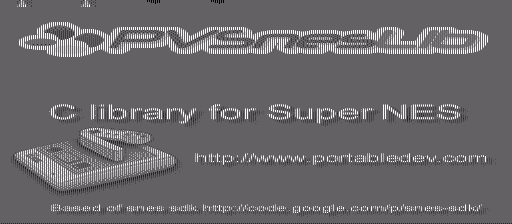

# Mode 5 — Hi-Res 512×256 Background

Demonstrates BG Mode 5, the SNES high-resolution mode with 512×256 pixel display.

## Description

Mode 5 doubles the horizontal resolution to 512 pixels using interlaced tile data. This provides sharper text and finer detail at the cost of reduced color depth (16 colors per BG).

## Architecture

- **Mode 5**: Hi-res, one BG, 4bpp (16 colors)
- **BG1**: 512×256 hi-res image with interlaced tiles
- gfx4snes flag `-M 5` generates the special interleaved tile format

## Ported from

PVSnesLib "Mode5" example.

## Modules

`console dma background`
