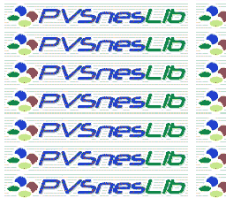

# Mode 7 -- Rotation and Scaling



## What This Example Shows

How to use the SNES Mode 7 -- a special background mode that applies an affine
transformation (rotation + scaling) to a single 128x128 tile layer. This is the
same technique behind F-Zero's ground, Mario Kart's tracks, and Pilotwings' maps.

## Prerequisites

Read `backgrounds/mode1` first (basic background setup). Mode 7 is fundamentally
different from tile-based modes but the initialization flow is similar.

## Controls

| Button | Action |
|--------|--------|
| A | Rotate clockwise |
| B | Rotate counter-clockwise |
| D-PAD Up | Zoom out (see more of the plane) |
| D-PAD Down | Zoom in (magnify) |

## Build & Run

```bash
cd $OPENSNES_HOME
make -C examples/graphics/backgrounds/mode7
```

Then open `mode7.sfc` in your emulator (Mesen2 recommended).

## How It Works

### 1. Mode 7 VRAM format

Mode 7 uses a special interleaved VRAM format:
- **Even bytes**: tilemap entries (128x128 = 16,384 tiles)
- **Odd bytes**: pixel data (256 tiles, 8x8, 256 colors each)

This is completely different from Modes 0-3 where tilemap and tile data are in
separate VRAM regions. The loading is handled by `asm_loadMode7Data()` in data.asm,
which uses `dmaCopyVramMode7()` to write both the tilemap and tile data into the
interleaved format the PPU expects.

### 2. Initialize the transformation

```c
setMode(BG_MODE7, 0);
mode7Init();
mode7SetScale(0x0200, 0x0200);
mode7SetAngle(0);
```

`mode7Init()` sets the rotation center to the screen center (128, 128).
Scale `0x0200` = 2.0 in 8.8 fixed-point -- this shows the map at a comfortable
zoom level. Scale `0x0100` would be 1.0 (one texel per pixel).

### 3. Update the matrix every frame

```c
if (pad0 & KEY_A) {
    angle++;
    mode7SetAngle(angle);
}
```

`mode7SetAngle()` recalculates the 2x2 transformation matrix (registers M7A-M7D
at $211B-$211E) using the current angle and scale. The angle is 0-255, mapping to
0-360 degrees.

### 4. Zoom control

```c
if (pad0 & KEY_UP) {
    if (zscale < 0x0F00) zscale += 16;
    mode7SetScale(zscale, zscale);
    mode7SetAngle(angle);
}
```

After changing the scale, you must call `mode7SetAngle()` again because the matrix
depends on both angle and scale. The scale range is clamped to `0x0010`-`0x0F00` --
values outside this range produce extreme distortion.

## SNES Concepts

### Affine Transformation

Mode 7 applies a 2x2 matrix to BG1. The matrix encodes rotation, scaling, and skew.
The hardware computes the transform per-scanline using four registers:

| Register | Address | Purpose |
|----------|---------|---------|
| M7A | $211B | Matrix element A (cosine * scale) |
| M7B | $211C | Matrix element B (sine * scale) |
| M7C | $211D | Matrix element C (-sine * scale) |
| M7D | $211E | Matrix element D (cosine * scale) |

### One Layer Only

Mode 7 supports exactly one background (BG1). No BG2/BG3/BG4.
Sprites still work normally on top, which is how F-Zero renders its cars.

### 256-Color Palette

Each Mode 7 tile uses 256 colors (8bpp), unlike Modes 0-3 which use 2/4/8 colors
per palette. This gives richer visuals but limits you to 256 unique tiles total.

### 8.8 Fixed-Point Scale

`0x0100` = 1.0x (normal), `0x0200` = 2.0x (zoomed out, shows more area),
`0x0080` = 0.5x (zoomed in, magnifies). The integer part is the high byte, the
fractional part is the low byte.

## Project Structure

| File | Purpose |
|------|---------|
| `main.c` | Input handling, rotation/zoom logic |
| `data.asm` | Mode 7 tile/tilemap/palette loading helper |
| `res/mode7bg.png` | Source image for Mode 7 ground |
| `Makefile` | `LIB_MODULES := console dma background sprite input mode7` |

## Going Further

- **Add scrolling**: Use `mode7SetPos()` to pan across the Mode 7 plane with the
  D-pad while rotating. This is how F-Zero navigates its tracks.

- **Add sprites on top**: Load sprite tiles and place an OAM sprite over the
  rotating background. Mode 7 supports full sprite rendering.

- **Explore related examples**:
  - `backgrounds/mode7_perspective` -- Per-scanline scaling for pseudo-3D (F-Zero style)
  - `effects/hdma_wave` -- HDMA can modify Mode 7 parameters per scanline
