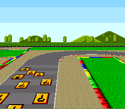

# Mode 7 Perspective -- Pseudo-3D Ground Effect



## What This Example Shows

How to combine Mode 7 with HDMA to create a **perspective ground plane** -- the same
technique used in F-Zero, Mario Kart, and Pilotwings. The screen is split in two:
a static sky on top and a scaled ground that recedes into the distance.

## Prerequisites

Read `backgrounds/mode7` first (Mode 7 basics), then `effects/hdma_wave` (HDMA
per-scanline programming).

## Controls

| Button | Action |
|--------|--------|
| D-PAD | Scroll the ground plane |

## Build & Run

```bash
cd $OPENSNES_HOME
make -C examples/graphics/backgrounds/mode7_perspective
```

Then open `mode7_perspective.sfc` in your emulator (Mesen2 recommended).

## How It Works

### 1. Split-screen with HDMA

The screen is divided by 4 HDMA channels running every frame:

| Channel | Target | Effect |
|---------|--------|--------|
| Ch1 | BGMODE ($2105) | Switches from Mode 3 (sky) to Mode 7 (ground) |
| Ch2 | TM ($212C) | Switches from BG2 (sky tiles) to BG1 (Mode 7 ground) |
| Ch3 | M7A ($211B) | Per-scanline horizontal scale (perspective) |
| Ch4 | M7D ($211E) | Per-scanline vertical scale (perspective) |

Top 96 scanlines: Mode 3 displays a static sky background on BG2.
Bottom 128 scanlines: Mode 7 displays the ground with per-scanline scaling.

### 2. Perspective math

The key to the 3D illusion: scanlines near the top of the ground area (the
"horizon") use a large scale value (small objects = far away), while scanlines
near the bottom use a small scale value (large objects = close up).

This is a pre-computed table in the assembly data -- each of the 128 ground
scanlines has its own M7A/M7D scale pair.

### 3. Scrolling

```c
if (pad0 & KEY_LEFT)  sx--;
if (pad0 & KEY_RIGHT) sx++;
if (pad0 & KEY_UP)    sy--;
if (pad0 & KEY_DOWN)  sy++;
asm_setupHdmaPerspective(sx, sy);
```

The scroll values are passed to the assembly helper, which writes them to the
Mode 7 scroll registers (M7HOFS/M7VOFS at $210D/$210E) and re-enables the HDMA
channels each frame.

## SNES Concepts

### Mode Switching Mid-Frame

The SNES allows changing the BGMODE register ($2105) via HDMA between scanlines.
This is how one screen shows two completely different video modes -- Mode 3 for
the sky portion and Mode 7 for the ground portion. The switch happens during
HBlank, so there is no visible glitch.

### Per-Scanline Scaling

By writing M7A/M7D every scanline via HDMA repeat mode, each horizontal line of
the ground has a different scale factor. Lines near the horizon are scaled way
down (far away), lines at the bottom are close to 1:1 (nearby). This creates the
depth illusion without any 3D math at runtime -- it is all pre-computed tables.

### HDMA Budget

4 simultaneous HDMA channels is feasible but uses significant bus time per scanline.
Each HDMA transfer needs ~18 master cycles per byte during HBlank. Adding more
channels risks running out of HBlank time (1364 master cycles per scanline).

## Project Structure

| File | Purpose |
|------|---------|
| `main.c` | Input handling, scroll updates, HDMA initialization |
| `data.asm` | Mode 7 ground data, sky tiles, HDMA perspective tables, assembly helpers |
| `res/ground.png` | Mode 7 ground texture source |
| `res/sky.png` | Sky background source |
| `Makefile` | `LIB_MODULES := console dma background sprite input mode7` |

## Going Further

- **Add rotation**: Combine the perspective tables with angle rotation for a
  full F-Zero-style driving effect. You would need to recompute the M7A-M7D
  table entries based on the current heading angle.

- **Add sprites**: Place car or character sprites on top of the ground plane.
  Sprites render normally in Mode 7 and can be scaled/positioned to match the
  perspective.

- **Explore related examples**:
  - `effects/gradient_colors` -- Another HDMA technique (color gradients)
  - `games/likemario` -- Scrolling backgrounds with sprites (different approach)
