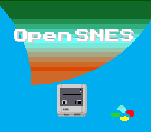

# Gradient Colors -- HDMA Color Gradients



## What This Example Shows

How to create a smooth color gradient across the screen using **HDMA to rewrite CGRAM**
(the palette) every few scanlines. This technique changes the backdrop color (color 0)
as the PPU draws each line, creating sky gradients, underwater effects, or sunset
transitions.

## Prerequisites

Read `effects/hdma_wave` first (HDMA basics and table format).

## Controls

| Button | Action |
|--------|--------|
| A | Remove the gradient (flat background) |
| B | Re-enable the gradient |

## Build & Run

```bash
cd $OPENSNES_HOME
make -C examples/graphics/effects/gradient_colors
```

Then open `gradient_colors.sfc` in your emulator (Mesen2 recommended).

## How It Works

### 1. HDMA targets CGADD ($2121)

```c
hdmaSetup(HDMA_CHANNEL_6, HDMA_MODE_2REG_2X, HDMA_DEST_CGADD, hdmaGradientList);
```

This configures HDMA mode 3 (`2REG_2X`), which writes **4 bytes per entry** to two
consecutive registers:

| Byte | Register | Purpose |
|------|----------|---------|
| 1 | $2121 | Set CGRAM address (low) |
| 2 | $2121 | Set CGRAM address (high) -- always 0 for color 0 |
| 3 | $2122 | Write color data (low byte of 15-bit color) |
| 4 | $2122 | Write color data (high byte of 15-bit color) |

### 2. The gradient table

Each entry in `hdmaGradientList` is:

```
[line_count] [cgadd_lo=0x00] [cgadd_hi=0x00] [color_lo] [color_hi]
```

The table defines color 0 (backdrop) for groups of scanlines. By stepping through
blues, purples, and oranges, it creates a smooth vertical gradient.

The table ends with a `0x00` byte (zero line count = end of HDMA table).

### 3. Toggle at runtime

```c
if (pad0 & KEY_A) hdmaDisableAll();
if (pad0 & KEY_B) enableGradient();
```

HDMA can be enabled/disabled at any time. When disabled, color 0 reverts to
whatever was last written to CGRAM.

## SNES Concepts

### CGRAM (Color Generator RAM)

The SNES palette holds 256 colors, each stored as a 15-bit value (5 bits per R/G/B
channel). Color 0 is the "backdrop" -- visible wherever no BG or sprite pixel is
drawn. By rewriting color 0 per scanline group via HDMA, each band of the screen
displays a different background color.

### HDMA Mode 3 (2REG_2X)

This mode writes 4 bytes to 2 consecutive registers, 2 bytes each. It is perfect
for CGADD+CGDATA pairs because you need to set the target color address first
(CGADD at $2121), then write the color value (CGDATA at $2122).

### Non-Repeat vs Repeat Mode

This gradient uses non-repeat entries (bit 7 = 0 in the count byte). The color is
written once, then holds for N scanlines. This works because CGRAM latches its
value -- unlike scroll registers (BG1HOFS etc.) which need repeat mode with fresh
writes every scanline.

## Project Structure

| File | Purpose |
|------|---------|
| `main.c` | Gradient setup, enable/disable, input handling |
| `data.asm` | Background tiles/tilemap/palette, HDMA gradient table |
| `res/opensnes.png` | Source background image |
| `Makefile` | `LIB_MODULES := console dma background sprite hdma input math` |

## Going Further

- **Custom gradient**: Edit the `hdmaGradientList` table in data.asm. Each entry
  is a 15-bit SNES color (BBBBBGGGGGRRRRR in little-endian). Try creating a sunset
  (orange to purple to dark blue).

- **Animated gradient**: Copy the table to RAM and rotate the color entries each
  frame. This creates a flowing color effect like underwater caustics.

- **Explore related examples**:
  - `effects/transparency` -- Color math blending (another way to modify colors)
  - `backgrounds/mode7_perspective` -- HDMA for per-scanline Mode 7 transforms
