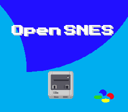

# HDMA Helpers Demo

Demonstrates the four HDMA library helper effects available in the OpenSNES SDK.

## Effects

| Button | Effect | Description |
|--------|--------|-------------|
| A | Brightness gradient | Fade to black at screen bottom |
| B | Color gradient | Sky-like color shift on background color 0 |
| X | Iris wipe | Circular window reveal/conceal |
| Y | Water ripple | Wave distortion increasing top-to-bottom |
| D-pad | Adjust | Change parameters per active effect |
| START | Stop | Disable current effect |

## Architecture

- **BG1**: Static background image (OpenSNES logo)
- **HDMA**: One channel driven by library helper functions
- Each effect builds a per-scanline HDMA table in RAM

## Modules

`console sprite dma input background hdma`

## Related examples

- [graphics/backgrounds/mode3](../../backgrounds/mode3/) — the canonical
  "8bpp single-layer background" example. If you want the brightness/color
  gradient effects above applied to an 8bpp Mode 3 image instead of a
  4bpp Mode 1 image, start from `mode3` for the BG setup and add a
  `hdmaBrightnessGradient()` / `hdmaColorGradient()` call afterwards.
