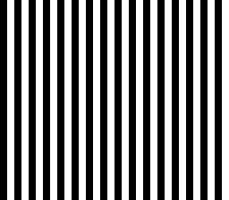

# HDMA Wave

> A wavy distortion effect that bends the entire screen like a funhouse mirror.
> Press A to toggle, D-pad to control amplitude and animation.
> This is the same trick used for water reflections in Chrono Trigger.



## Controls

| Button | Action |
|--------|--------|
| A | Toggle wave on/off |
| D-Pad Left/Right | Decrease/increase amplitude |
| D-Pad Up | Start animation |
| D-Pad Down | Stop animation (freeze) |

## Build & Run

```bash
make -C examples/graphics/effects/hdma_wave
# Open hdma_wave.sfc in Mesen2
```

## What You'll Learn

- What HDMA is and why it's one of the SNES's most powerful features
- How to bend the screen per-scanline by changing BG scroll registers mid-frame
- The HDMA table format: line counts, repeat mode, and data bytes
- Pre-computing animation tables in ROM to avoid any runtime math

---

## Walkthrough

### 1. What Is HDMA?

Normal DMA transfers a block of data from one place to another — useful for loading
tiles during VBlank. **HDMA** (Horizontal DMA) is different: it feeds a small amount
of data to a PPU register *every single scanline* while the screen is being drawn.

Think about it: the PPU draws 224 horizontal lines per frame. If you change the
BG1 horizontal scroll register between each line, every line on screen shifts by
a different amount. Feed it a sine wave pattern and the whole screen undulates.

That's exactly what this demo does.

### 2. The HDMA Table Format

An HDMA table is a sequence of entries in RAM or ROM. The hardware reads one entry
per group of scanlines:

```
[0x81] [lo] [hi]   ← Repeat 1 scanline, write (lo, hi) to target register
[0x81] [lo] [hi]   ← Next scanline, different scroll value
...
[0x00]              ← End of table
```

The `0x81` byte means: repeat mode (bit 7 = 1), for 1 scanline (bits 6-0 = 1).
Repeat mode writes the data on every scanline in the group. Without it, the data
is written once and held — fine for registers that latch, but scroll registers need
fresh writes every line.

This demo has 335 entries per table (224 visible lines + 111 extra for animation
phase wrapping) × 3 bytes each + 1 end marker = 1006 bytes per amplitude level.

### 3. Seven Amplitude Levels

The demo pre-computes tables for 7 wave amplitudes (0, 4, 8, 12, 16, 20, 24 pixels):

```c
#define AMP_LEVELS    7
#define TABLE_ENTRIES 335
#define TABLE_SIZE    1006

static const u8 hdma_tables[AMP_LEVELS * TABLE_SIZE] = {
    /* Amplitude 0: all entries are (0x81, 0x00, 0x00) — no displacement */
    /* Amplitude 1: sine wave with peak ±4 pixels */
    /* ... */
    /* Amplitude 6: sine wave with peak ±24 pixels */
};
```

All 7 × 1006 = 7042 bytes live in ROM. Zero runtime math — the CPU just points the
HDMA channel at the right offset and the hardware does the rest.

> **Why 335 entries instead of 224?** Animation works by shifting the starting offset
> into the table. With only 224 entries, the phase offset would run off the end.
> The extra 111 entries (one full sine period = 112, minus 1) provide wrap-around
> space so animation can cycle smoothly without bounds checking.

### 4. Setting Up the HDMA Channel

The SNES has 8 DMA channels (0-7). This demo uses channel 6 for HDMA:

```c
HW_DMAP6 = 0x02;    /* Mode 2: write 2 bytes to same register, twice */
HW_BBAD6 = 0x0D;    /* Target: BG1HOFS ($210D) */
HW_A1B6  = 0x00;    /* Source bank 0 (ROM) */
```

Mode 2 writes two bytes to the target register, which is exactly what BG1HOFS needs —
it's a 16-bit register written as two consecutive bytes to the same address.

> **Why $210D specifically?** BG1HOFS (BG1 Horizontal Offset) controls how far BG1
> is scrolled horizontally. By writing a different value to it on every scanline,
> each line of pixels shifts by a different amount. That's the wave.

### 5. Animation = Just Move the Pointer

Each frame, the main loop advances the phase and recalculates the table address:

```c
if (animating) {
    phase = phase + 1;
    if (phase >= 112) phase = 0;  /* Sine period = 112 entries */
}

if (wave_on) {
    phase_off = (u16)phase * 3;   /* 3 bytes per entry */
    tbl_addr = (u16)hdma_tables + amp_offsets[amp_idx] + phase_off;
    HW_A1T6L = (u8)(tbl_addr & 0xFF);
    HW_A1T6H = (u8)((tbl_addr >> 8) & 0xFF);
    HW_HDMAEN = 0x40;  /* Enable channel 6 */
}
```

`amp_offsets[]` is a pre-computed lookup table to avoid multiplying by 1006 at runtime:

```c
static const u16 amp_offsets[AMP_LEVELS] = {
    0, 1006, 2012, 3018, 4024, 5030, 6036
};
```

The animation "moves" by starting the HDMA read from a different point in the sine table.
Phase 0 starts at the beginning, phase 56 starts halfway through the sine cycle. The wave
appears to flow because each frame shifts the starting position by one entry.

### 6. The Checkerboard Background

To make the wave visible, the demo fills BG1 with alternating black and white tiles:

```c
for (i = 0; i < 1024; i++) {
    if (i & 1) {
        *(vu8*)0x2118 = 0x01;  /* White tile */
    } else {
        *(vu8*)0x2118 = 0x00;  /* Black tile */
    }
    *(vu8*)0x2119 = 0x00;
}
```

Without some visual pattern, the wave would be invisible — you'd just see a flat
color shifting left and right. The checkerboard makes the distortion obvious.

---

## Tips & Tricks

- **Wave is invisible?** You need a visible pattern on the background. A solid color
  won't show horizontal displacement — there's nothing to distinguish shifted from
  non-shifted lines.

- **Wave looks jerky?** Make sure `animating` is set (press Up). Without animation,
  the wave is static and only changes when you adjust amplitude.

- **Screen tears when toggling?** HDMA enable/disable should happen during VBlank.
  This demo writes `HW_HDMAEN` in the main loop after `WaitForVBlank()`, which is
  safe because we're still in VBlank at that point.

- **Want to apply this to a real background?** Replace the checkerboard with actual
  tile art. The wave effect works on any background — it just shifts the scroll register.
  Water reflections in RPGs use this exact technique on a duplicated background layer.

---

## Go Further

- **Vertical wave:** Instead of BG1HOFS, target BG1VOFS ($210E). Now the wave goes
  up and down instead of left and right. Combine both for a truly psychedelic effect.

- **Apply to sprites:** You can't HDMA sprite positions, but you can simulate it by
  moving sprites vertically in sync with the wave table.

- **Layer-specific waves:** Use a second HDMA channel on BG2HOFS with a different
  amplitude or frequency. Two layers waving independently creates impressive depth.

- **Next example:** [HDMA Gradient](../hdma_gradient/) — using HDMA to create smooth
  color gradients across the screen.

---

## Under the Hood: The Build

### The Makefile

```makefile
TARGET      := hdma_wave.sfc
CSRC        := main.c
USE_LIB     := 1
LIB_MODULES := console dma sprite input
```

### All Data Lives in C

Notice there's no `ASMSRC` and no graphics tools. The entire HDMA table — all 7042
bytes of pre-computed sine waves — is a `static const` array in `main.c`. The compiler
places `const` data directly in ROM (in a `SUPERFREE` section), so it costs zero RAM.

The checkerboard background tiles are also generated at runtime with a simple loop,
not loaded from an asset file. This makes the example fully self-contained: one C file,
no external dependencies.

> **When should data go in C vs. assembly?** Rule of thumb: if the data is generated
> by a tool (gfx4snes, smconv) or is a binary blob (`.pic`, `.pal`, `.brr`), put it in
> assembly with `.INCBIN`. If the data is hand-written or computed (lookup tables, HDMA
> tables, font tiles), a `const` array in C is simpler and keeps everything in one place.

### Why These Modules?

| Module | Why it's here |
|--------|--------------|
| `console` | `consoleInit()`, `WaitForVBlank()`, NMI handler |
| `dma` | Required by sprite module (OAM DMA). Not used directly — HDMA is configured via raw register writes, not library functions. |
| `sprite` | OAM buffer for the NMI handler. Even with no visible sprites, the NMI handler DMAs the OAM buffer every frame. |
| `input` | Joypad reading — the NMI handler fills `pad_keys[]` for the A/D-pad controls. |

> **"Where's the HDMA module?"** The library has `hdma.c`/`hdma.asm`, but this example
> doesn't use them. HDMA setup is just 5 register writes — `DMAP6`, `BBAD6`, `A1T6L/H`,
> `A1B6`, `HDMAEN` — simple enough to do inline. The library's HDMA API is more useful
> when you need to manage multiple HDMA channels dynamically.

---

## Technical Reference

| Register | Address | Role in this example |
|----------|---------|---------------------|
| BG1HOFS  | $210D   | HDMA target — per-scanline horizontal scroll |
| DMAP6    | $4360   | Channel 6 mode (mode 2 = 2 bytes to same reg) |
| BBAD6    | $4361   | Channel 6 target register ($0D = BG1HOFS) |
| A1T6L/H  | $4362-63 | Channel 6 source address (table pointer) |
| A1B6     | $4364   | Channel 6 source bank |
| HDMAEN   | $420C   | HDMA channel enable (bit 6 = channel 6) |

## Files

| File | What's in it |
|------|-------------|
| `main.c` | Everything — sine tables, HDMA setup, input loop (~573 lines, mostly data) |
| `Makefile` | `LIB_MODULES := console dma sprite input` |
