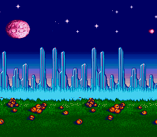

# Parallax Scrolling



Multi-speed horizontal scrolling using HDMA -- one background image, three scroll zones.

## What This Example Shows

- Splitting the screen into horizontal zones with different scroll speeds
- Using HDMA to update BG1HOFS per scanline group
- Creating a depth illusion with a single background layer
- Updating HDMA table values at runtime from C

## Controls

No interactive controls. The background scrolls automatically in three horizontal
bands at different speeds.

## Build & Run

```bash
cd $OPENSNES_HOME
make -C examples/graphics/effects/parallax_scrolling
```

Then open `parallax_scrolling.sfc` in your emulator (Mesen2 recommended).

## How It Works

### The Parallax Technique

Real parallax scrolling uses multiple BG layers at different speeds. This example
achieves the same depth effect with a **single layer** by using HDMA to change the
horizontal scroll register at different screen positions.

The screen is divided into three zones:

| Zone | Scanlines | Speed | Visual |
|------|-----------|-------|--------|
| Top | 72 lines | +1 px/frame | Stars/sky (distant, slow) |
| Middle | 88 lines | +2 px/frame | Midground pattern |
| Bottom | 64 lines | +4 px/frame | Grass/ground (close, fast) |

### HDMA Scroll Table

The HDMA table lives in RAM so it can be updated each frame:

```
Byte 0: 72          Line count (top zone)
Byte 1-2: scroll    16-bit horizontal offset
Byte 3: 88          Line count (middle zone)
Byte 4-5: scroll    16-bit horizontal offset
Byte 6: 64          Line count (bottom zone)
Byte 7-8: scroll    16-bit horizontal offset
Byte 9: 0x00        End marker
```

### HDMA Setup

```c
hdmaParallax(HDMA_CHANNEL_6, 0, scroll_table);
hdmaEnable(1 << HDMA_CHANNEL_6);
```

The `hdmaParallax()` function configures HDMA mode `1REG_2X` on the specified
channel, targeting the BG horizontal scroll register. Mode `1REG_2X` writes 2 bytes
to the same register -- the low byte and high byte of the scroll position.

### Animation Loop

Each frame, the main loop increments the scroll offsets at different rates:

```c
*(u16 *)&scroll_table[1] += 1;  /* +1 px/frame (slow) */
*(u16 *)&scroll_table[4] += 2;  /* +2 px/frame (medium) */
*(u16 *)&scroll_table[7] += 4;  /* +4 px/frame (fast) */
```

Because the table lives in RAM, the HDMA hardware reads the updated values on the
next frame automatically.

## SNES Concepts

### BG1HOFS ($210D) -- Write-Twice Register

BG scroll registers on the SNES are "write-twice" latched registers. You write the
low byte first, then the high byte, both to the same address. HDMA mode `1REG_2X`
handles this automatically by writing 2 bytes per entry to the target address.

### 64x32 Tilemap for Seamless Wrapping

The example uses a 64x32 tilemap (512 pixels wide). When the scroll offset exceeds
512, the tilemap wraps seamlessly because the PPU performs modular addressing on
the tilemap. This is wider than the screen (256 pixels), so there is always enough
off-screen content to scroll into.

### Why This Works with One Layer

In a true multi-layer parallax, BG1 and BG2 have independent scroll registers. But
HDMA can rewrite BG1HOFS at different points during the frame, effectively giving
each screen zone its own scroll speed. The limitation is that you cannot overlap
the zones -- each zone is a strict horizontal band.

## Project Structure

| File | Purpose |
|------|---------|
| `main.c` | HDMA table setup, per-frame scroll updates |
| `data.asm` | Background tiles, tilemap, and palette data |
| `res/back.png` | Source background image (512 pixels wide) |
| `Makefile` | `LIB_MODULES := console dma background sprite hdma input math` |

## Going Further

- **Player-controlled scroll**: Replace the automatic scroll with D-pad input.
  Only increment the offsets when a direction is held.

- **More zones**: Add more entries to the scroll table for 5-6 speed zones.
  The HDMA table just needs more `[count][lo][hi]` entries before the terminator.

- **Explore related examples**:
  - `backgrounds/continuous_scroll` -- True multi-layer parallax with player control
  - `effects/hdma_wave` -- Another HDMA technique (per-scanline wave distortion)
