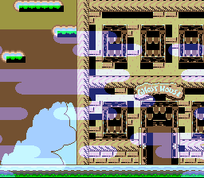

# Color Addition Transparency

> Additive blending between two background layers: a static landscape with
> semi-transparent clouds scrolling over it. No input required.



## Build & Run

```bash
cd $OPENSNES_HOME
make -C examples/graphics/effects/transparency
```

Then open `transparency.sfc` in your emulator (Mesen2 recommended).

## Controls

No interactive controls. The clouds scroll automatically.

## What You'll Learn

- How the SNES color math unit blends layers using CGWSEL and CGADSUB registers
- The difference between main screen and sub screen layer assignment
- How Mode 1 with BG3 priority high creates an overlay layer
- Mixing 4bpp (BG1) and 2bpp (BG3) tile formats in the same mode
- Using an assembly DMA loader for SUPERFREE graphics data with correct bank bytes

---

## SNES Concepts

### Color Math: Main Screen + Sub Screen

The SNES PPU can blend two images together using its color math unit. The "main screen"
is the final displayed image. The "sub screen" is a second, hidden rendering of selected
layers whose pixel colors are used as the blend source.

In this example:
- **Main screen**: BG1 (landscape) + BG3 (clouds) -- both visible
- **Sub screen**: BG3 (clouds) -- provides the color values for blending

The color math unit takes each main screen pixel and **adds** the corresponding sub
screen pixel color to it. Where clouds overlap the landscape, the cloud colors brighten
the landscape beneath them. Where there are no cloud pixels, no addition occurs.

### Mode 1 with BG3 Priority High

Mode 1 normally draws BG3 (2bpp) behind BG1 (4bpp). Setting `BG3_MODE1_PRIORITY_HIGH`
promotes BG3's high-priority tiles above all other BG layers, which is essential for the
cloud overlay to render on top of the landscape.

```c
setMode(BG_MODE1, BG3_MODE1_PRIORITY_HIGH);
```

### Color Math Configuration

```c
colorMathInit();
colorMathSetSource(COLORMATH_SRC_SUBSCREEN);  /* Blend source = sub screen */
colorMathSetOp(COLORMATH_ADD);                /* Addition (brightens) */
colorMathEnable(COLORMATH_BG1 | COLORMATH_BACKDROP);  /* What gets blended */
```

The `COLORMATH_BACKDROP` flag ensures clouds also blend over empty areas (CGRAM entry 0).

### Assembly DMA Loader

The tile data, tilemaps, and palettes live in SUPERFREE ROM sections that may land in
any bank. C code cannot reliably specify bank bytes for cross-bank data, so `data.asm`
provides a `loadGraphics()` routine that uses the `:label` syntax to get linker-resolved
bank bytes at link time. All graphics are loaded during forced blank (screen off) since
the total data exceeds the ~4KB VBlank DMA budget.

---

## Walkthrough

### Setup

1. `consoleInit()` initializes the PPU and NMI handler
2. Force blank (`REG_INIDISP = 0x80`) allows unlimited VRAM write time
3. `loadGraphics()` DMAs all tile/tilemap/palette data to VRAM and CGRAM
4. BG1 tilemap at VRAM `$2000`, tiles at `$0000` (4bpp landscape)
5. BG3 tilemap at VRAM `$2400`, tiles at `$1000` (2bpp clouds)
6. Main screen, sub screen, and color math are configured
7. Screen is turned on

### Main Loop

Each frame, BG3's horizontal scroll is incremented by one pixel. The tilemap wraps
naturally, creating seamless looping clouds:

```c
while (1) {
    scrX++;
    bgSetScroll(2, scrX, 0);  /* bg index 2 = BG3 (0-indexed) */
    WaitForVBlank();
}
```

`bgSetScroll()` defers the actual PPU register write to the NMI handler via a dirty-flag
mechanism, ensuring scroll updates happen safely during VBlank.

---

## Files

| File | Purpose |
|------|---------|
| `main.c` | PPU setup, color math configuration, scroll loop |
| `data.asm` | Assembly DMA loader + SUPERFREE graphics data |
| `Makefile` | Build config, gfx4snes conversion rules |
| `res/backgrounds.bmp` | 4bpp landscape source image |
| `res/clouds.bmp` | 2bpp cloud overlay source image |

## What's Next?

**Window Masking:** [Window Example](../window/) - Triangle-shaped HDMA window

**HDMA Gradient:** [Gradient Colors](../gradient_colors/) - Per-scanline color effects
