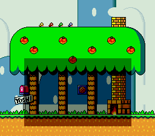

# Transparent Window -- Color Math + HDMA



A semi-transparent darkened rectangle rendered over a background image using
SNES color math and HDMA-driven window boundaries. No input -- the effect is
static.

Ported from PVSnesLib "TransparentWindow" example by Digifox.

## Controls

No interactive controls. The darkened rectangle is displayed statically.

## Build & Run

```bash
cd $OPENSNES_HOME
make -C examples/graphics/effects/transparent_window
```

Then open `transparent_window.sfc` in your emulator (Mesen2 recommended).

## How It Works

### The Technique

This combines three SNES hardware features:

1. **HDMA** changes the window boundaries per scanline to define a rectangle
2. **Window masking** restricts color math to the rectangular region
3. **Color math** subtracts a fixed color inside the window, darkening pixels

### Window for Color Math (Not for BG Masking)

The key insight: windows can control **where color math applies** independently
from where they mask background layers.

- `REG_WOBJSEL = 0x20` enables Window 1 for the color math region
- `REG_TMW = 0` -- no background layers are masked by the window
- The background is fully visible everywhere
- But inside the window rectangle, color math darkens the pixels

### HDMA Rectangle

Two HDMA channels define the rectangle shape by driving WH0 ($2126) and
WH1 ($2127):

```
Lines  0-95:  WH0=255, WH1=0  -> window disabled (left > right = no region)
Lines 96-207: WH0=40,  WH1=216 -> rectangle from x=40 to x=216
Lines 208+:   WH0=255, WH1=0  -> window disabled again
```

The tables use **repeat mode** (bit 7 set in the line count byte) for the
rectangle segment. Even though the values are constant across those scanlines,
repeat mode ensures WH0/WH1 are re-written every line. This is required because
WH0/WH1 are write-only PPU registers.

### Color Math Configuration

| Register | Value | Effect |
|----------|-------|--------|
| CGWSEL ($2130) | `0x10` | Apply math inside color window only, use fixed color |
| CGADSUB ($2131) | `0x82` | Subtract mode, BG2 participates |
| COLDATA ($2132) | `0xEC` | Subtract intensity 12 from R+G+B (moderate darkening) |

## SNES Concepts

### Color Math Window vs BG Window

The SNES window system serves two independent purposes:
- **BG/OBJ masking** (controlled by W12SEL/$2123 and TMW/$212E): hides pixels
  inside or outside the window
- **Color math region** (controlled by WOBJSEL/$2125 and CGWSEL/$2130): restricts
  where add/subtract blending applies

This example uses only the color math window, leaving BG masking untouched. The
background is fully visible everywhere, but the rectangular region gets darkened.

### Practical Use

This technique is used in RPGs for dialog boxes (darken the area behind text),
menu overlays, and spotlight effects. It costs zero CPU time -- all hardware.

## Project Structure

| File | Purpose |
|------|---------|
| `main.c` | HDMA tables, color math setup, window config |
| `data.asm` | Background tiles, tilemap, and palette data |
| `res/background.png` | Source background image |
| `Makefile` | `LIB_MODULES := console sprite dma background window colormath hdma math` |

## Going Further

- **Animated rectangle**: Move the rectangle by modifying the HDMA table values
  each frame. Change the `RECT_X` and `RECT_Y` offsets and rebuild the tables.

- **Rounded corners**: Use per-scanline HDMA values that curve inward at the top
  and bottom of the rectangle, creating a rounded window.

- **Explore related examples**:
  - `effects/window` -- Triangle-shaped HDMA window (BG masking, not color math)
  - `effects/transparency` -- Color math without windows (full-screen effects)
