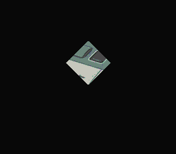

# Window -- HDMA Triangle Masking



A triangle-shaped window mask driven by HDMA, showing how per-scanline window
boundary updates create non-rectangular shapes. Press **A**, **X**, or **B** to
apply the window to different background layers.

Ported from PVSnesLib "Window" example.

## Controls

| Button | Action |
|--------|--------|
| **A** | Window on BG1 only |
| **X** | Window on BG2 only |
| **B** | Window on both BG1 and BG2 |

## Build & Run

```bash
cd $OPENSNES_HOME
make -C examples/graphics/effects/window
```

Then open `window.sfc` in your emulator (Mesen2 recommended).

## How It Works

### SNES Window System

The SNES PPU has two hardware windows -- rectangular regions defined by left and
right X coordinates. These windows can mask (hide) portions of any background
layer or sprite layer. Window operations cost zero CPU time because they are
handled entirely by the PPU.

### Making Non-Rectangular Shapes with HDMA

A single window is always a horizontal band. But by changing the left/right
boundaries **every scanline** using HDMA, you can create any shape -- circles,
triangles, or custom silhouettes.

This example uses two HDMA channels:
- **Channel 6** writes to WH0 ($2126) -- window 1 left boundary
- **Channel 7** writes to WH1 ($2127) -- window 1 right boundary

### The Triangle Tables

The HDMA tables define a diamond/triangle shape centered on screen:

```
Line  0-59:  WH0=255, WH1=0   -> left > right -> window disabled (no mask)
Line 60-91:  WH0 shrinks 127->96, WH1 grows 129->160 -> triangle expands
Line 92-123: WH0 grows 96->127, WH1 shrinks 160->129 -> triangle contracts
Line 124+:   WH0=255, WH1=0   -> window disabled again
```

The tables use **repeat mode** (bit 7 set in the line count) because each
scanline needs a different value. Non-repeat mode would write once and hold,
which does not work when the shape changes per line.

### Inversion: Show Inside

By default, TMW (main screen window at $212E) hides pixels **inside** the window.
The code sets the **invert** flag in W12SEL ($2123) so that pixels **outside**
the window are hidden instead -- revealing only the triangle-shaped area.

### Switching Layers

When you press A/X/B, the code:
1. Disables HDMA channels
2. Resets all window registers via `windowInit()`
3. Enables window 1 on the new layer(s) with inversion
4. Sets TMW for the new layer(s)
5. Re-enables HDMA

## SNES Concepts

### W12SEL Register ($2123)

This register controls Window 1 enable and inversion for BG1 and BG2:

| Bit | Purpose |
|-----|---------|
| 0 | BG1 Window 1 Invert |
| 1 | BG1 Window 1 Enable |
| 4 | BG2 Window 1 Invert |
| 5 | BG2 Window 1 Enable |

Setting both the enable and invert bits for a BG makes pixels **outside** the
window invisible, revealing only the windowed region.

### Window Shapes in Commercial Games

This technique was used extensively: spotlight effects in Mega Man X, the
title screen reveal in Donkey Kong Country, and dialog box cutouts in RPGs.
Any shape that can be described as a left-right boundary pair per scanline
can be rendered as a window.

## VRAM Layout

| Region | Content |
|--------|---------|
| $0000 | BG1 tilemap (32x32) |
| $1000 | BG2 tilemap (32x32) |
| $4000 | BG1 tiles (4bpp, 16 colors) |
| $6000 | BG2 tiles (4bpp, 16 colors) |

## Project Structure

| File | Purpose |
|------|---------|
| `main.c` | HDMA triangle tables, window setup, input loop |
| `data.asm` | Two backgrounds (BG1 + BG2) graphics data |
| `res/bg1.png` | Background 1 (palette slot 0) |
| `res/bg2.png` | Background 2 (palette slot 1) |
| `Makefile` | `LIB_MODULES := console sprite dma input background window hdma math` |

## Going Further

- **Animated window**: Modify the triangle tables each frame to make the shape
  pulse or rotate. Copy the tables to RAM and adjust the boundary values.

- **Circle window**: Replace the linear expansion/contraction with a circular
  profile calculated from the equation `x = sqrt(r^2 - y^2)`.

- **Explore related examples**:
  - `effects/transparent_window` -- Window + color math for semi-transparent overlays
  - `effects/hdma_wave` -- Another HDMA-driven per-scanline effect
