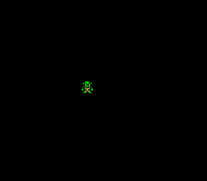

# Animated Sprite -- Direction States and Sprite Sheets



## What This Example Shows

How to animate a character sprite that walks in 4 directions with 3 animation frames
each. Demonstrates sprite sheet layout, direction state machines, and horizontal flip
to reuse art.

## Prerequisites

Read `sprites/simple_sprite` first (OAM basics, tile loading).

## Controls

| Button | Action |
|--------|--------|
| D-PAD Up | Walk up |
| D-PAD Down | Walk down |
| D-PAD Left | Walk left (flipped) |
| D-PAD Right | Walk right |

## Build & Run

```bash
cd $OPENSNES_HOME
make -C examples/graphics/sprites/animated_sprite
```

Then open `animated_sprite.sfc` in your emulator (Mesen2 recommended).

## How It Works

### 1. Sprite sheet layout

The sprite sheet is a PNG strip containing 9 frames of 16x16 sprites, loaded
to VRAM at startup via `oamInitGfxSet()`. Each 16x16 sprite occupies 2 tile
columns in VRAM. The frame index maps to tile numbers:

- Walking down: tiles 0, 2, 4
- Walking up: tiles 6, 8, 10
- Walking right: tiles 12, 14, 32
- Walking left: same as right, but with `OBJ_FLIPX`

### 2. State machine

```c
enum SpriteState {
    W_DOWN = 0,
    W_UP = 1,
    W_RIGHT = 2,
    W_LEFT = 2  /* Reuses W_RIGHT with flipx */
};
```

Left and right share the same animation row -- the PPU's horizontal flip flag
(`OBJ_FLIPX`) mirrors the sprite at zero CPU cost. This is a standard SNES
technique that halves the sprite art needed for left/right movement.

### 3. Animation timing

```c
monster.anim_delay++;
if (monster.anim_delay >= ANIM_DELAY) {
    monster.anim_delay = 0;
    monster.anim_frame++;
    if (monster.anim_frame >= 3) monster.anim_frame = 0;
}
```

Animation only advances when a direction button is held. `ANIM_DELAY` (6 frames)
controls walking speed -- at 60 fps, this means about 10 animation steps per second.

### 4. Tile calculation

The tile number is computed from the state and frame:

```c
if (state == W_DOWN)  tile = frame * 2;          /* 0, 2, 4 */
if (state == W_UP)    tile = 6 + frame * 2;      /* 6, 8, 10 */
if (state == W_RIGHT) tile = 12 + frame * 2;     /* 12, 14, (32) */
```

Frame 2 of the right-walk is at tile 32 (next row in VRAM) because the sheet wraps
at 16 tiles per row.

## SNES Concepts

### OBJ_FLIPX -- Hardware Horizontal Mirror

The PPU can flip any sprite horizontally by setting a single bit in the OAM
attribute byte. This costs nothing -- no extra tiles in VRAM, no CPU work.
Many SNES games use this to halve the sprite art needed for left/right movement.

### Sprite Sheets in VRAM

All animation frames are loaded into VRAM at once via `oamInitGfxSet()`. The
active frame is selected by changing the tile number in `oamSet()`. This means
switching frames is instant -- just change a number, no DMA needed.

### 16x16 Tiles in OAM

In OAM, a 16x16 sprite uses 4 hardware 8x8 tiles arranged in a 2x2 grid. The
tile number refers to the top-left tile; the PPU fills in the rest automatically
using the SNES tile numbering convention (right tile = tile+1, bottom tiles follow
the 16-tile-per-row VRAM layout).

## Project Structure

| File | Purpose |
|------|---------|
| `main.c` | Input handling, state machine, animation logic |
| `data.asm` | Sprite tile data and palette via `.INCBIN` |
| `res/sprites.png` | Source sprite sheet (9 frames, 16x16 each) |
| `Makefile` | `LIB_MODULES := console sprite dma input` |

## Going Further

- **Add diagonal movement**: Check for simultaneous Up+Right, Down+Left, etc.
  Choose a direction state based on the last-pressed direction.

- **Variable walk speed**: Use fixed-point positions (8.8 format) for sub-pixel
  movement. This gives smoother motion at speeds between 1 and 2 pixels per frame.

- **Explore related examples**:
  - `sprites/dynamic_sprite` -- Stream frames instead of pre-loading all of them
  - `games/breakout` -- Multiple sprites interacting with game logic
