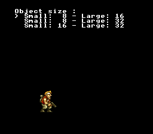

# Dynamic Metasprite Engine

> Multi-tile sprite characters with dynamic VRAM streaming



## Build & Run

```bash
cd $OPENSNES_HOME
make -C examples/graphics/sprites/dynamic_metasprite
```

Then open `dynamic_metasprite.sfc` in your emulator (Mesen2 recommended).

## What You'll Learn

- Dynamic VRAM tile streaming for multi-tile sprite characters
- Defining metasprites with `MetaspriteItem` arrays
- Three OBJSEL size configurations: 8/16, 8/32, 16/32
- Using `oamMetaDrawDyn(id, x, y, meta, gfx, OBJ_SMALL/OBJ_LARGE)`
- Force blank for glitch-free OBJSEL changes at runtime

## Controls

| Button | Action |
|--------|--------|
| D-PAD Up/Down | Switch OBJSEL size configuration |

## Modules Used

| Module | Purpose |
|--------|---------|
| console | System initialization |
| sprite | OAM management |
| sprite_dynamic | Dynamic VRAM tile streaming |
| sprite_dynamic_meta | Metasprite draw functions |
| sprite_lut | Sprite lookup tables |
| dma | DMA transfers |
| background | BG configuration |
| text | Menu text display |
| input | Joypad reading |
