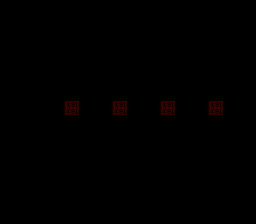

# Dynamic Sprite

> Four animated 16x16 characters, all updating their VRAM tiles on the fly.
> No input needed — just sit back and watch the animation engine work.



## Build & Run

```bash
make -C examples/graphics/sprites/dynamic_sprite
# Open dynamic_sprite.sfc in Mesen2
```

## What You'll Learn

- Why you can't preload all animation frames into VRAM (and what to do instead)
- How the dynamic sprite system queues tile updates for VBlank
- The `oambuffer` struct — the RAM-side shadow of what the PPU sees
- Frame-rate independent animation with a tick counter

---

## Walkthrough

### 1. The Problem with Animation

A 16x16 sprite in 4bpp is 128 bytes of VRAM. If your character has 24 animation frames,
that's `24 × 128 = 3072 bytes` — just for one character. Four characters? 12 KB. The SNES
has 32 KB of sprite VRAM total, and half of it is usually reserved for backgrounds.

You could preload all frames and switch between them with tile numbers. That works for
small sprite sheets. But real games have characters with dozens of animations (walk, run,
jump, attack, die...), and VRAM fills up fast.

The dynamic sprite system solves this: **only the current frame lives in VRAM.** When the
animation advances, the system DMAs the new frame's tiles during VBlank, overwriting the
old ones. You get unlimited animation frames with constant VRAM cost.

### 2. Initialization — One Call Does a Lot

```c
REG_INIDISP = INIDISP_FORCE_BLANK;

oamInitDynamicSprite(0x0000, 0x1000, 0, 0, OBJ_SIZE8_L16);
dmaCopyCGram(spr16_properpal, 128, 32);
```

`oamInitDynamicSprite()` sets up the entire dynamic sprite engine:
- `0x0000`: OAM name base (where sprite tiles start in VRAM)
- `0x1000`: name select offset
- `OBJ_SIZE8_L16`: small sprites are 8x8, large sprites are 16x16

The palette goes into CGRAM slot 128 (sprite palettes start at color 128 on the SNES).
We do all this during force blank — the display is off, so VRAM and CGRAM are fully
accessible.

### 3. Setting Up Four Sprites

Each sprite lives in the `oambuffer` — a RAM array that shadows the hardware OAM.
Instead of writing PPU registers directly, you fill in struct fields:

```c
oambuffer[0].oamx = xpos[0];       /* X position on screen */
oambuffer[0].oamy = 100;            /* Y position */
oambuffer[0].oamframeid = frame0;   /* Which animation frame (0-23) */
oambuffer[0].oamattribute = OBJ_PRIO(3);  /* Highest priority */
oambuffer[0].oamrefresh = 1;        /* "I changed, please update VRAM" */
OAM_SET_GFX(0, spr16_tiles);       /* Point to tile data in ROM */
```

> **What's `oamrefresh`?** It's the flag that tells the dynamic engine "this sprite's
> frame changed, upload new tiles." Without it, the engine skips the DMA — important
> for performance, because you only pay the VBlank cost for sprites that actually changed.

Four sprites, four positions, all starting at frame 0:

```c
static const s16 xpos[4] = {64, 112, 160, 208};
```

They're spaced 48 pixels apart across the screen, all at y=100.

### 4. The First Frame — Drawing Before the Loop

Before entering the main loop, we draw all four sprites and flush the VRAM queue:

```c
oamDynamic16Draw(0);
oamDynamic16Draw(1);
oamDynamic16Draw(2);
oamDynamic16Draw(3);
oamVramQueueUpdate();
oamInitDynamicSpriteEndFrame();
```

`oamDynamic16Draw(n)` reads sprite n's current frame and queues the tile data for upload.
`oamVramQueueUpdate()` does the actual DMA. `oamInitDynamicSpriteEndFrame()` resets the
queue for the next frame.

This three-step dance — draw, flush, reset — happens every frame.

### 5. The Animation Loop

The main loop is clean: wait for VBlank, advance the animation every 8 frames, redraw:

```c
while (1) {
    WaitForVBlank();

    frame_counter++;
    if (frame_counter >= 8) {
        frame_counter = 0;

        frame0++;
        if (frame0 >= 24) frame0 = 0;
        oambuffer[0].oamframeid = frame0;
        oambuffer[0].oamrefresh = 1;

        /* Same for sprites 1, 2, 3... */
    }

    oamDynamic16Draw(0);
    oamDynamic16Draw(1);
    oamDynamic16Draw(2);
    oamDynamic16Draw(3);
    oamVramQueueUpdate();
    oamInitDynamicSpriteEndFrame();
}
```

The `frame_counter >= 8` check means animation advances every 8 VBlanks, which at 60fps
gives about 7.5 fps for the animation — smooth enough for walk cycles.

> **Why separate frame counters for each sprite?** In this demo they're all in sync,
> but the structure lets you easily give each sprite different animation speeds or
> offsets. Sprite 0 could walk while sprite 2 idles — just change when you increment
> their counters.

### 6. What Happens During VBlank

Here's the flow each frame, under the hood:

```
Main loop                    NMI handler (VBlank)
─────────                    ────────────────────
advance frames               ┌─ DMA oambuffer → OAM ($0300→$2104)
set oamrefresh = 1           │  DMA queued tiles → VRAM
call oamDynamic16Draw()      │  Read joypads
  → queues tile data         └─ Set vblank_flag
call oamVramQueueUpdate()
  → DMA tiles to VRAM
call oamInitDynamicSpriteEndFrame()
  → reset queue
```

The key insight: `oamDynamic16Draw` doesn't touch VRAM. It just says "sprite 0 needs
these tiles uploaded." The actual VRAM write happens in `oamVramQueueUpdate()`, which
must run during VBlank (guaranteed because we just called `WaitForVBlank()`).

---

## Tips & Tricks

- **Sprites are invisible?** Check that `REG_TM` includes `TM_OBJ`. Without it, the PPU
  won't draw sprites, period. Also verify the palette is loaded to CGRAM 128+, not 0+
  (sprite palettes are separate from BG palettes).

- **Animation looks frozen?** Make sure `oamrefresh` is set to 1 after changing
  `oamframeid`. Without the refresh flag, the engine thinks nothing changed and skips
  the DMA.

- **Garbled tiles during init?** Large DMA transfers can overflow VBlank time. The
  `REG_INIDISP = INIDISP_FORCE_BLANK` at the start ensures we're not racing the PPU.
  Don't remove it.

- **Why explicit sprite setup instead of a loop?** The OpenSNES compiler sometimes
  generates incorrect code for certain loop+struct patterns. Spelling out each sprite
  explicitly is ugly but guaranteed correct. When the compiler matures, a loop will work.

---

## Go Further

- **Add user control:** Read the joypad and move one sprite with the D-pad.
  See [Calculator](../../../basics/calculator/) for input handling patterns.

- **Different animation speeds:** Give each sprite a different `frame_counter` threshold.
  Sprite 0 at 4 (fast), sprite 3 at 16 (slow). See how it looks.

- **Mix with backgrounds:** Add a BG layer behind the sprites. Set `REG_TM = TM_OBJ | TM_BG1`
  and load a tilemap. The sprites will float over the background.

- **Next example:** [Metasprite](../metasprite/) — combining multiple hardware sprites
  into one logical character.

---

## Under the Hood: The Build

### The Makefile

```makefile
TARGET      := dynamic_sprite.sfc
CSRC        := main.c
ASMSRC      := data.asm
USE_LIB     := 1
LIB_MODULES := console sprite sprite_dynamic sprite_lut dma background input
```

### Why `ASMSRC` for Sprite Data?

The sprite sheet is 24 frames of 16x16 4bpp tiles — that's `24 × 4 × 32 = 3072 bytes`
of raw pixel data, plus a 32-byte palette. This data was pre-converted from a PNG sprite
sheet using `gfx4snes` and stored as binary files (`.pic` and `.pal`).

`data.asm` includes these binaries with `.INCBIN` directives and exports them as
symbols (`spr16_tiles`, `spr16_properpal`) that C code can reference:

```asm
.SECTION ".sprites" SUPERFREE
spr16_tiles:  .INCBIN "res/sprite16_grid.pic"
.ENDS

.SECTION ".palette" SUPERFREE
spr16_properpal:  .INCBIN "res/sprite16_proper.pal"
.ENDS
```

> **Why not `#include` the data in C?** Two reasons: size and placement. A 3 KB array in C
> would consume precious WRAM (bank $00, limited to 8 KB). In assembly with `SUPERFREE`,
> the linker places it in any available ROM bank. C code gets a pointer to ROM — zero RAM cost.

### Why So Many Modules?

| Module | Why it's here |
|--------|--------------|
| `console` | `consoleInit()`, NMI handler, `WaitForVBlank()` |
| `sprite` | OAM buffer management (`oamSet()`, `oamInit()`) |
| `sprite_dynamic` | The VRAM queue engine: `oamDynamic16Draw()`, `oamVramQueueUpdate()`, `oamInitDynamicSpriteEndFrame()` |
| `sprite_lut` | Lookup tables for sprite tile calculations (tile offsets, sizes) |
| `dma` | DMA transfers — both OAM buffer → PPU and queued tile data → VRAM |
| `background` | Background layer configuration (used by console's init) |
| `input` | Joypad buffer declarations for the NMI handler |

The dynamic sprite engine is the most module-heavy system in OpenSNES. It's three
modules deep: `sprite_dynamic` needs `sprite_lut` for tile math, `sprite` for OAM
buffer access, and `dma` for the actual VRAM transfers.

### The gfx4snes Tool (Asset Conversion)

The sprite sheet in `res/` was converted offline:

```bash
gfx4snes -s 16 -p -i sprite16_grid.png
```

| Flag | Meaning |
|------|---------|
| `-s 16` | Tile size: 16x16 pixels (default is 8x8) |
| `-p` | Generate palette file (`.pal`) alongside tile data (`.pic`) |
| `-i` | Input file |

`gfx4snes` reads a PNG, splits it into tiles of the specified size, encodes each tile
in the SNES 4bpp bitplane format, and writes the raw binary. The output is ready to
DMA straight into VRAM — no runtime conversion needed.

---

## Technical Reference

| Register | Address | Role in this example |
|----------|---------|---------------------|
| INIDISP  | $2100   | Force blank during initialization |
| BGMODE   | $2105   | Mode 1 (for sprite layer) |
| TM       | $212C   | Enable OBJ layer only (`TM_OBJ`) |

## Files

| File | What's in it |
|------|-------------|
| `main.c` | Sprite setup, animation loop (~116 lines) |
| `data.asm` | ROM tile data: `spr16_tiles` (24 frames), `spr16_properpal` |
| `res/sprite16_grid.pic` | 128×48 sprite sheet (24 frames of 16x16, 4bpp) |
| `res/sprite16_proper.pal` | 16-color sprite palette |
| `Makefile` | `LIB_MODULES := console sprite sprite_dynamic sprite_lut dma background input` |
