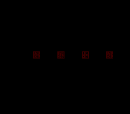

# Dynamic Sprite -- VRAM Streaming for Animated Sprites



## What This Example Shows

How to use the **dynamic sprite system** to stream sprite tile data into VRAM every frame.
Unlike static sprites (where all frames live in VRAM permanently), dynamic sprites upload
only the current animation frame, saving VRAM space when sprites have many frames.

This demo displays 4 animated 16x16 sprites, each cycling through 24 frames of animation.

## Prerequisites

Read `sprites/simple_sprite` first (OAM basics), then `sprites/animated_sprite`
(frame-based animation).

## Controls

No interactive controls. Four sprites animate automatically.

## Build & Run

```bash
cd $OPENSNES_HOME
make -C examples/graphics/sprites/dynamic_sprite
```

Then open `dynamic_sprite.sfc` in your emulator (Mesen2 recommended).

## How It Works

### 1. Initialize the dynamic sprite engine

```c
oamInitDynamicSprite(0x0000, 0x1000, 0, 0, OBJ_SIZE8_L16);
```

This configures the engine:
- VRAM base: `$0000` (where streaming sprites start)
- VRAM ceiling: `$1000` (max VRAM used -- prevents overwriting background data)
- Sprite size: 8x8 small / 16x16 large

### 2. Set up sprites via the oambuffer

```c
oambuffer[0].oamx = 64;
oambuffer[0].oamy = 100;
oambuffer[0].oamframeid = 0;
oambuffer[0].oamattribute = OBJ_PRIO(3);
oambuffer[0].oamrefresh = 1;
OAM_SET_GFX(0, spr16_tiles);
```

Each dynamic sprite has:
- **oamframeid**: which animation frame to display (index into the sprite sheet)
- **oamrefresh**: set to 1 when the frame changes -- tells the engine to re-upload tiles
- **OAM_SET_GFX**: points to the source tile data in ROM

### 3. Draw and upload every frame

```c
oamDynamic16Draw(0);        /* Queue sprite 0 for VRAM upload */
oamVramQueueUpdate();       /* DMA all queued tiles to VRAM */
oamInitDynamicSpriteEndFrame();  /* Reset for next frame */
```

The draw/upload cycle runs every frame in the main loop. Only sprites with
`oamrefresh = 1` actually trigger a DMA transfer.

### 4. Animate by changing frame IDs

```c
frame0++;
if (frame0 >= 24) frame0 = 0;
oambuffer[0].oamframeid = frame0;
oambuffer[0].oamrefresh = 1;
```

Every 8 frames, the animation advances. Setting `oamrefresh = 1` tells the engine
to upload the new frame's tiles to VRAM on the next `oamVramQueueUpdate()` call.

## SNES Concepts

### VRAM Budget During VBlank

The SNES can only write to VRAM during VBlank. With DMA, you get roughly 4-5 KB
per frame. Each 16x16 sprite frame is 128 bytes (4 tiles x 32 bytes). With 4
sprites updating simultaneously, that is 512 bytes -- well within budget.

### Static vs Dynamic Sprites

- **Static**: All frames pre-loaded in VRAM. Frame selection is instant (just change
  the tile number). Downside: a 24-frame sprite uses 3 KB of VRAM permanently.
- **Dynamic**: Only the current frame lives in VRAM. Supports hundreds of frames
  with minimal VRAM usage. Downside: each frame change costs DMA time during VBlank.

Dynamic sprites are the right choice when sprites have many animation frames (RPG
characters with walk cycles, attack animations, etc.) or when multiple unique
characters share limited VRAM space.

### Force Blank for Initial Setup

This demo uses `setScreenOff()` (which sets `REG_INIDISP = 0x80`) during setup to
allow unlimited VRAM writes. During gameplay, writes happen via DMA in VBlank only.

## Project Structure

| File | Purpose |
|------|---------|
| `main.c` | Dynamic sprite initialization, animation loop |
| `data.asm` | Sprite tile data (24-frame sheet) and palette via `.INCBIN` |
| `res/sprite16_grid.png` | 16x16 sprite sheet source |
| `Makefile` | `LIB_MODULES := console sprite sprite_dynamic sprite_lut dma background input` |

## Going Further

- **Move sprites with input**: Add `padHeld()` and update `oambuffer[0].oamx/oamy`
  based on D-pad direction.

- **Mix static and dynamic**: Use static sprites for simple objects (bullets, UI
  elements) and dynamic sprites for complex animated characters.

- **Explore related examples**:
  - `games/breakout` -- Dynamic sprites in a real game context
  - `games/likemario` -- Dynamic sprites with scrolling backgrounds
