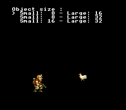

# Metasprite

This example demonstrates how to compose large characters from multiple hardware sprites using the metasprite system. The SNES OAM supports only two sprite sizes per frame (selected via register $2101), so characters larger than one hardware sprite must be assembled from several. This example displays hero characters at three different OBJ size configurations -- 8x8/16x16, 8x8/32x32, and 16x16/32x32 -- and lets you switch between them with the D-PAD to see how the same character is built from different hardware sprite sizes.



## What You'll Learn

- How metasprites combine multiple hardware sprites into one logical character
- How the SNES OBJ size register ($2101) selects two active sprite sizes per frame
- How `MetaspriteItem` structures define relative positions and tile offsets
- How `oamDrawMeta()` places a list of hardware sprites from a single function call
- How VRAM tile layout relates to OAM tile numbering

## SNES Concepts

### OBJ Size Modes (Register $2101)

The SNES PPU supports 128 hardware sprites (OAM entries), but only two sizes are available at any time, controlled by bits 5-7 of register $2101 (OBJSEL). Each OAM entry has a size bit selecting either "small" or "large." The three modes used in this example:

| OBJSEL Mode | Small | Large | Constant |
|-------------|-------|-------|----------|
| OBJ_SIZE8_L16 | 8x8 | 16x16 | `0x00` (bits 7-5) |
| OBJ_SIZE8_L32 | 8x8 | 32x32 | `0x20` (bits 7-5) |
| OBJ_SIZE16_L32 | 16x16 | 32x32 | `0x60` (bits 7-5) |

You cannot mix three sizes (e.g. 8x8 + 16x16 + 32x32) in one frame. Choose the two sizes that best suit your game's needs.

### MetaspriteItem Structure

A metasprite is defined as an array of `MetaspriteItem` entries, terminated by `METASPR_TERM`. Each item specifies the X/Y offset from the metasprite origin, a tile number, and attribute flags (palette, priority, flip):

```c
static const MetaspriteItem hero16_frame0[] = {
    METASPR_ITEM(0,  0,  0,  OBJ_PAL(0) | OBJ_PRIO(2)),  /* top-left */
    METASPR_ITEM(16, 0,  2,  OBJ_PAL(0) | OBJ_PRIO(2)),  /* top-right */
    METASPR_ITEM(0,  16, 4,  OBJ_PAL(0) | OBJ_PRIO(2)),  /* middle-left */
    METASPR_ITEM(16, 16, 6,  OBJ_PAL(0) | OBJ_PRIO(2)),  /* middle-right */
    METASPR_ITEM(0,  32, 8,  OBJ_PAL(0) | OBJ_PRIO(2)),  /* bottom-left */
    METASPR_ITEM(16, 32, 10, OBJ_PAL(0) | OBJ_PRIO(2)),  /* bottom-right */
    METASPR_TERM
};
```

### VRAM Tile Layout and OAM Tile Numbers

OAM tile numbers reference 8x8 tiles in VRAM, regardless of the hardware sprite size. A 16x16 sprite uses 4 consecutive 8x8 tiles (2 across x 2 down in the VRAM character grid, which is 16 tiles wide). A 32x32 sprite uses 16 tiles. The `-T` flag in gfx4snes transposes the sprite sheet to match the SNES OBJ VRAM grid layout, so tile indices in the metasprite data correspond directly to positions in the converted `.pic` file.

This example packs all three sprite sheets into contiguous VRAM starting at $0000:

| Sprite Set | VRAM Address | Tiles | Base Tile |
|------------|-------------|-------|-----------|
| hero32 | $0000 | 192 | 0 |
| hero16 | $0C00 | 96 | 192 |
| hero8 | $1200 | 16 | 288 |

## Controls

| Button | Action |
|--------|--------|
| D-PAD Up | Select previous OBJ size mode |
| D-PAD Down | Select next OBJ size mode |

## How It Works

**1. Load all sprite tiles** -- Three sprite sheets are DMA'd to contiguous VRAM regions while the screen is blanked:

```c
dmaCopyVram(spritehero32_til, VRAM_HERO32, HERO32_TILES * TILE_BYTES);
dmaCopyVram(spritehero16_til, VRAM_HERO16, HERO16_TILES * TILE_BYTES);
dmaCopyVram(spritehero8_til,  VRAM_HERO8,  HERO8_TILES * TILE_BYTES);
dmaCopyCGram(spritehero32_pal, 128, 32);  /* sprite palette 0 */
```

**2. Set OBJ size mode** -- When the user switches modes, the OBJSEL register is updated and OAM is cleared:

```c
static void changeObjSize(void) {
    WaitForVBlank();
    if (selectedItem == 0)
        REG_OBJSEL = OBJ_SIZE_TO_REG(OBJ_SIZE8_L16);
    else if (selectedItem == 1)
        REG_OBJSEL = OBJ_SIZE_TO_REG(OBJ_SIZE8_L32);
    else
        REG_OBJSEL = OBJ_SIZE_TO_REG(OBJ_SIZE16_L32);
    oamClear();
}
```

**3. Draw metasprites** -- `oamDrawMeta()` iterates the `MetaspriteItem` array, placing hardware sprites at the origin plus each item's (dx, dy) offset. The `baseTile` parameter offsets all tile indices so that different sprite sheets can share the same VRAM region. It returns the next available OAM ID, enabling sequential placement of multiple metasprites:

```c
/* Mode 0: hero16 (LARGE=16x16) + hero8 (SMALL=8x8) */
nextId = oamDrawMeta(0, 64, 140, hero16_frame0,
                     BASE_TILE_16, 0, OBJ_LARGE);
oamDrawMeta(nextId, 160, 148, hero8_frame0,
            BASE_TILE_8, 0, OBJ_SMALL);
```

**4. Text menu** -- A text overlay on BG1 (Mode 1, 4bpp font) shows the current selection and the two active sprite sizes, updated whenever the user presses Up or Down.

## Project Structure

```
metasprite/
├── main.c              — OBJ mode switching, metasprite drawing, text menu
├── data.asm            — ROM data: three sprite tile sets and palettes
├── Makefile            — Build configuration with gfx4snes -T (transpose) rules
└── res/
    ├── spritehero32.png    — 64x64 hero sprite sheet (32x32 tiles, 4bpp)
    ├── spritehero16.png    — 32x48 hero sprite sheet (16x16 tiles, 4bpp)
    ├── spritehero8.png     — 16x16 hero sprite sheet (8x8 tiles, 4bpp)
    ├── hero32_meta.inc     — MetaspriteItem definitions for 32x32 frames
    ├── hero16_meta.inc     — MetaspriteItem definitions for 16x16 frames
    └── hero8_meta.inc      — MetaspriteItem definitions for 8x8 frames
```

## Build & Run

```bash
cd $OPENSNES_HOME
make -C examples/graphics/sprites/metasprite
```

Then open `metasprite.sfc` in your emulator (Mesen2 recommended).
