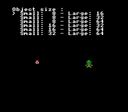

# Object Size -- All 6 SNES Sprite Size Modes



## What This Example Shows

An interactive menu to switch between all **6 SNES sprite size combinations**.
The SNES OBJSEL register defines two sizes (small and large) that apply to all
128 sprites. Each sprite chooses small or large via its OAM high-table bit.

## Controls

| Button | Action |
|--------|--------|
| D-PAD UP/DOWN | Select sprite size mode |

## Build & Run

```bash
cd $OPENSNES_HOME
make -C examples/graphics/sprites/object_size
```

Then open `object_size.sfc` in your emulator (Mesen2 recommended).

## How It Works

### 1. Set up text on BG1 (4bpp in Mode 1)

```c
textInit();
textLoadFont4bpp(0x0000);
bgSetGfxPtr(0, 0x0000);
bgSetMapPtr(0, 0x3800, SC_32x32);
```

The built-in font is loaded as 4bpp tiles at VRAM `$0000`. The text system
writes to a RAM buffer, then DMAs to the tilemap at `$3800` during VBlank.

### 2. Load sprites with force blank

```c
REG_INIDISP = 0x80;  /* Force blank -- unlimited VRAM write time */

oamInitGfxSet(sprite8, size, palette, palsize, 0, 0x4100, OBJ_SIZE8_L32);
dmaCopyVram(sprite32, 0x4500, size32);

REG_INIDISP = 0x0F;  /* Restore display */
```

**Force blank is required** because larger sprites (32x32, 64x64) exceed the
~4 KB VBlank DMA budget. Without it, VRAM writes are silently dropped by the PPU.

### 3. Two sprites per mode

```c
oamSet(0, 70, 120, 0x0010, 0, 3, 0);   /* Small sprite, left */
oamSetEx(0, OBJ_SMALL, OBJ_SHOW);

oamSet(1, 170, 120, 0x0050, 1, 3, 0);  /* Large sprite, right */
oamSetEx(1, OBJ_LARGE, OBJ_SHOW);
```

Tile numbers are offsets from the OBJSEL name base (`$4000`):
- Small at VRAM `$4100`: tile = (`$4100` - `$4000`) / 16 = `$10`
- Large at VRAM `$4500`: tile = (`$4500` - `$4000`) / 16 = `$50`

## The 6 Size Modes

| Mode | Small | Large | OBJSEL Constant |
|------|-------|-------|-----------------|
| 0 | 8x8 | 16x16 | `OBJ_SIZE8_L16` |
| 1 | 8x8 | 32x32 | `OBJ_SIZE8_L32` |
| 2 | 8x8 | 64x64 | `OBJ_SIZE8_L64` |
| 3 | 16x16 | 32x32 | `OBJ_SIZE16_L32` |
| 4 | 16x16 | 64x64 | `OBJ_SIZE16_L64` |
| 5 | 32x32 | 64x64 | `OBJ_SIZE32_L64` |

Most SNES games use mode 3 (`OBJ_SIZE16_L32`) -- 16x16 for characters and
32x32 for bosses/effects. Mode 0 (`OBJ_SIZE8_L16`) is common for simple
games with small sprites.

## SNES Concepts

### OBJSEL Register ($2101)

This register sets the global size pair and name base address. Changing it affects
ALL 128 sprites simultaneously, so games typically pick one mode at startup and
stick with it for the entire game. The size pair defines what "small" and "large"
mean -- individual sprites select between the two via `oamSetEx()`.

### OAM High Table

Each of the 128 sprites has 2 extra bits stored in 32 bytes of high table:
- Bit 0: X position bit 8 (extends the 8-bit X to 9 bits, allowing off-screen positions)
- Bit 1: Size select (0 = small, 1 = large)

These bits are packed 4 sprites per byte. The `oamSetEx()` function writes them.

### Force Blank for Large DMA

The SNES PPU silently ignores VRAM writes during active display (scanlines 0-223).
A 64x64 sprite is 8 KB of tile data -- far too much for VBlank DMA. Use
`REG_INIDISP = 0x80` to disable rendering, transfer the data, then restore with
`REG_INIDISP = 0x0F`.

## VRAM Layout

| Address | Content | Size |
|---------|---------|------|
| `$0000` | Font tiles (4bpp) | ~3 KB |
| `$3800` | BG1 tilemap (text) | 2048 bytes |
| `$4000` | Sprite name base | -- |
| `$4100` | Small sprite tiles | varies |
| `$4500` | Large sprite tiles | varies |

## Project Structure

| File | Purpose |
|------|---------|
| `main.c` | Menu UI, size mode switching, sprite loading |
| `data.asm` | Four sprite sizes (8/16/32/64) with palettes via `.INCBIN` |
| `res/` | Source PNGs for each sprite size |
| `Makefile` | `LIB_MODULES := console sprite dma text text4bpp input background` |

## Going Further

- **Size comparison**: Modify the code to display all 6 small/large pairs on
  screen simultaneously (using sprites 0-11). This gives a visual reference chart.

- **Runtime size switching**: In a real game, you might switch OBJSEL between
  scenes -- 8/16 for overworld, 16/32 for battles.

- **Explore related examples**:
  - `sprites/simple_sprite` -- Basic static sprite setup
  - `sprites/animated_sprite` -- Frame-based sprite animation
  - `sprites/dynamic_sprite` -- VRAM streaming for many animation frames
