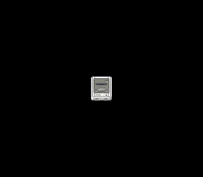

# Simple Sprite -- Your First OAM Sprite



## What This Example Shows

How to display a single 32x32 pixel sprite on screen using the SNES Object Attribute
Memory (OAM). This is the simplest possible sprite program -- no animation, no input,
just one sprite at the center of the screen.

## Prerequisites

Read `text/hello_world` first -- it covers `consoleInit()`, VRAM, and the PPU basics.

## Controls

No interactive controls. A static sprite is displayed at the center of the screen.

## Build & Run

```bash
cd $OPENSNES_HOME
make -C examples/graphics/sprites/simple_sprite
```

Then open `simple_sprite.sfc` in your emulator (Mesen2 recommended).

## How It Works

### 1. Load sprite graphics into VRAM

```c
dmaCopyVram(sprite32, 0x2100, sprite32_end - sprite32);
```

Sprite tiles go to a different VRAM region than background tiles. Here we load them
at word address `$2100`. The SNES has a shared 64 KB VRAM -- backgrounds and sprites
coexist by using non-overlapping address ranges.

### 2. Load the sprite palette

```c
dmaCopyCGram(palsprite32, 128, 32);
```

CGRAM (Color Generator RAM) holds 256 entries. The first 128 are for backgrounds,
the last 128 are for sprites. Offset 128 = first sprite palette (palette 0 in
sprite terms). Each palette is 16 colors (32 bytes in 15-bit SNES format).

### 3. Configure OBJ size

```c
oamInitEx(OBJ_SIZE8_L32, 1);
```

The SNES supports two sprite sizes simultaneously: "small" and "large". Here we use
8x8 small / 32x32 large. The second parameter (`1`) sets the name base -- the VRAM
region where sprite tiles start (`$2000` in word addressing).

### 4. Place the sprite

```c
oamSet(0, 112, 96, 0x0010, 0, 3, 0);
oamSetEx(0, OBJ_LARGE, OBJ_SHOW);
```

`oamSet()` configures OAM entry 0:
- Position: (112, 96) -- roughly centered on the 256x224 screen
- Tile number: `0x0010` -- calculated as `(0x2100 - 0x2000) / 16`
- Palette: 0 (first sprite palette)
- Priority: 3 (in front of all backgrounds)

`oamSetEx()` sets this sprite as "large" (32x32) and visible.

### 5. Enable display

```c
setMode(BG_MODE1, 0);
setMainScreen(LAYER_OBJ);
setScreenOn();
```

Mode 1 is used but we only enable sprites (`LAYER_OBJ`) on the main screen --
no backgrounds needed for this demo.

## SNES Concepts

### OAM (Object Attribute Memory)

The SNES has 128 sprite entries in OAM, each with:
- X/Y position (9-bit X, 8-bit Y)
- Tile number (9 bits -- selects which VRAM tiles to display)
- Palette (3 bits -- selects from 8 sprite palettes)
- Priority (2 bits -- controls layering with backgrounds)
- Horizontal/vertical flip flags

Plus 32 bytes of "high table" storing the X position MSB and size-select bit
for each sprite (2 bits per sprite, packed 4 per byte).

### CGRAM Split

Colors 0-127 are for backgrounds, colors 128-255 are for sprites. Sprite palette 0
starts at CGRAM offset 128, palette 1 at 144, and so on. Each palette holds 16
colors (32 bytes).

### Name Base

The VRAM word address where the PPU starts looking for sprite tiles. Set via
`oamInitEx()` or register $2101 (OBJSEL). The tile number in each OAM entry is
an offset from this base.

## Project Structure

| File | Purpose |
|------|---------|
| `main.c` | Sprite loading, OAM setup, display configuration |
| `data.asm` | Sprite tile data and palette via `.INCBIN` |
| `res/sprite32.png` | Source 32x32 sprite image |
| `Makefile` | `LIB_MODULES := console dma sprite` |

## Going Further

- **Move the sprite**: Add `padHeld()` input reading and update the X/Y position
  in the main loop with `oamSet()`.

- **Change the palette**: Write different colors to CGRAM offset 128 and see the
  sprite change appearance without reloading tiles.

- **Explore related examples**:
  - `sprites/animated_sprite` -- Add movement and animation frames
  - `sprites/dynamic_sprite` -- Stream sprite tiles to VRAM each frame
