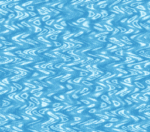

# HDMA Wave

> One water image, one per-scanline ripple, made two ways: first by an HDMA
> table written by hand and animated krom-style, then by the `hdma` module's
> wave helper. Press A to switch between them.



## Controls

| Button | Action |
|--------|--------|
| A | Switch between the hand-built table and the `hdma` module |
| D-Pad Left/Right | Module mode: amplitude 2 to 24 pixels, in steps of 2 |

The ripple runs from boot, with no input.

## Build & Run

```bash
make -C examples/hdma/hdma_wave
```

Then open `hdma_wave.sfc` in luna (`luna-gui hdma_wave.sfc`) or any SNES
emulator.

## What You'll Learn

- What HDMA does that DMA cannot: a different register value on every scanline
- The HDMA table format: a line count, the register payload, a `0x00` terminator
- Animation by moving the table's start pointer, without rewriting a byte
- What the `hdma` module's `hdmaWaveH` / `hdmaWaveUpdate` do for you, and
  how to hand a channel from your own table to the module and back

---

## Walkthrough

### 1. The table, by hand

The PPU draws 224 lines per frame. HDMA feeds a PPU register a new value at
the start of each line from a table: give BG1's horizontal scroll (`BG1HOFS`,
`$210D`) a sine, one value per line, and each line of the image shifts by a
different amount.

The table here is krom's, verbatim (`res/wavetable.bin`, 896 entries):

```
[0x01] [lo] [hi]   one scanline, then write (lo, hi) to BG1HOFS
[0x01] [lo] [hi]   next scanline, next value
...
[0x00]             end of table
```

`HDMA_MODE_1REG_2X` writes two bytes to the same register, which is the
shape the 16-bit scroll registers expect (low byte, then high byte).

### 2. Animation = move the start pointer

```c
wave_phase++;
if (wave_phase >= WAVE_WRAP)       /* 672: krom's seamless wrap */
    wave_phase = 0;
hdmaSetup(CH_HAND, HDMA_MODE_1REG_2X, HDMA_DEST_BG1HOFS,
          wavetable + wave_phase * ENTRY_BYTES);
```

Line L reads entry `phase + L`, so the crests flow up the screen one line
per frame. The table holds 672 + 224 entries so that every start phase
still has a full screen of valid lines. Nothing is ever written to it, so
HDMA can never read a half-updated entry, and the per-frame cost is one
`hdmaSetup` call. HDMA reloads its table address at the start of every
frame, so repointing during VBlank is safe.

### 3. The same ripple from the `hdma` module

```c
hdmaWaveInit();                          /* switches every channel off */
hdmaWaveH(CH_LIB, 0, amp, WAVE_FREQ);    /* BG1, amplitude, frequency */
hdmaEnableMask(1 << CH_LIB);
...
hdmaWaveUpdate();                        /* once per frame */
```

The module computes the sine table in RAM, double-buffers it and advances
it each frame. Amplitude 10 at frequency 10 (a 25.6-line period) is close
to krom's table (`round(10 * sin)`, a ~25.8-line quasi-period), so the
ripple barely changes when you switch. What you gain is the parameter:
LEFT/RIGHT call `hdmaWaveH` again with a new amplitude.

### 4. Handing the channel over and back

The hand-built table runs on channel 0 (krom's), the module's wave on
channel 6. `hdmaWaveInit()` switches off every HDMA channel, yours
included, so it comes before arming the module's. Going back,
`hdmaWaveStop()` releases channel 6 and restores BG1's scroll, then the
hand-built table is re-armed from the phase it had reached.

---

## Fidelity to the original (hand mode; measured, not assumed)

Register-level — krom's writes vs what this ROM's generated code does:

| Register | krom (ASM) | this example (via the C API) |
|---|---|---|
| `$4300` DMAP0 | `%00000010` | `hdmaSetup` mode = `HDMA_MODE_1REG_2X` (0x02) |
| `$4301` BBAD0 | `$0D` (BG1HOFS) | `HDMA_DEST_BG1HOFS` (0x0D) |
| `$4302-3` A1T0 | table start, **+3 bytes/frame** | `hdmaSetup(…, wavetable + wave_phase*3)` per VBlank (hand mode) |
| `$4304` A1B0 | `$00` | the far pointer's bank byte (the table's ROM bank) |
| `$420C` HDMAEN | `%1` once | `hdmaEnableMask(1 << CH_HAND)` at boot (and on the way back from module mode) |
| `$2105` BGMODE | `$0B` (mode 3 + BG3-prio bit, no-op in mode 3) | `setMode(BG_MODE3, 0)` → mode 3 |
| `$2107` BG1SC | `$FC` (word $FC00 → mirrors $7C00) | `bgSetMapPtr(0, 0x7C00, SC_32x32)` |

One deliberate difference: krom rewrites only `A1T0L` each frame; this
example re-runs `hdmaSetup` (same five values) — semantically identical.

Behavioral — proven EXACT (luna v1.9.0 `dma.channels[]` + displacement-field
analysis on `luna frames` sequences of both ROMs):

| Proof | Result |
|---|---|
| HDMA table | **byte-identical**: krom's 896 entries extracted verbatim (`res/wavetable.bin`) |
| This ROM's rendering | displacement field == table prediction, **residual 0** over 1400 line-measurements |
| This ROM's cadence | exactly one +3-byte A1T0 step per frame, at VBlank (register-level, `dma.channels[0].a_addr`) |
| Reference's rendering | every frame pair fits the same table with **residual 0** |
| Reference's cadence in luna | irregular 2,1,1 entries/frame — a luna `$4210` polling emulation issue (luna#107), not a demo or port defect; on hardware both ROMs advance +3/frame |

## Tips & Tricks

- **Nothing moves?** An HDMA channel that is set up but not enabled does
  nothing: `hdmaSetup()` configures, `hdmaEnableMask()` arms. luna's
  `dma.hdmaen` in `luna state --out -` shows which channels are on.
- **Channel 7 is taken** by the NMI handler's OAM DMA; do not put HDMA on it.
- **A flat colour hides the effect.** The wave only shifts pixels
  horizontally: it needs an image with vertical detail to be seen.

## Go Further

- **Vertical wave:** target `BG1VOFS` (`HDMA_DEST_BG1VOFS`) instead; the
  lib writes `y - 1` for you, but an HDMA table on `BGnVOFS` must carry the
  -1 itself (see `KNOWN_LIMITATIONS.md`).
- **Two layers:** a second channel on `BG2HOFS` with another amplitude.
- **Next example:** [HDMA Helpers](../hdma_helpers/) — the module's other
  effects (brightness and colour gradients, iris wipe, water ripple).

---

## Modules Used

`console`, `dma`, `background`, `input`, `hdma` (`LIB_MODULES` in the Makefile).

| Module | Why it's here |
|--------|--------------|
| `console` | `consoleInit()`, `WaitForVBlank()`, the NMI handler |
| `dma` | `dmaCopyVram` / `dmaCopyCGram` for the image and its palette |
| `background` | `bgSetGfxPtr`, `bgSetMapPtr` |
| `input` | `padPressed()` for A and LEFT/RIGHT |
| `hdma` | `hdmaSetup` / `hdmaEnableMask` for the hand-built table, `hdmaWaveH` and friends for the module's wave |

## Technical Reference

| Register | Address | Role in this example |
|----------|---------|---------------------|
| BG1HOFS | $210D | HDMA target — per-scanline horizontal scroll |
| DMAP0 / DMAP6 | $4300 / $4360 | Channel mode (`HDMA_MODE_1REG_2X`) |
| BBAD0 / BBAD6 | $4301 / $4361 | Target register ($0D = BG1HOFS) |
| A1T0 | $4302-$4304 | Table address, +3 bytes per frame in hand mode |
| HDMAEN | $420C | Bit 0 in hand mode, bit 6 in module mode |
| BGMODE | $2105 | Mode 3 (8bpp BG1) |

## Files

| File | What's in it |
|------|-------------|
| `main.c` | Setup, the hand-built repoint loop, the switch to the `hdma` module |
| `data.asm` | The Mode 3 image (tiles in two sections, map, palette) and krom's table |
| `res/water.bmp` | Original art: procedurally generated water caustics (256 colours) |
| `res/wavetable.bin` | krom's 896-entry HDMA table, extracted verbatim |
| `Makefile` | `LIB_MODULES`, and the `gfx4snes` rule for the 8bpp image |
