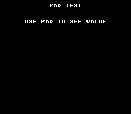

# Controller Input

Reads the SNES controller and displays which button is currently held. The simplest possible input example — press a button, see its name on screen.



## What You'll Learn

- How to read controller state with `padHeld(0)` (returns a 16-bit bitmask)
- The SNES button constants: `KEY_A`, `KEY_B`, `KEY_X`, `KEY_Y`, `KEY_L`, `KEY_R`, `KEY_UP`, `KEY_DOWN`, `KEY_LEFT`, `KEY_RIGHT`, `KEY_START`, `KEY_SELECT`
- That the NMI handler reads joypads automatically — no manual polling needed
- The difference between `padHeld()` (held right now) and `padPressed()` (just pressed this frame)

## Controls

| Button | Display |
|--------|---------|
| A | "A PRESSED" |
| B | "B PRESSED" |
| X / Y | "X PRESSED" / "Y PRESSED" |
| L / R | "L PRESSED" / "R PRESSED" |
| D-pad | "UP/DOWN/LEFT/RIGHT PRESSED" |
| START / SELECT | "START/SELECT PRESSED" |
| None | (blank) |

## SNES Concepts

### How Input Works on the SNES

The SNES joypad is a shift register — the hardware clocks out 16 bits of button state every frame during the auto-joypad read period (after VBlank). The NMI handler in `crt0.asm` captures this automatically into `pad_keys[]`. Your code never touches hardware registers directly.

### padHeld vs padPressed

```c
u16 held = padHeld(0);      // Buttons held RIGHT NOW (every frame)
u16 pressed = padPressed(0); // Buttons pressed THIS FRAME ONLY (edge detection)
```

Use `padHeld` for continuous actions (movement, charging). Use `padPressed` for one-shot actions (jump, menu select, pause toggle).

### Button Bitmask

Multiple buttons can be held simultaneously. Test with bitwise AND:

```c
if (pad & KEY_A) { /* A is held */ }
if ((pad & KEY_L) && (pad & KEY_R)) { /* both shoulders held */ }
```

## Build & Run

```bash
cd $OPENSNES_HOME
make -C examples/input/controller
```

Open `controller.sfc` in Mesen2 and press buttons.
