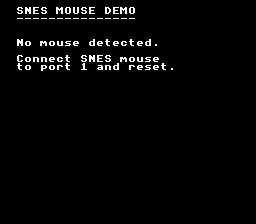

# SNES Mouse

Demonstrates how to use the SNES Mouse peripheral: detecting the device on a
controller port, reading motion deltas to drive an on-screen cursor sprite, and
responding to left/right button clicks. The SNES Mouse was a real accessory
(bundled with Mario Paint) and a handful of commercial games supported it. This
example covers the full workflow from detection to input handling.



## What You'll Learn

- How to detect whether a SNES Mouse is connected to a controller port
- How to read mouse motion deltas and accumulate them into a cursor position
- How to check mouse button presses (left click, right click)
- How to cycle the mouse sensitivity setting (low, medium, high)
- How to display a hardware sprite as a cursor on top of a text background

## SNES Concepts

### SNES Mouse Hardware

The SNES Mouse connects to a standard controller port and is identified by the
auto-joypad read circuitry. The CPU reads it through the same I/O registers as
controllers ($4218-$421F), but the data format differs: instead of button bits,
it returns X and Y displacement values (deltas) and two button bits (left and
right). The `mouseInit()` function checks the device signature returned by
auto-joypad and returns whether a mouse was found.

### Mouse Sensitivity

The SNES Mouse has three sensitivity levels (low, medium, high) that control how
many pixels of displacement are reported per physical movement unit. The setting
is stored in the mouse hardware and cycled via `mouseSetSensitivity()`.

### Sprites as UI Elements

This example uses a hardware sprite (OAM entry 0) as the cursor rather than
drawing into a background tilemap. Sprites can be positioned at arbitrary pixel
coordinates without affecting backgrounds and are drawn on top of all BG layers.
The cursor tile data is DMA'd to OBJ VRAM at $4000 and configured as 16x16 via
`REG_OBJSEL` ($2101).

## Controls

| Button | Action |
|--------|--------|
| Mouse movement | Move cursor |
| Left click | Change background color to blue |
| Right click | Cycle sensitivity (Low / Med / High) |

Note: In Mesen2, enable SNES Mouse emulation under Input settings and assign it
to controller port 1.

## How It Works

### 1. Initialize Text and Detect Mouse

The text system provides on-screen labels. After one VBlank cycle (to ensure
auto-joypad has run), `mouseInit(0)` checks port 1 for a mouse. If none is
found, a message is displayed and the program halts.

```c
consoleInit();
setMode(BG_MODE0, 0);
textInit();
textLoadFont(0x0000);

WaitForVBlank();
detected = mouseInit(0);

if (!detected) {
    textPrintAt(2, 5, "No mouse detected.");
    /* ... halt ... */
}
```

### 2. Load Cursor Sprite

The cursor is a 16x16 4bpp sprite. Because SNES OBJ tiles are arranged in a
16-tile-wide grid in VRAM, a 16x16 sprite uses tiles 0-1 (top row) and tiles
16-17 (bottom row). The tile data is split across two DMA transfers:

```c
dmaCopyVram(cursor_tiles, 0x4000, 64);          /* top half: tiles 0-1 */
dmaCopyVram(cursor_tiles + 64, 0x4100, 64);     /* bottom half: tiles 16-17 */
dmaCopyCGram(cursor_pal, 128, ...);              /* sprite palette 0 */
```

### 3. Set Up OAM Directly

Rather than calling `oamSet()` every frame (which has high overhead on the
65816), the cursor sprite is configured by writing directly to the `oamMemory[]`
buffer. The NMI handler DMA's this buffer to OAM hardware each VBlank:

```c
oamMemory[0] = (u8)pos_x;       /* X position */
oamMemory[1] = (u8)pos_y;       /* Y position */
oamMemory[2] = 0x00;            /* Tile number */
oamMemory[3] = 0x30;            /* Priority 3, palette 0 */
oamMemory[512] = 0x02;          /* Size bit = large (16x16) */
oam_update_flag = 1;
```

### 4. Main Loop: Read Mouse, Update Cursor

Each frame, the mouse deltas are read and accumulated into the cursor position.
The position is clamped to screen bounds (0-255 horizontal, 0-223 vertical):

```c
pos_x += mouseGetX(0);
pos_y += mouseGetY(0);
if (pos_x < 0) pos_x = 0;
if (pos_x > 255) pos_x = 255;
```

### 5. Button Handling

`mouseButtonsHeld()` returns which buttons are currently down (for continuous
display), while `mouseButtonsPressed()` returns buttons that transitioned from
released to pressed this frame (for single-shot actions like color change):

```c
if (mouseButtonsPressed(0) & MOUSE_BUTTON_LEFT) {
    REG_CGADD = 0;
    REG_CGDATA = 0x00;
    REG_CGDATA = 0x7C;    /* Set BG to blue */
}
```

## Project Structure

```
mouse/
├── main.c        — Mouse detection, cursor movement, button handling
├── data.asm      — Cursor sprite tiles and palette (ROM data)
├── Makefile      — Build configuration (6 library modules)
└── res/
    └── cursor.png — 16x16 cursor sprite source graphic (4bpp)
```

## Build & Run

```bash
cd $OPENSNES_HOME
make -C examples/input/mouse
```

Then open `mouse.sfc` in your emulator (Mesen2 recommended). Enable SNES Mouse
emulation in your emulator's input configuration and assign it to port 1.
