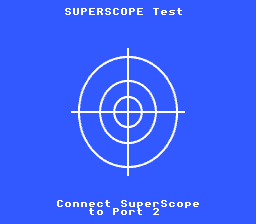

# Super Scope



Light gun detection, calibration via PPU H/V counters, and fire tracking with a red dot sprite.

## Controls

| Input | Action |
|-------|--------|
| Fire (trigger) | Calibrate aim / mark hit position |
| Pause | Return to calibration screen |
| Cursor | Advance to ready state |

## Build & Run

```bash
cd $OPENSNES_HOME
make -C examples/input/superscope
```

Then open `superscope.sfc` in your emulator (Mesen2 recommended).
Enable Super Scope in Mesen2 Input settings, port 2.

## What You'll Learn

- How the SNES Super Scope communicates hit position via PPU H/V counters
- The detect/calibrate/ready state machine pattern for light guns
- Using `OBJSEL()` to configure sprite sizes and VRAM base in one readable macro
- Direct OAM buffer writes for fast single-sprite updates
- 2bpp background graphics on Mode 0 with 4-color palettes

## Walkthrough

### 1. Initialization

```c
consoleInit();
setMode(BG_MODE0, 0);
```

Mode 0 gives four 2bpp BG layers. We use BG1 for text and BG2 for the calibration target image.

### 2. Text System (BG1)

```c
textInit();
textLoadFont(0x0000);
bgSetGfxPtr(0, 0x0000);
bgSetMapPtr(0, 0x3800, BG_MAP_32x32);
```

The built-in 2bpp font is loaded to VRAM $0000. BG1's tilemap sits at $3800 to avoid conflicts with BG2 graphics.

### 3. Calibration Background (BG2)

```c
dmaCopyVram(aim_target_tiles, 0x1000, ...);
dmaCopyVram(aim_target_map, 0x2000, ...);
bgSetGfxPtr(1, 0x1000);
bgSetMapPtr(1, 0x2000, BG_MAP_32x32);
```

The crosshair target image is a 256x224 background. Tiles at $1000, tilemap at $2000.

### 4. Sprites

```c
dmaCopyVram(sprites_tiles, 0x4000, ...);
REG_OBJSEL = OBJSEL(OBJ_SIZE16_L32, 0x4000);
```

The `OBJSEL()` macro replaces the cryptic `0x62` with a readable size + base address. `OBJ_SIZE16_L32` means small=16x16, large=32x32. The sprite sheet has the red dot at tile 0x80 (pixel position 0,64 in the 128-wide sheet).

### 5. Direct OAM Setup

```c
oamMemory[0] = 0;
oamMemory[1] = 0xE0;     /* Off-screen */
oamMemory[2] = 0x80;     /* Tile 0x80 (red dot) */
oamMemory[3] = 0x34;     /* Priority 3, palette 2 */
oamMemory[512] = 0x00;   /* Small (16x16), X high = 0 */
oam_update_flag = 1;
```

Writing directly to `oamMemory[]` avoids the overhead of `oamSet()` (framesize=158). For a single sprite updated occasionally, this is clean and fast.

### 6. State Machine

The example uses three states:

- **DETECT**: Calls `scopeInit()` each frame until `scopeIsConnected()` returns true
- **CALIBRATE**: Waits for a fire event, then calls `scopeCalibrate()` to set the aim offset
- **READY**: Reads `scopeGetX()`/`scopeGetY()` on fire events and moves the red dot

The `fire_armed` flag prevents the calibration fire from immediately re-triggering in the next state (debouncing).

## Tips & Tricks

- **2bpp quantization**: When converting images with mostly one color (blue background), gfx4snes may lose minority colors (white crosshair lines). Pre-process the PNG with a fixed indexed palette (e.g. via PIL `quantize()`) to control which colors are preserved.

- **Sprite tile numbering**: In a 128px-wide sprite sheet with 16x16 sprites, tile numbers follow `row * 32 + col * 2`. Use `gfx4snes --sprite-map` to print the full tile map and find the right tile number.

- **OBJSEL macro**: Instead of memorizing that `0x62` means "16/32 sizes at VRAM $4000", use `OBJSEL(OBJ_SIZE16_L32, 0x4000)`.

- **Mesen2 Super Scope setup**: In Input settings, assign Super Scope to port 2. Map Fire and Pause to keyboard keys. The scope cursor must be over the emulator window for H/V counters to register.

## Under the Hood: The Build

```makefile
TARGET      := superscope.sfc
USE_LIB     := 1
LIB_MODULES := console input sprite dma text background
ASMSRC      := data.asm
```

| Module | Why it's here |
|--------|--------------|
| `console` | VBlank/NMI handling |
| `input` | Super Scope detection and reading |
| `sprite` | `oamInit()`, `oamClear()` |
| `dma` | DMA transfers for tiles, maps, palettes |
| `text` | Font loading and text rendering |
| `background` | `bgSetGfxPtr()`, `bgSetMapPtr()`, `bgSetScroll()` |

## Technical Reference

| Register | Address | Role in this example |
|----------|---------|---------------------|
| OBJSEL | $2101 | Sprite size + tile base address |
| CGADD | $2121 | Palette write address |
| CGDATA | $2122 | Palette color data (RGB555 LE) |
| TM | $212C | Main screen layer enable |
| OPHCT | $213C | PPU horizontal counter (Super Scope X) |
| OPVCT | $213D | PPU vertical counter (Super Scope Y) |

## Files

| File | What's in it |
|------|-------------|
| `main.c` | State machine, sprite control, text display |
| `data.asm` | `.incbin` references for background and sprite graphics |
| `res/` | Pre-converted graphics (.pic, .pal, .map) and source PNGs |
| `Makefile` | `LIB_MODULES := console input sprite dma text background` |
