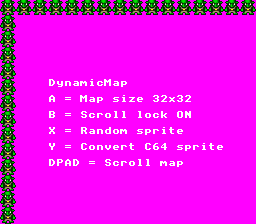

# Dynamic Map

This example demonstrates a custom tilemap-based sprite engine that treats BG1 as a grid of 16x16 "sprites" (not OAM hardware sprites). Each sprite is composed of tilemap entries pointing to 8bpp tile data in VRAM, allowing you to place, move, and scroll dozens of graphical elements on a background layer. The example supports two map modes (32x32 and 64x64) and includes a C64-to-SNES sprite format converter, showing how retro formats can be adapted to SNES hardware.



## What You'll Learn

- How to build a tile-based sprite engine on a background layer using Mode 3 (8bpp, 256 colors)
- How SNES tilemaps are organized as SC_64x64 (four 32x32 pages)
- How to manage large RAM buffers in bank $7E extended WRAM via assembly helpers
- How to perform safe VBlank DMA transfers using the 1-page-per-VBlank pattern
- How to convert C64 sprite data to SNES 8bpp tile format

## SNES Concepts

### Mode 3 and 8bpp Tiles

Mode 3 gives BG1 a full 256-color palette (8 bits per pixel). Each 8x8 tile uses 64 bytes of VRAM (8 bitplanes x 8 rows). A 16x16 sprite at 8bpp requires 4 tiles = 256 bytes. This is configured by calling `setMode(BG_MODE3, 0)` for 8x8 tile size, or `setMode(BG_MODE3, 0x10)` for 16x16 tile size (bit 4 of register $2105). BG2 in Mode 3 uses 4bpp (16 colors), which this example uses for the text overlay.

### SC_64x64 Tilemap Layout

An SC_64x64 tilemap consists of four 32x32 tile pages (8KB total). In memory, they are arranged as: page 0 (top-left), page 1 (top-right), page 2 (bottom-left), page 3 (bottom-right). Each tile entry is 2 bytes (tile number + attributes), so each page is 2048 bytes. The code maps logical (x, y) sprite coordinates to the correct page and byte offset within the tilemap buffer.

### Extended WRAM and Assembly Helpers

The SNES has 128KB of WRAM at banks $7E-$7F. The compiler generates `sta.l $0000,x` which can only reach bank $00:$0000-$1FFF (8KB). To use the remaining WRAM, the tilemap buffer lives at $7E:$2000 and is accessed through assembly helper functions (`smapWrite`, `smapRead`, `smapDma`, `smapClear`) that set the correct bank byte.

### 1-Page-Per-VBlank DMA Pattern

The SNES PPU ignores VRAM writes during active display. VBlank provides roughly 41,000 master cycles for DMA. At 8 cycles per byte, a 2KB page transfer takes about 16,000 cycles -- well within budget. The code DMAs one 2048-byte tilemap page per VBlank across 4 frames (67ms total), which is imperceptible to the player and avoids any visual glitching.

## Controls

| Button | Action |
|--------|--------|
| D-PAD  | Scroll the map |
| A      | Toggle between 32x32 and 64x64 map mode |
| B      | Toggle scroll lock on/off |
| X      | Place a random gargoyle sprite on the map |
| Y      | Display a C64 Rockford sprite (Boulder Dash) converted to SNES format |

## How It Works

**1. Initialization** -- The console is set up with Mode 3, BG1 for the sprite map, and BG2 for text. The tilemap buffer in bank $7E is cleared, and gargoyle tile data is DMA'd from ROM to VRAM during force blank:

```c
REG_INIDISP = 0x80;  /* Force blank for safe VRAM writes */
dmaFillVRAM(0, VRAM_SPRITE_GFX, 256);  /* Clear empty tile slot */
for (i = 1; i < 10; i++) {
    u16 vram_off = VRAM_SPRITE_GFX + element2sprite32x32(i) * 32;
    dmaCopyVram((u8*)&sprite16, vram_off, 256);
}
dmaCopyCGram((u8*)&palsprite16, 0, 32);
```

**2. Drawing sprites on the tilemap** -- Each 16x16 sprite occupies 2x2 tiles in 8x8 mode (or 1 tile in 16x16 mode). The `drawSprite32x32()` function writes tile indices into the RAM buffer, mapping logical coordinates to the correct SC_64x64 page:

```c
void drawSprite32x32(u8 x, u8 y, u16 sprite) {
    if (x < 16 && y < 16)
        drawSpriteRaw32x32(x, y, sprite);
    else if (x < 32 && y < 16)
        drawSpriteRaw32x32(x - 16, y + 16, sprite);
    /* ... handles all 4 pages */
}
```

**3. Tilemap DMA to VRAM** -- After modifying the RAM buffer, changes are sent to VRAM one page per VBlank:

```c
vblank_flag = 0;
WaitForVBlank();
smapDma(0,    VRAM_SPRITEMAP,        2048);  /* page 0 */
WaitForVBlank();
smapDma(2048, VRAM_SPRITEMAP + 1024, 2048);  /* page 1 */
/* ... pages 2 and 3 */
```

**4. C64 sprite conversion** -- The `convertC64Sprite()` function reads 2-bit C64 pixel data and repacks it into SNES 8bpp bitplane format (8 interleaved bitplanes per 8-pixel row, 4 tiles per 16x16 sprite).

## Project Structure

```
dynamic_map/
├── main.c          — Main loop, controls, C64 converter, demo init
├── map32x32.c      — 32x32 grid engine (8x8 tile mode, 4 tiles per sprite)
├── map32x32.h      — API for 32x32 mode
├── map64x64.c      — 64x64 grid engine (16x16 tile mode, 1 tile per sprite)
├── map64x64.h      — API for 64x64 mode
├── maputil.c       — Screen refresh (tilemap DMA to VRAM)
├── maputil.h       — Refresh API
├── data.asm        — ROM data: 8bpp sprite tiles, palette, C64 sprite bytes
├── ram.asm         — Bank $7E/$7F RAM sections and assembly DMA helpers
├── Makefile        — Build configuration
└── res/
    ├── sprite16.png        — 16x16 gargoyle sprite (8x8 tiles, 8bpp)
    └── sprite16_64x64.png  — 16x16 gargoyle sprite (16x16 tiles, 8bpp)
```

## Build & Run

```bash
cd $OPENSNES_HOME
make -C examples/maps/dynamic_map
```

Then open `dynamic_map.sfc` in your emulator (Mesen2 recommended).
