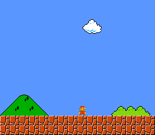

# Map Scroll

A large Tiled map scrolls as a Mario sprite moves left and right. The map engine streams only the visible tile columns to VRAM, so the map can be much wider than the screen. This is the stepping stone between "static background" and the full continuous_scroll example.



## What You'll Learn

- How the map engine streams a large level through a small VRAM window
- How camera-follow works: sprite position drives the viewport
- How to combine a scrolling background with an animated sprite
- The two-phase update pattern: `mapUpdate()` (CPU) → `mapVblank()` (DMA)
- Sprite screen positioning relative to camera (`xloc - x_pos`)

## Controls

| Button | Action |
|--------|--------|
| LEFT | Move Mario left (sprite flips, map scrolls) |
| RIGHT | Move Mario right |

## SNES Concepts

### Map Engine Two-Phase Update

The map is too large to fit in VRAM. The map engine solves this:

1. **`mapUpdate()`** — runs during active display. Checks if the camera crossed a tile boundary. If so, prepares a column of new tiles in a RAM buffer.
2. **`mapVblank()`** — runs during VBlank. DMAs the prepared tile column to VRAM. This is the only safe time to write VRAM.

### Camera-Relative Sprite Positioning

The sprite's position in the map (`xloc`) is not its screen position. The screen position is `xloc - x_pos`, where `x_pos` is the camera's current offset exported by the map engine.

```c
oamSet(0, xloc - x_pos, yloc - y_pos, frame, 0, 3, flags);
```

### Walk Animation

The sprite cycles through 4 frames (tiles 0, 2, 4, 6). Each 16x16 sprite uses 2 VRAM tiles (top-left + top-right), so frames are spaced by 2. Animation advances every other input frame for natural pacing.

## Modules Used

| Module | Why it's here |
|--------|--------------|
| `console` | `consoleInit()`, `WaitForVBlank()`, NMI handler setup |
| `sprite` | OAM buffer for the Mario sprite |
| `dma` | DMA transfers for tiles, palette, and map column streaming |
| `input` | `padHeld()` for continuous D-pad reading |
| `background` | BG layer and scroll register configuration |
| `map` | `mapLoad()`, `mapUpdate()`, `mapVblank()` — the streaming map engine |

## Build & Run

```bash
cd $OPENSNES_HOME
make -C examples/maps/mapscroll
```

Open `mapscroll.sfc` in Mesen2 and scroll with LEFT/RIGHT.
